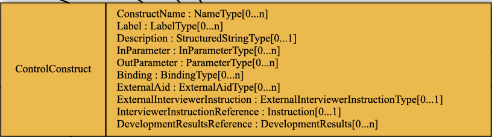

## Outline

- Questionnaires and Surveys
  - Questionnaire structure
  - Questionnaire components

---

## What is a question?

---

## Question vs Variable

::::: columns
::: column
*Question*

- Describes a means of capturing data
- A question specifies a text and a means of defining the form of the expected response
- Questions can be organized in a questionnaire

:::
::: column
*Variable*

- Description of data
- A variable does not need to come from a question
:::
:::::

---

## Questions in DDI

**DDI Codebook** is variable-centric – it only provides a partial description of question as the source of data for a variable

**DDI Lifecycle** supports stand-alone question specification and management, can describe the use of a question within a questionnaire flow-logic

---

## DDI Items Related to Questions

| Coverage      | DDI-C    | DDI-L             |
|---------------|----------|-------------------|
| Questionnaire |          | Instrument        |
| Question Text | qstLit   | QuestionText      |
| Question      | qstn     | QuestionItem      |
|               |          | QuestionGrid      |
|               |          | QuestionBlock     |
| Measurement   |          | MeasurementItem   |
| Instruction   | preQTxt  | Instruction       |
|               | postQTxt |                   |

DDI-Codebook has limitations for our purposes, so we will just be talking about DDI-Lifecycle

---

## Questionnare structures and DDI

DDI Lifecycle allows the **specification**, **management of the questionnaire components**, **implementation**, and subsequent **description** of these componente to their **relationship** to the data generated from the questionnaire. It is necessarily complex as a result of its multiple roles.

---

## DDI Instrument Model

:::
Instruments have a relationship to other instruments (group/scheme), a data collection, types of collection and development activities
:::

---

## DDI Instrument Model

:::
Just looking at the instrument object, common things to describe a questionnaire, name, label, description but other than that NOTHING that looks familiar
This is becuase the actual questionnaire is an abstract object called a ControlConstruct which is a wrapper for all the things contained in an actual questionnaire
:::

---

## DDI Control Construct

:::

:::

---

## DDI Sequence

:::

:::

---

## DDI Question Construct

:::

:::

---

## DDI Question

:::

:::

---

## QuestionItem 

| Routing       |          | Sequence. Loop    |
|               |          | IfThenmElse.      |
|               |          | RepeatUntil,      |
|               |          | RepeatWhile       |

---

## Acknowledgements and Sources

Slides 

[![DDI Lifecyle: Questions and Instruments. (2021)],(https://docs.google.com/presentation/d/1wZ03TVoVMv-TWI9rMD-lWUh6XhF233ws/edit#slide=id.p1)

---
