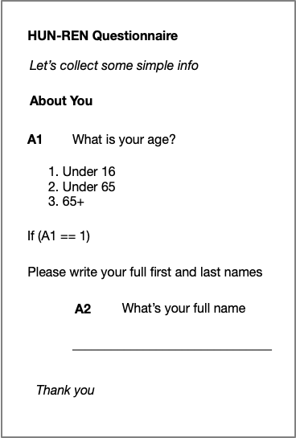
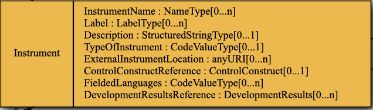
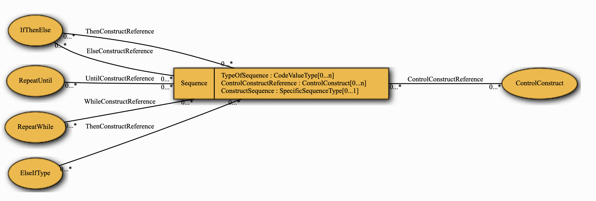
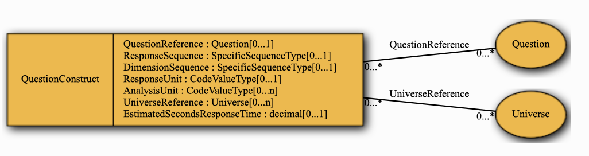
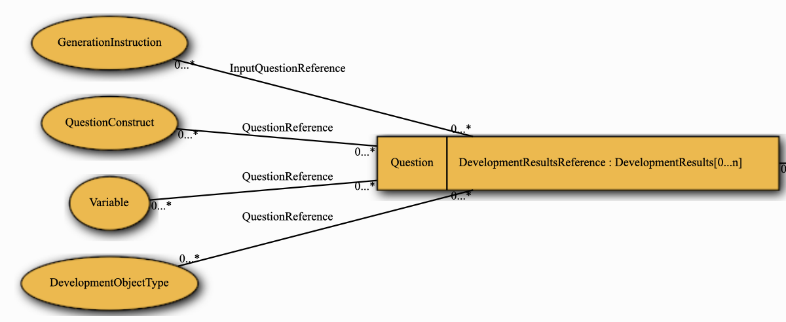

## Outline

- Questionnaires and Surveys
  - Questionnaire structure
  - Questionnaire components

---

## Questionnare structure

:::
This is possibly the simplest questionnaire imaginable, Title, some information about what is going to do, something to tell the respondent the sort of information in each clock of questions, a question with some response options 
a filter to ask quesitons only of specific universe of participantes,and another question with a different type of response option
:::

---

## Questionnare structures and DDI

DDI Lifecycle allows the **specification**, **management of the questionnaire components**, **implementation**, and subsequent **description** of these componente to their **relationship** to the data generated from the questionnaire. It is necessarily complex as a result of its multiple roles.

---

## DDI Instrument Model

:::
Instruments have a relationship to other instruments (group/scheme), a data collection, types of collection and development activities
:::

---

## DDI Instrument Model (Focus)

:::
Just looking at the instrument object, common things to describe a questionnaire, name, label, description but other than that NOTHING that looks familiar
This is becuase the actual questionnaire is an abstract object called a **ControlConstruct** which is a wrapper for all the things contained in an actual questionnaire
:::

---

## DDI Control Construct

:::
This acts as a set of containers for the things we actually want to be asking and the things that control the way in which we implement it. 
Again, not many things here we are familiar with!
Typically a questionnaire starts with a sequence
:::

---

## DDI Sequence

:::
So we can see here that a sequence is a way of controlling the flow of a questionnaire Sequence contains Control Constructs.
A special construct is the QuestionConstruct 

:::

---

## DDI Question Construct

:::
Finally, we have something we can recognise a Question!
And some things we might want to associate with it such as a response unit or analysis unit
:::

---

## DDI Question

:::
Nearly there, there are three types of question supported in DDI, QuestionItem, QuestionBlock and QuestionGrid, so Question act as ANOTHER wrapper, pointing to a ControlConstruct .... which brings us to a QuestionItem
:::

---

## DDI QuestionItem 

:::
This is covered in more detail in the questions slides
:::

---

## Acknowledgements and Sources

- Hayley Mills, (2021) DDI Lifecyle: Questions and Instruments https://docs.google.com/presentation/d/1wZ03TVoVMv-TWI9rMD-lWUh6XhF233ws/edit#slide=id.p1
- DDI Alliance, DDI Model  https://ddialliance.github.io/ddimodel-web/

---
