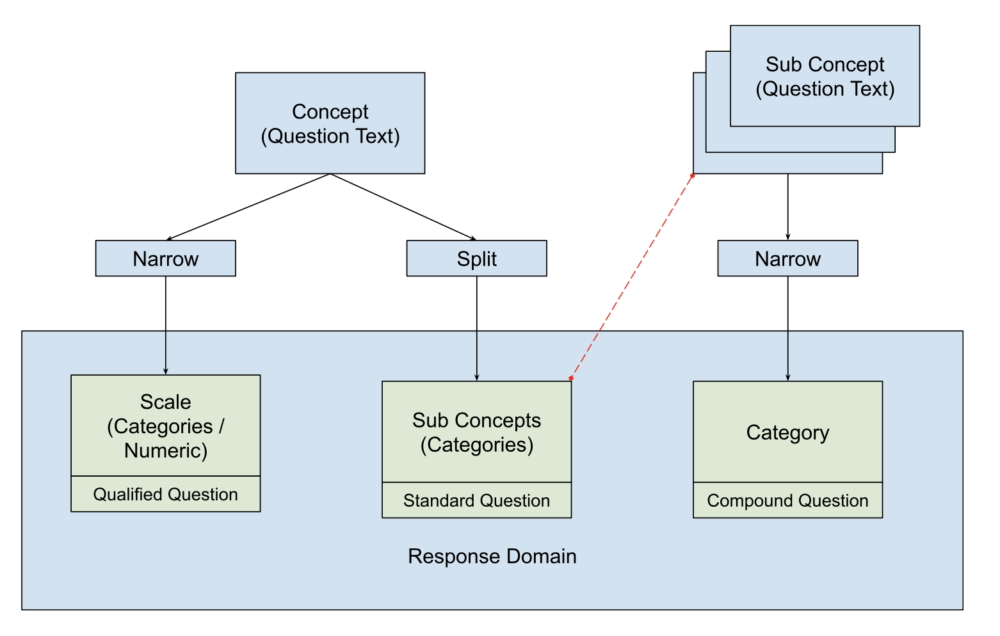
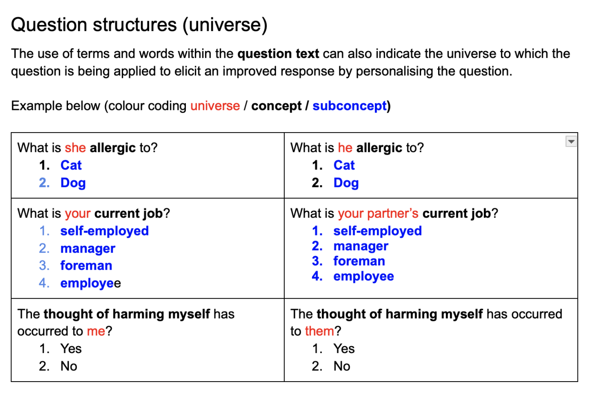

---

## Extracting Semantics from Questions

Questions have the following elements to extract semantics from:

- Question Name
- Question Text
- Response Domain
  - CodeList
  - Numeric
  - DateTime
  - Text 

::: notes
Numeric, DateTime and Text are limited in this regard
:::

---

## Question Content Types

A question is intended to determine a specific concept from a respondent. 

The concept being determined is restricted within a set of possible options, called a response domain which can be conceived of as being sub-concepts. 

This may be represented in different ways, illustrated below.

---

## Standard Question

A question text describes the concept and the response domain (in these cases a code list) captures sub-concepts 

**Question Text**: What is his current job? 

**Response Domain**

1. self-employed 
2. manager 
3. foreman 
4. employee

**Concept**: Job

**Sub Concepts**: self-employed, manager, etc

::: notes
We need to be able to utilise both the Question Text and Response Domain
:::

---

## Qualified Question

A question text where the concept is defined in the text, and the code list acts as a qualifier (e.g  a likert scale, binary option) where NO sub-concept is captured.

**Question Text**: The thought of harming myself has occurred to me: 

**Response Domain**

1. yes, quite often 
2. sometimes 
3. hardly ever 
4. never

**Concept**: Thought about self harm

**Sub Concepts**: none

::: notes
We are only able to utilise both the Question Text
:::

---

## Compound Question

A question text where the concept is defined in the text, along with a sub-concept, the response domain acts as a qualifier (e.g  a binary option) where NO sub-concept is captured. These are often in blocks of seperate questions each of which generates a separate data variable.

**Question Text**: What is she allergic to? (tick all that apply) dog 
**Question Text**: What is she allergic to? (tick all that apply) cat 

**Response Domain**

1. yes
2. no

**Concept**:Allergies

**Sub Concepts**: dog, cat

::: notes
This is a bit more problematic, as the sub-concepts are 'spread out' over two different questions
:::

---

## Compound Question (reverse engineered)

**Question Text**: What is she allergic to? (tick all that apply) 

**Response Domain**

1. dog
2. cat

**Concept**:Allergies

**Sub Concepts**: dog, cat

---

## Questions with universes

It is often the case that there will be audience specific text which can 'throw' a ML model

---

