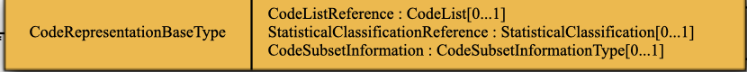

## Outline

- What is a question
- Question vs Variable
- DDI-Codebook vs DDI-Lifecycle

---

## What is a question?


---

## Question vs Variable

::::: columns
::: column
*Question*

- Describes a means of capturing data
- A question specifies a text and a means of defining the form of the expected response
- Questions can be organized in a questionnaire

:::
::: column
*Variable*

- Description of data
- A variable does not need to come from a question
:::
:::::

---

## Questions in DDI

**DDI-Codebook** is variable-centric – it only provides a partial description of question as the source of data for a variable

**DDI-Lifecycle** supports stand-alone question specification, implementation and management, crucially its representation, and can also describe the use of a question within a questionnaire flow-logic

---

## DDI Items Related to Questions

| Coverage       | DDI-C    | DDI-L             |
|----------------|----------|-------------------|
| Question Text  | qstLit   | QuestionText      |
| Question       | qstn     | QuestionItem      |
| ResponeDomain  |          | Representation    |
| Instruction    | preQTxt  | Instruction       |
|                | postQTxt |                   |
| Flow / Logic   |          | ControlConstructs |


DDI-Codebook has limitations for our purposes, so we will just be talking about DDI-Lifecycle

---

## DDI-Lifecycle Question Types

There are three quesstion structures in DDI-Lifecycle

- QuestionItem
- QuestionGrid
- QuestionBlock
  - QuestionItem

 :::
 QuestionBlocks are a collection of QuestionItems, we wil concentrate on QuestionItems.
 :::

## DDI Question Item

QuestionItem type brings togather all the elements needed to describe, implement and manage a question


---

## Question Item elements (Implementing)

- In/Out Parameter, Binding are for passing information into the question text (she/he etc)
- External Aid (e.g. a card with response options)
- EstimatedSecondsResponseTime - for a timed question
- ResponseCardinality - number of allowed responses e.g. tick all that apply, max 2/8 etc)


---

## Question Item elements (Management)

- QuestionScheme (all QuestionItems 'live' in a QuestionSheme, there can be multiple)
- RepresentedVariable (definition of variable from output)
- ResponseDomainReference (reference to another place where the ResponseDomain is held)
- InterviewerInstructionReference

---

## Question Item elements (Describing)

- QuestionItemName, Label, Description (ISO 11179)
  - QuestionItemName (e.g. A1, WORKTYPE)
- QuestionIntent, Concept, QuestionGroup (Semantics)
- Question Text (e.g. What is your name)
- QuestionText (The question, allows insertion of contextual information)
- Representation
  - ResponseDomain (e.g. CodeList, Text, numeric)
  - StructuredMixedReponseDomain (e.g CodeList + Text)
- ExternalInterviewerReference, InterviewerInstructionReference  (to where they are held)

---

## Question Item Code List Example


:::
This shows a question item from Understanding Society, Question name, text, representation type and cardinality (selection style)
:::

---

## Question Item Text language

```xml

<QuestionItemName>
  <r:String xml:lang="en-GB">qi_68</r:String>
</QuestionItemName>
<r:Label>
  <r:Content xml:lang="en-GB">qi 68</r:Content>
</r:Label>
<QuestionText audienceLanguage="en-GB">
  <LiteralText>
    <Text>How interested are you in politics?</Text>
   </LiteralText>
</QuestionText>
<QuestionText audienceLanguage="hu-HU">
  <LiteralText>
    <Text>Mennyire érdekli a politika?</Text>
   </LiteralText>
</QuestionText>

```
:::
Text in the same item can be repeated in different language for both content (name and label) and the text, which audience
- audienceLanguage="fr-FR">Dans quelle mesure êtes-vous intéressé par la politique
:::

---


## Representation Types

- CodeRepresentation
- DateTimeRepresentation
- TextRepresentation
- NumericRepresentation
- Other Numeric e.g. Nominal, Scale, Ranks
- CategoryRepresentation (used in classifications)
- Geograhical - several available

---

## Code Representation



Codes are used in two ways as traditional code lists and in statistical classifications which can be more complex e.g. hierachical, levels etc

---

## Code List 


---


## Code List (Detail)

```xml
<CodeList>
  <Code isUniversallyUnique="true">
  <r:URN>urn:ddi:uk.iser.ukhls:adc21c8d-40bb-4104-83bb-c5709019a385:1</r:URN>
    <r:CategoryReference>
      <r:Agency>uk.iser.ukhls</r:Agency>
      <r:ID>6358d76d-165d-4c93-b736-dfb3d5f21535</r:ID>
      <r:Version>1</r:Version>
      <r:TypeOfObject>Category</r:TypeOfObject>
    </r:CategoryReference>
    <r:Value>3</r:Value>
  </Code>
</CodeList>

```

---

## Question Item Numeric Example


----

## Numeric Representation


---

## Numeric Representation (Details

```xml

<QuestionText audienceLanguage="en-GB">
  <LiteralText> <Text>
   How many hours paid work did you do last week? If you have more than one job please write in the total hours worked at all of them.
  </Text> </LiteralText>
</QuestionText>
<NumericDomain blankIsMissingValue="false">
  <r:NumberRange>
    <r:Low isInclusive="true">0</r:Low>
    <r:High isInclusive="true">168</r:High>
  </r:NumberRange>
  <r:NumericTypeCode controlledVocabularyVersionID="1.0">Integer</r:NumericTypeCode>
  <r:Label>
    <r:Content xml:lang="en-GB">Hours in week</r:Content>
  </r:Label>
</NumericDomain>

```

---

## Date / Time Representation

---

## Text Representation

---

## Acknowledgements


