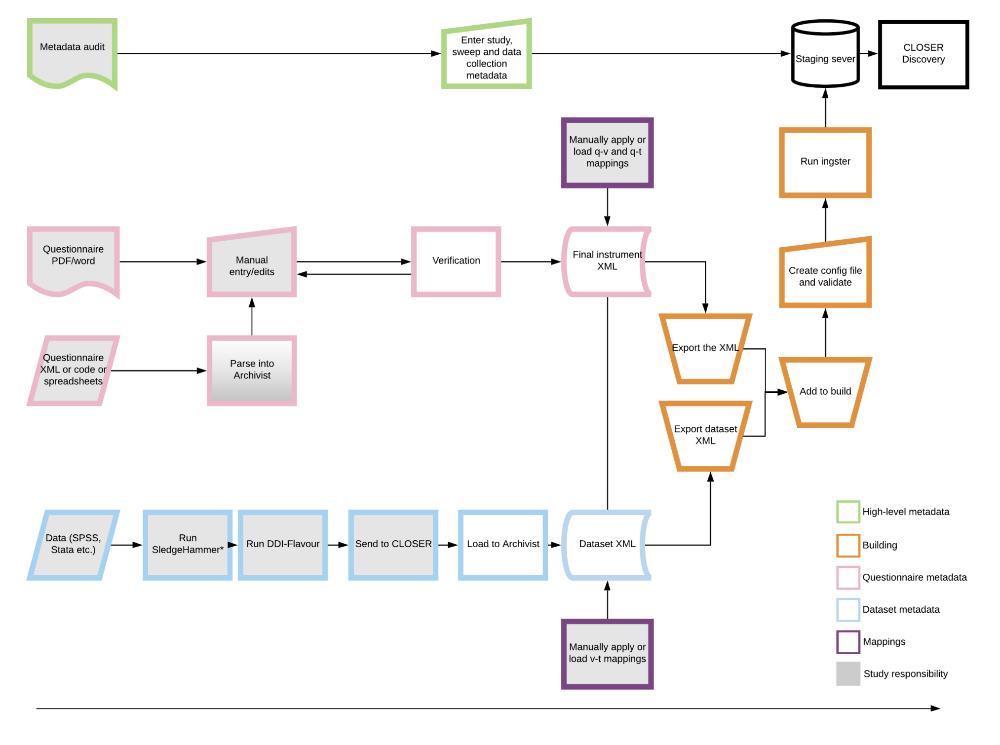

## Data Sharing

Discovery does not contain any data

Studies provide metadata from their files and send to CLOSER

- Standardised tooling
- Optional content (aka minimum metadata)

Each dataset has a link to where it can be accessed, either 

- DOI to archive or
- link to access committee

---

## CLOSER Workflow

----

