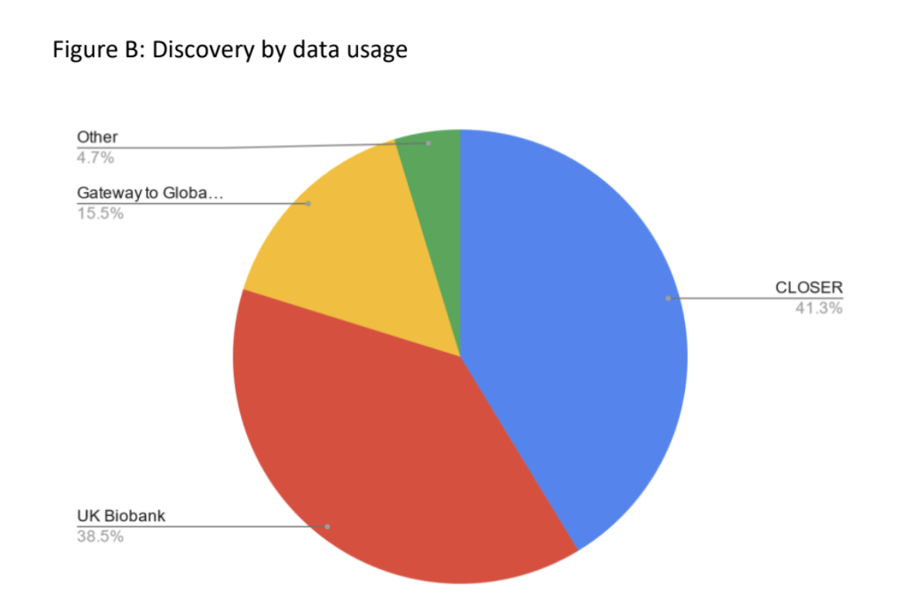

## Vision

- To be a centre of expertise in metadata management ... that advocates for and supports the uptake and development of community standards
- To cultivate a world-class team dedicated to building and maintaining a robust infrastructure that empowers the research and data community with LPS metadata, skills, and knowledge.

---

## Vision

- To inspire a move towards sustainable and standardized metadata practices ..  so it is FAIR
- To set the global benchmark for metadata practices, fostering an environment .. advance quality research in social, behavioural, and biomedical science.

---

## Mission

- To make data from UK LPS visible, understood and utilised to
  - support high quality informed research
- Creating a sustainable infrastructure (technology, funding, people and skills) that 
  - supports the evolving technical, semantic and organisational needs of LPS studies and data users, 
  - through collaboration with others in the (meta)data management, computer science and data infrastructure community.

---

## Mission

- To improve the use and understanding of metadata in longitudinal population data, through the capture of provenance and relationship information to support the funder mandate for FAIR.
- To develop teaching and upskilling resources for the community so they can implement best practice and support existing and emerging infrastructures.

---

## Purpose

- To bring together in one place, the most widely used UK longitudinal population studies providing the best available information, to empower researchers to find/discover, assess and understand the utility of data during and prior to its use.
- To enhance the data by providing additional information on the provenance, and relationships between different data collections to enable within and cross study usage.

---

## Purpose

- To leverage structural and semantic metadata standards to support national and international interoperability of UK longitudinal population data.
- To encourage innovative data management through better information 
- To enable reproducible and transparent research 

---

## CLOSER Discovery (F)

CLOSER Discovery was developed in collaboration with our studies to be a research tool which streamlines the process of exploring longitudinal population study research data. It empowers researchers to confidently navigate these large and complex data collections, saving valuable time with minimal recourse to the studies or cumbersome documentation.

---

## CLOSER Discovery (A)

Lists allow you to curate the data or questions you may be interested e.g. to inform a research proposal, data management plan, to share with collaborators or as part of a data access request

---

## CLOSER Discovery (I)

A consistent vocabulary is used across the available data for discovery of variables, questions, life stage, mode and types of data

Uses an establisjed community metadata standard (DDI-LIfecycle)

---

## CLOSER Discovery (R)

- CLOSER Discovery provides detailed information about
  - the data collected, including summary statistics for each variable to assess quality and coverage,
  - its source questions or measurements and the context in which it was asked.

---

## Study Capacity

There is no contract with studies, there is an MOU, but that is not binding.

- Discovery of data
- It is not a capability the studies can sustain themselves
- Adds value which they can repurpose
- Act as ambassadors for the studies more broadly
  
---

## Audience

Primary audience are users wanting to find out what data is available, to be able to assemble the information to create a research proposal, or to find provenance information unavailable elsewhere

- question provenance
- data which is comparable within and between studies

---

## Users

- Users: 2500 / month
- Session: 3000 / month
- View: 8,000 / month

---

## Coverage of UK LPS

