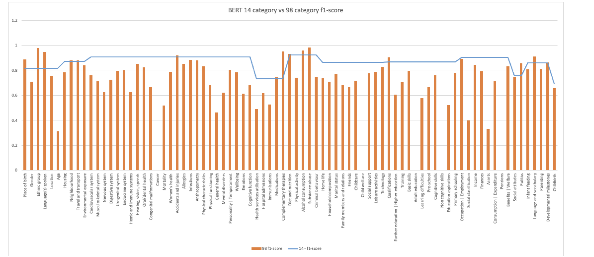
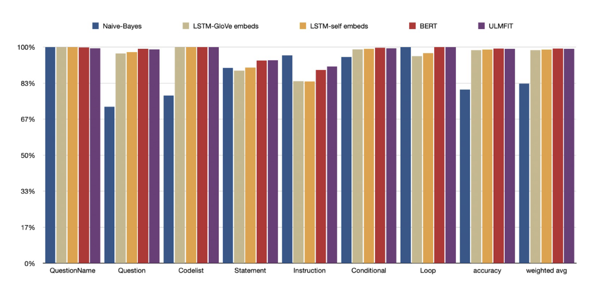
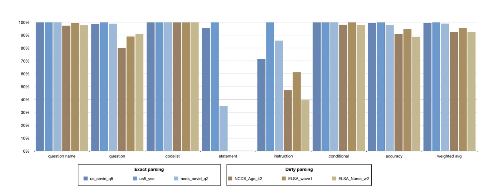
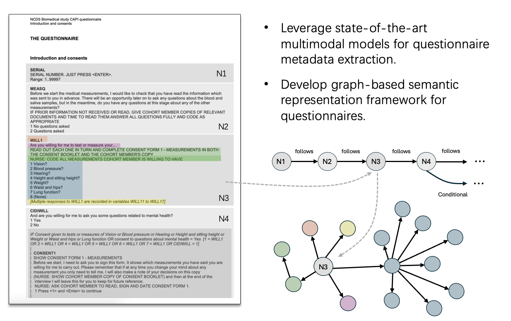
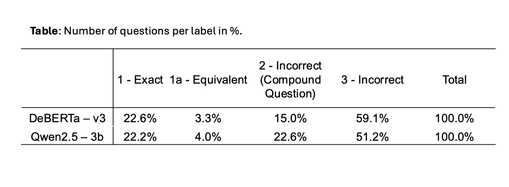
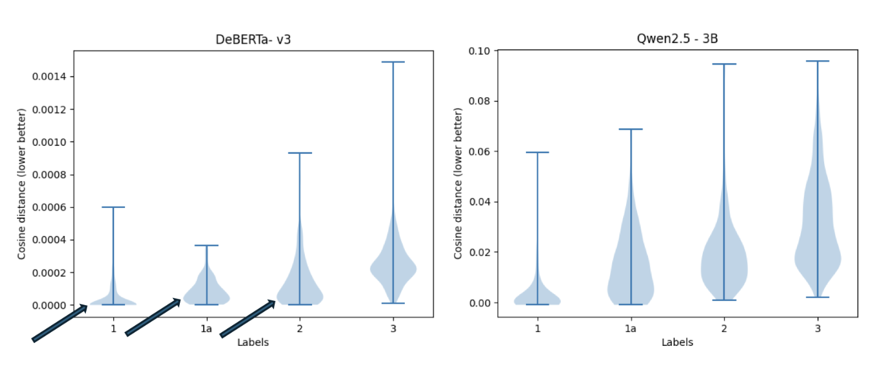

## Challenges

Most information is in documents, mostly PDFs as this is the standard archival format for studies, sometimes as code from survey software. There are thousands of potential questionnaires which could be extracted across the SSH archives.

Questionnaires have an inherent structure, but is not well suited to extraction into the elements we want to process into a metadata schema.

- Classification to a vocabulary
- Questions, response domains, routing
- Conceptual classification

--- 

## Classification to a vocabulary

About 88% correct classification for top level, varies for lower level classifications

::: notes
The reasons vary, sometime  due to small training data size, also some areas are semantically more complex
:::

---

## Questionnaire element classification

::: notes
THe level of classificaiton is very good there are from an ML problem only 7 categories 9cv CV where there are 16/100
:::

---

## Questionnaires unseen classification

::: notes
We have a sufficiently large training dataset to be able to classify to close to what we want to be achieving

The quality of the extraction is the primary driver of poor classification
:::

---

## Questionnaires Knowledge Graph

::: notes
We can mimic the inherent structure of DDI Lifecycle schema through a simplifieed KG. The break-through using this approach is that is fundamentally language neutral.

:::

---

## Conceptual Comparison Evaluation

---

## Conceptual Comparison Distribution

::: notes
This is the most challenging as the differences we want to capture can be very nuanced which traditional ML/NLP methods are not good at.
:::

---

