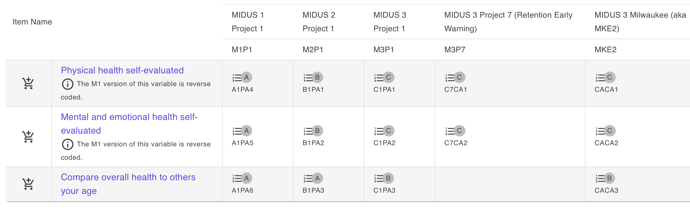
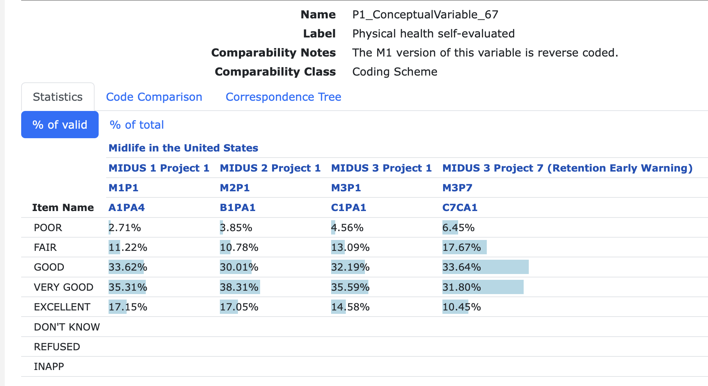
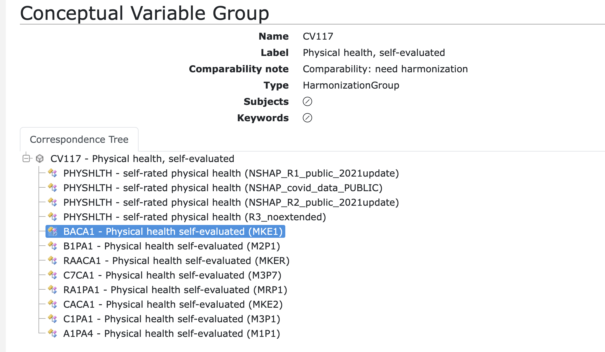

## Discovery Topics

The CLOSER Vocabulary was created in consultation with the PI's on the origonal project.

- Is was developed as a loose interpretation of HASSET (the forerunner of ELSST) and MeSH. As a consequence it has some level of duplication and contradiction.
- We are currently aligning it with ELSST and where there is no suitable vocabulary item, we wil continue to use MeSH or other established CV.
- This will allow us to additionally add clearer definitions and guidance.

---

## CLOSER Concepts

Concepts are captured by questions and measurements.

- In the majority of cases, studies have not explictly captured the concepts alongside the questions deployed in surveys.
- Conceptual harmonisation is the process of bringing together questions which are asking the same concept
- The purpose of such harmonisation is to provide sufficient information to a user to make their own decisions

---

## Concordance of variables

Harmonised Concepts are the basis for presenting like / equivalent variables

---

## Concordance of variables (detail)

Harmonised Concepts allow comparison at the codes and data disctribution.

---

## Concordance across studies

---
