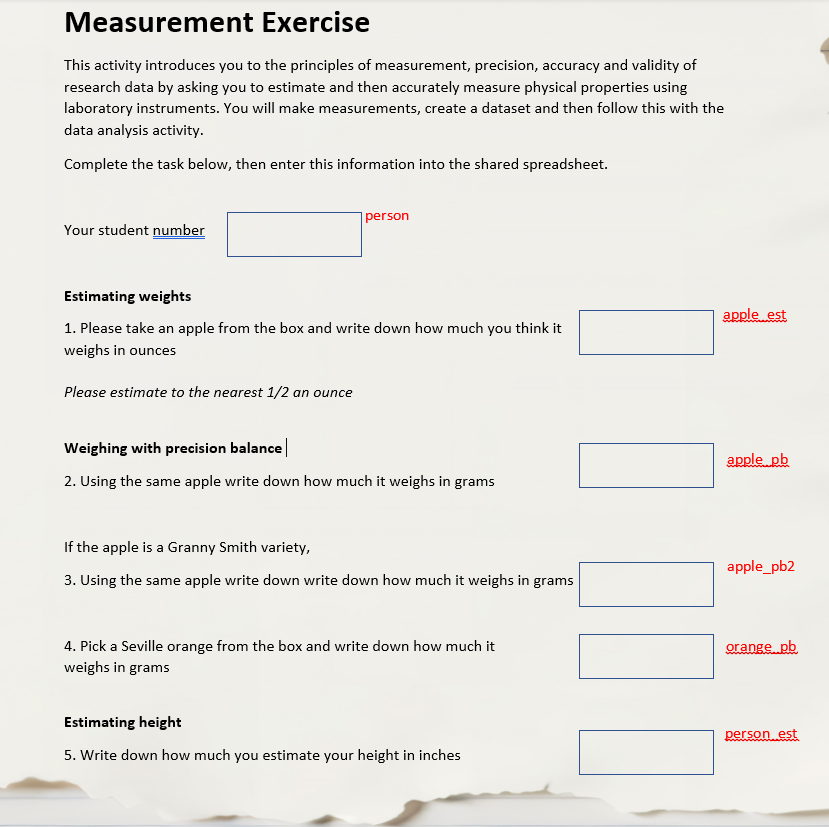

# Unit 1.1 Why create metadata?

## Overview

!!! example ""

    **Unit study time**
    1 hour

    **Intended Learning Outcome**
    By the end of the unit, you will ...

---

## Overall reasons
See https://closer-cohorts.github.io/understanding-metadata/introduction/2.1%20Introduction%20to%20metadata/#benefits-of-metadata for benefits of creating metadata. 

Lets look in more detail how creating metadata could; 
- make data management processes more robust and efficient, 
- enable more accurate, reliable and higher-quality research,
- help your future self (and others) understand and reuse the data (NB: need to demonstrate this in this section (or wider in the foundation), the other points are more self-explanatory and were demonstated in the intro (hopefully)).

## Fictional example
To start, we will look through a hypothetical example dataset, where the instrument of data collection is a questionnaire, and which could have been implemented as part of a student project. The following units will then take a more detailed look into some of the terms highlighted related to creating research metadata.  

### Questionnaire and data

**Look at the example questionnaire and corresponding dataset below.**

 

person |	apple_est |	apple_pb	| apple_pb2 |orange_pb | person_est  
|------------|-------|-------|--------|-----------|-------
1 | 	6.5	| 170	| 165	| |140 
2 | 	7	| 200	| 	|250 | 180
3 | 	18	| 250	| 270	| | 370
4 | 	5	| 125	| 	|190| 100
5 | 	6| 115	| 140	|| 275
6 | 	5	| 180	| 170	|190 | 300

**Exercise**
Imagine this is an exercise given to students so they can practice using scales whilst introducing the ideas of systematic data recording, measurement unit selection, and instrument precision. 

Suppose you are the student who is asked to complete this task abd are now about to start the data analysis. Since you were not involved in the design of the survey you do not know what the intension of the data collection was, so you must determine what the data might be able to tell you and what reserach question you want to answer. 

Think about the following questions

1. What questions could we ask from the data?
2. What variables might you want to compare or not compare?
3. How would you make these decisions?
4. Is there any addtional information which would help you with these decsions?

Now what if you wanted to compare these with other datasets you have? Suppose for example this actvity had been completed in the same way for the past 10 years with different students? Or the same activity was completed by students at a differenet university or with pupils at a nearby school. This will likely give rise to other reserach questions, and potetially more information you would need to make decisions about what is possible to analyse. 

Possible answers
1. How well can students estimate weight? What are the differences in weight of the apples and oranges? How many granny smith apples are there? What are the estimating capabilities of the students? Have Seveille oranges changed in weight over time? On average how much taller are students then pupils? .....
2. Apples with apples, Seville apples with granny smith apples, estiamted weight and estimated height...
3. How the variable was measured, the units of measurement, the sample, what the variable is measuring, what is the measurement being applied to, are there any transormation needed, are there any new variables which need to be created...
4. How many students completed the task, was the same type of balance used for all measurements, when the activity took place, who made the measurements...

## How does metadata help
From skills with have aquired through conducting research, analysiing data, reading research apapers and through training we intutively know what to look for when we read the survey to understnad the variables including the meaning behind the words, context and formatting clues. However if we want to make these decisosns more systemactically, look for other oppotunies for different research questions, ensure quslity and validity, allow others and our future selves to use the data, compare with other or past studies or prepare for computer processing/machine actionaability it is valuable to record this information and to do so in a strucutred, item level way.  

So how do we capture this information and what terms might we use? Some of these have been covered in the intro and will be recapped here, some are new.

First we might start with documenting and understading the survey

Label |	Name |	Question text	| Instruction |Response domain | Numeric Type  | Response Unit  
|------------|-------|-------|--------|-----------|------- |-------
qc_intro_i | 	| Please take an apple from the box and write ...	| Please estimate to the nearest 1/2 ...	| Numeric |Float |Student
qc_1 | 	1	| Using the same apple ...	| | Numeric	| Integer|  Student
qc_2 | 	2	| Using the same down ...	| | Numeric	|Integer | Student 
qc_3 | 	3	| Pick a Seville orange ...	| | Numeric	|Integer| Student 
qc_4 | 	4 | Write down how much ...	| | Numeric	|Integer| Student 
qc_5 | 	5	| Write down how much you ...	| | Numeric	|Integer | Student 

This makes it clear the precison of the measurement taken. This is likely the same as what is contained in the variable and variable metadata (see table below), but if not, this will help you to identify if there has been any data processing. You can also see that the response unit i.e. who completed the question is the same for all, this becomes more useful if we combine the pupil dataset for example. 

Name |	Label |	Unit of measurement	| Representation | Numeric Type  
|------------|-------|-------|--------|----------- 
apple_est | Weight of apple (onz)	| Ounces	| Numeric | Integer
apple_pb | 	Weight of apple (g)	| Grams	| Numeric	| Integer
apple_pb2 | 	Weight of Granny Smith (g)	| Grams	| Numeric | Integer
orange_pb | 	Weight of Seville (g)| Grams	| Numeric	| Integer
person_est | 	Height of Person (inches) | Inches | Numeric	| Integer

So far we have pulled out information from the survey documentation about the question, variable and the type of data. As discussed above, there is addtional information we know and use, to make decisions about the data which we can record in the metadata. For example, what the variable is measuring and what is the measurement being applied to, this can be seen in the table below are the concept and the unit type. 

Name |	Label |	Concept	| Unit Type |Method | Universe 
|------------|-------|-------|--------|-----------|-------
apple_est | Weight of apple (onz)	| weight	| apples | Estimated | All apples
apple_pb | 	Weight of apple (g)	| weight	| apples	| Precison balance | All apples
apple_pb2 | 	Weight of Granny Smith (g)	| apples	| Numeric | Precison balance | Granny Smith apples
orange_pb | 	Weight of Seville (g)| weight	| oranges	| Precison balance | Seville orange
person_est | 	Height of Person (inches) | height | person	| Estiamted | All students

Simailr to the address example given in the 'Introduction to metadata' course (NB this is to be added), we have split each element into a seperate category, we can do this intutively, but documenting this additional metadata in this way, can help our understanding even further and is partiucalry with more complex datasets or data collections. 

Documenting the dimensions of the data in the form of structured metadata is helpful for a human to understand the variables as disucssed above, but it is vital for the metadata to be read by a computer which is not possible from the documentation, as this meaning is not provided.

## How do we defining these 
Below are some simple defintions with the examples for each of the terms, we will expand on these in more detial in the later units (XYZ), including the addtional information and terms which were not covered in the survey documentaiton e.g.  when the activity took place for example, which is particualry useful if comparing across years.

- Question text
- Instruction
- Response domain
- Numeric Type 
- Response Unit  
- Unit of measurement - quantity used for the variable being measured e.g. gramms
- Representation - 
- Concept - What are we measuring e.g. weight
- Unit type - what are we applying this measurement to e.g. apples
- Method - how it was measured e.g. estimated
- Universe - all elements that could possibly be studied within the scope of the study e.g. All apples 

