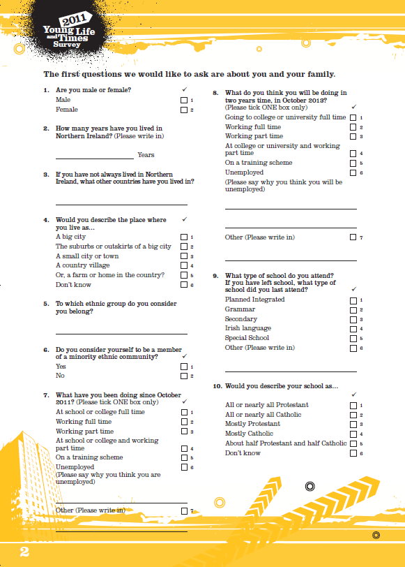

# Unit 1.1 Creating metadata

## Overview

## Overview

!!! example ""

    **Unit study time**
    1 hour

    **Intended Learning Outcome**
    By the end of the unit, you will ...
    - Understand how metadata creation varies across projects depending on scope, size and aims of research
    - Know how to decide what metadata to create for a project
    - Know what software you can use to create and store metadata
    - Identify tools you can use to support metadata creation and implement best practice

---

## Metadata: a recap

Before we look at creating metadata, let's recap what metadata is.

Try answering the following questions in your own words.

???  question "What is metadata?"

    Metadata is a form of structured data documentation that describes data. It gives the context needed to understand data and use it in a meaningful way. It is often referred to as 'data about data'. 

    CODATA descibres [metadata](https://terms.codata.org/rdmt/metadata) as...
    _Data about data. It is data (or information) that defines and describes the characteristics of other data. It is used to improve the understanding and use of the data._

    See unit 2.1 in the Introduction course for more information about metadata.

???  question "What are the features of metadata that differentiate from other forms of documentation?"

    Unlike other forms of free-text documentation, metadata is **machine readable** documentation. To be machine readable, metadata needs to be...
    - Structured 
    - Created and stored in machine readable formats
      - For example: CSV, XML, SAV, XLS, JSON, RDF, SHP

    By being machine readable, metadata is also **machine actionable**. This means we can use machines to organise and utilise the metadata at a larger scale. For example, by being machine actionable, metadata enables use to search and filter on platforms such as data repositories and data catalogues (see unit 2.4 in the Introduction course for more information about the role of metadata in data repositories and data catalogues)

---

## Why create metadata?

??? "You're a researcher about to conduct a study, why might you want to create metadata for your research project?"

    Benefits of creating for you research project...
    - Preserves your data and research
    - Makes data management processes more robust and efficient
    - Enables more accurate, reliable and higher-quality research
    - Helps your future self understand and reuse the data
    - Helps others find, understand, compare, and use your data
    - Increases the visibility of your study to other researchers and organisations
    - Exploits the full potential of your data by supporting cross-study comparisons and secondary research
    
    It may be required by ...
    
    - Institutes in your working contract or project agreements
    - Funding agencies may require metadata to ensure reusability of the data and that a project is meeting FAIR requirements
    - Journals may specify metadata as a condition for publishing
    - Supervisors may require metadaata in order to encourage data citations and enchance researcher reputation
    - By certain projects that include collaborations across agencies and/or organisations</li>

    For more information about the benefits of metadata creation, explore unit 2.1 in the Introduction course.

---

## What metadata should you create?

What metadata should you create?

There is no singular, universally-agreed set of minimum metadata requirements. If you look on the internet, there are a variety of suggestions which are often discipline or resource specific. With extensive metadata, your data is more discoverable, understandable and (re)usable. However, the amount of metadata you create can be a trade-off between time and resource.

Common metadata elements that are frequently used across disciplines and resources describe the who, what, where, when and how of the research. Beyond this, what metadata you create depends on the scope and aims of your research project.  

**To identify what metadata to create, you could consider the following questions ...**

**Sharing data...**

- Do you plan to share your (meta)data or is it for personal reference only?
- If you're planning to share your (meta)data, how widely will you share it? 
- Will the people who interact with your (meta)data have direct contact with you and/or your research team?
  (_note, sharing metadata does not mean the data has to be open_)

=== "Personal use"
  
        If you're not planning to share your data, you will be the main user of your metadata. You can choose metadata elements that will help you manage and preserve your data. The aim of this metadata is to help you conduct your research efficiently and help your future self to understand the data you collected. 

=== "Sharing data"
  
        If you're sharing (meta)data with external people who don't have direct contact with you, your metadata needs to provide a standalone guide to your research and data. In this scenario, metadata has the additional purpose to make your project discoverable and understandable for other people. As people won't be able to contact you easily to clarify confusing or missing information, it's important to make sure your metadata is clear, standardised and comprehensive from the get go. This means you will most likely create more metadata than a project that does not share it's (meta)data. Tools such as metadata standards and controlled vocabularies will also be fundamental in ensuring your metadata is interoperable and (re)usable by yourself and others. 

**Size of project...** 

- What is the scale of your research?
- How much data will you collect? How many different data collection methods will you use?
- How many researchers are working on the project?
- How many people will be creating the metadata?
- What time and resources do you have available?
- What software do you have available to use?

=== "Scale of research"
    If you're working on a large research project that handles a vast amount of data and data collection methods, you will need to create more metadata in order to effectively describe the different types of data and the processes undertaken to collect it. If it's a small research project, you will not need to create as much metadata.

=== "Research team"
    If you are working with a large research team, it is important to establish a clear metadata schema so metadata remains consistent and standardised. If there are multiple people creating, managing and using the metadata, following a schema will ensure the metadata remains consistent and easy to understand. If you are doing a solo research project, you may want to create your own metadata template. However, it can still be useful to follow a metadata schema and use controlled vocabularies in order to make sure your metadata is high quality.

=== "Time and resources"
    If you are working on a large research project, you may have more time and resource to create metadata. You could use specific metadata tools to help create and manage your metadata. If you are doing a small, solo project, you may not have the capacity to create extensive metadata or the access to metadata tools. In this scenario, it's important to prioritise the high value metadata for your research that support the aims of your project.

**One-off or repeated study...** 
- Is it a one-off study or a repeated study?
- If it is a repeated study, have there already been completed studies? What will the upcoming studies cover?

=== "Repeated study"
    If you are creating metadata for a repeated study, it is important to consider what metadata was captured for previous studies, including what schemas or standards were used. You should incoporate previous metadata structures into the metadata creation for any new research in the series in order to make sure your data is interoperable. If it's the first study of a series, it's important to create a robust metadata schema that can be reused for future studies.

=== "One-off study"
    For a one-off study, you have more felxibility about what metadata you create and/or what schema you use as it only needs to serve the aims of that individual project. However, it is still important to consider how you can make your (meta)data interoperable with other research projects in your field.
  

**Metadata standards and schemas...** 
- What common metadata standards are used in your discipline?
- What metadata schemas are widely available?
- Are you planning to deposit your (meta)data in a data repository and/or data catalogue? Do they provide a schema?

    === "Data repositories and catologues schemas"
  
        If you're depositing your (meta)data on data catalogues or data repositories, they may specify what metadata standards and controlled vocabularies to use. They may provide guidance or a metadata template/model, for example...

        - [CESSDA Data Model]( https://www.cessda.eu/Training/Training-Resources/Resource-crd-2592) maps out the required metadata elements needed to deposit a dataset in their data cataologue</ul>li>
        - [UK Data Service](https://ukdataservice.ac.uk/help/deposit-data/prepare-your-data-for-deposit/) gives guidance on how to prepare your metadata and documentation</li>

        Even if you're not planning to deposit your data in a repository or catalogue, they can provide easy-to-acess guidance on what metadata elements to capture and a ready made structure. You can download their metadata templates and models to use as a basis for your metadata creation.

=== "Metadata standards and schemas"

    It is good practice to identify common guidelines around metadata creation in your discipline or for a specific resource you are creating metadata for. This includes identifying widely used metadata standards and/or schemas. These can either provide the strucutre for your metadata creation or inform the approach you will take.

    **Standards for a large research project with shared data**

    Using a metadata schema and standard is essential when you are planning to share your (meta)data and reposit your research in a repository and/or catalogue. Scehmas and standards ensure that your (meta)data is interoperable and can be integrated into larger centralised systems (such as repositories and catalogues). Moreover, if you're working on larger project alongside multiple researchers, schemas and standards are great way to standardise the language you use internally, reducing the risk of confusion and miscommnuication.

    **Using metadata standards for a small research project where data is not shared**
Even if you're not planning to share your (meta)data, metadata standards and schemas will save you time in choosing what metadata elements to capture and what structure to follow. While you don't have to follow the metadata standard or schema in it's entirety, you can use it as a basis for your metadata creation. This will help you organise your metadata in a consistent way. For example, they can also provide definitions for metadata elements, valid inputs for metadata fields and controlled vocabularies so your metadata is clear and consistent. 

    While there are a few cross-discipline standards and schemas, they are mostly discipline specific. If you're planning to use a standard, it's best to identify the one you want to use before you start creating any metadata.

    You can refer to a list of common standards for different disciplines provided by the [University of Texas at Austin here](https://guides.lib.utexas.edu/metadata-basics/domain-standards). You could also use the [metadata standard catalogue](https://rdamsc.bath.ac.uk/search) to search available standards.

    For more information about standards, take a look at unit 2.6 of the Introduction course.

---

## How to create metadata

### What software should you use to create metadata?

There's no singular software you should use to create and manage metadata. You can use any software that generates and supports machine readable formats. You may then export your metadata into text based formats such as PDF, in order to create further documentation but the original file must be **machine readable** (for example, CSV, XML, SAV, XLS, JSON, RDF, SHP).

There are also tools to help make metadata creation and management easier and more efficient. These tools can be particularly useful if you're doing a large project and need to capture extensive metadata. Metadata tools can provide different different functionalities, for example: metadata management, quality review or repository compliance checkers. Depending on your needs, you may want to use more than one tool in your metadata management.

**Metadata tools include...** 
  - Online tools:
    - [Dublin Core Generator](https://nsteffel.github.io/dublin_core_generator/index.html)
  - Free open source software:
    - [Collectica for Excel (standard)](https://www.colectica.com/software/colecticaforexcel/)
    - [OpenRefine](https://openrefine.org/)
  - Commercial software:
    - [Collectica for Excel (advanced packages), questionnaire, designer](https://www.colectica.com/software/)
   
**You can further explore useful metadata tools here ...** 

- DCC provide a [list of metadata tools you can explore](https://www.dcc.ac.uk/guidance/standards/metadata/tools)
- UK Data service provide a [list of tools that can be used to explore and document data](https://ukdataservice.ac.uk/help/exploring-data/uk-data-service-online-tools-for-exploring-data/)

**Where to store metadata**

Depending on how you create your metadata, it can be stored in different locations. This includes ...
- in a spearate file alongside your data
- embedded in the data file

It is important to keep a record of where your metadata is stored so you can easily extract it when necessary.

---

## Creating metadata in the Foundation course

In the Foundation course, we will explore creating metadata for a small research project that has produced tabular data. We will use an excel template to practice creating metadata. 

=== "For tabular data"

    While metadata can be created for any research project and data type, we will be focusing on **metadata for tabular data**. If you have tabular dataset you would like to create metadata for, have it open while completing this course. If you do not regularly work with tabular data, the metadata elements and concepts this course covers are still relevant across disciplines and data types.

=== "Based on a small research project"

    In the Foundation course, we will mainly focus on creating metadata for small scale research projects, with the purpose of personal use or sharing with project collaborators. 

    The metadata elements we explore will also be relevant to those working on large scale projects whose (meta)data will be widely shared, however, for these projects, you will have to take into account further contextual considerations such as discipline specific metadata standards, controlled vocabularies and data repository/catalogue requirements.

=== "Using excel"

    To practice metadata creation in the Foundation unit, we will use an excel metadata template. However, depending on your research project and the tools you chose to use, you may create and manage metadata using different software.

    While Excel is not an machine readable format itself, it can be exported into machina readable formats such as CSV or XML. However, this is only possible if the file follows a clear strucutre, data is clean and it doesn't rely on extra formatting such as colour, merged cells or notes.

You can download the metadata template for the Foundation course here **XXX**

---

## Practice research project

After exploring the metadata elements, you can practice what you've learnt using a small teaching dataset based on the 2011 Young Life and Times Survey delivered by ARK in Northern Ireland. The full dataset has been deposited on the UK Data Service and [can be seen here](https://datacatalogue.ukdataservice.ac.uk/studies/study/7058#details).

**Research practice example**

Imagine you're a social science researcher who has collected data using the survey below.

 

Through conducting this research you create the following dataset.

**Dataset title:** 7058_ylt11 teaching dataset 

respondentID |	rsex |	yearsni	| placeliv |ethncat | memmec  | thisoct | oct2yrs | typeschl	| relschl
|------------|-------|-------|--------|-----------|-------|-------|-------|-------|------
1211 | 	2	| 16	| 2	|[closed data] |[closed data] | 1	| 1	| 2	| 5
1212 | 1	| 16	| 3	|[closed data] |[closed data] | 1	| 1	| 2	| 1
1213 | 1	| 16	| 2	|[closed data] |[closed data] | 1	| 4	| 2	| 3
1214 |  1	| 16	| 5	|[closed data] |[closed data] | 1	| 1	| 3	| 2
1215 |  2	| 16	| 3	|[closed data] |[closed data] | 4	| 4	| 2	| 2
1216	|  1	| 16	| 1	|[closed data] |[closed data] | 1	| 1	| 3	| 2
1217	|  1	| 16	| 2	|[closed data] |[closed data] | 1	| 1	| 2	| 2
1218	| 2	| 16	| 3	|[closed data] |[closed data] | 1 |	4 |	2	| 1
1219	|  2	| 16	| 2	|[closed data] |[closed data] | 1	| 1	| 2	| 2
1220	|  1	| 16	| 2	|[closed data] |[closed data] | 1	| 1	| 2	| 2

ARK. Young Life and Times Survey, 2011 [computer file]. ARK www.ark.ac.uk/ylt [distributor], May 2012

You want to make sure you preserve your data, documenting it clearly for your own records and share documentation where needed to colleagues and collaborators. In the Foundation course we will cover metadata we can create to capture key information about the dataset, variables and data collection method.

If you want to use an alternative teaching dataset, you can find more on the UK Data Service. Expand the box below to explore more.

??? info "List of Open Access Teaching datasets from UKDS"

        - 2021 Census: Public Microdata Teaching Sample (England and Wales): 1% Sample: Open Access
        - British Social Attitudes Survey, 2021, Health Care and Equalities: Open Access Teaching Dataset
        - British Social Attitudes Survey, 2019, Poverty and Welfare: Open Access Teaching Dataset
        - British Social Attitudes Survey, 2017, Environment and Politics: Open Access Teaching Dataset
        - SN 7913 Opinions and Lifestyle Survey, Well-Being Module, April-May 2015: Unrestricted Access Teaching Dataset
        - SN 7912 Quarterly Labour Force Survey, January - March, 2015: Unrestricted Access Teaching Dataset

    You can download one of these datasets to practice metadata creation in the Foundation unit. In order to do this, you can download the dataset as a CSV or Excel file and download the user guide for the data so you have the background information about the dataset.

>[!NOTE]
> Signpost to other training around metadata creation for other forms research data that is not tabular data 

[^1]: https://www.uu.nl/en/research/research-data-management/guides/during-research/metadata-and-documentation

---

## Using the metadata template

**Metadata template structure**

The metadata template is strucutred into five tabs...
1. Dataset metadata (links to unit 2.2)
2. Variable metadata (links to unit 2.3)
3. Question metadata (links to unit 2.4)
4. Codes and categories metadata (links to unit 2.5)

Each tab contains a metadata template to describe different areas of the research project. Each metadata element is linked to a definition and we will cover each one in this course. You can also add more elements to this template if you need to capture further information. If you add metadata elements it is important to define them and specify what information should be captured.

**Tools to support metadata creation in excel** 

Excel has features that can help ensure your metadata is clean, structured and standardised. For example, you can lock cells so that metadata element titles can't be changed or you can control what data can be inputted into certain metadata fields using data validation tools. This helps us to implement contolled vocabularies in our metadata creation (to recap controlled vocabularies, go to unit 2.5 in the Introduction course) and reduces risk of human errors[1].

You can also download tools compatible with excel. For example [Collectica for Excel](https://www.colectica.com/software/colecticaforexcel/) is an add-on for Excel which includes pre-defined metadata elements where you can input your metadata direclty into the dataset file (rather than having a separate Excel file for your metadata).

>[!NOTE]
>SW - once all content is finalised can a link to 'controlled vocabularies' be applied here? (and for other references to previous course content throughout)? 

Throughout the course we'll also be thinking about how to make our metadata sure metadata is consistent, well structured and high quality. We will apply some of the tools we covered in the Introduction course such as controlled vocabularies, metadata standards and schemas.

---

## Further resrouces around creating metadata

- Video explains the tools you can use in excel to implement metadata best practice: https://www.uu.nl/en/research/research-data-management/guides/during-research/metadata-and-documentation

