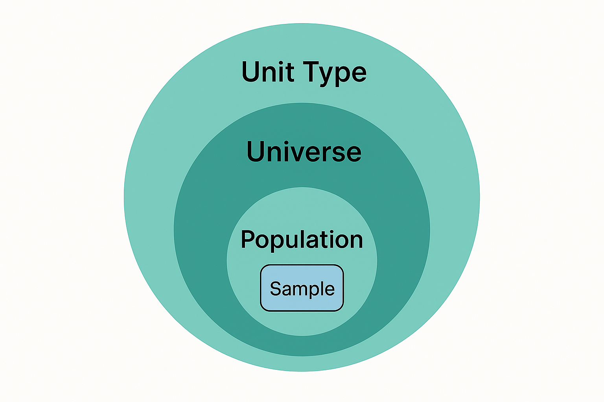

# Unit 2.1 Unit type, Population and Universe

!!! example ""

    **Unit study time**
    2 hours

    **Intended Learning Outcome**
    By the end of the unit, you will ...

----
As demonstrated in unit 1.2, we need to describe what/who the data is about. We can do this by capturing Unit Type, Universe and Population metadata. These were breifly defined in unit 1.2, but we will now have a more detailed look at these, as well how they relate to each other. 

The reason for being explicit about these terms is that they provide a way to understand 
- Who or what is being measured
- The characteristic of whom or what is being measured
- Where and when is was being measured

This can seem self evident, but if we want to validly combine or compare data (or at least know we are NOT comparing the same thing), these are important peices of metadata which allow us to make valid or informed decisions.

### Unit type

The Unit Type is type of entity being measured. It is the unit of observation or analysis in your research based on a single characteristic. It is usually a primary entity, for example: individual, household, establishment, country, dog, apple, maize plant. Variables are always attahced to a unit type, as they are made up of individual units.

The Universe and Population help contextualise the Unit Type further.

### Universe

The universe defines who or what is eligible to be within the study. Sub-universes can define who is eligible to answer a particular question or have a variable measured. 

"A universe consists of all survey elements that qualify for inclusion in the research study. The precise definition of the universe for a particular study is set by the research question, which specifies who or what is of interest." Encyclopedia of Survey Research Methods (https://methods.sagepub.com/ency/edvol/encyclopedia-of-survey-research-methods/chpt/universe).

A universe is broad in nature as it is the set *all* experimental units, from which a sample is to be drawn, although this can vary size e.g. a survey of *all* individuals who have won 1 million dollars or more in the lottery, is a much smaller universe than a survey of the television-viewing habits of *all* adults in the United States. Encyclopedia of Survey Research Methods (https://methods.sagepub.com/ency/edvol/encyclopedia-of-survey-research-

>[!NOTE]
> BO - I'm not sure what this means "as it is the set all experimental units". Does "all" need deleting or replacing to "of"? Remove "Although" from the start of the second sentence as I was expecting something to come after the example.

Understanding the universe can help us decide if the data can be used for our research question or not. For example, if your research question was concerned with wind speeds in urban areas, a study with the universe "All wind speed and direction measurements recorded by research vessels" would not be able to help with your research. It could help with reserach about anemometer biases across research vessels instead, for example. 

>[!NOTE]
> BO - Suggest changing "help us understand" to "help us decide" so we don't repeat "understand". I don't understand this "It could help with instrument bias across research vessels for example.", but that could just be me! 

A Universe contextualises a Unit Type by providing additional characteristics, defining a certain group of people, objects, institutions or events. 

For example...
- All individuals with a university degree
- All adults who could develop hypertension
- All retail business establishments
- All maize plants grown under drought stress

In this way, the Universe is the larger group that the study's conclusions might apply to. 

A Universe may also be defined by what it excludes... 
- All retail business establishments except charity shops
- All dogs without an owner

### Population
The Population contextualises the Universe by specifying the experimental context, location, and timeframe. The Population is the specific subset of the Universe representing the actual group from which data could be collected i.e. the group which the units are drawn for at a specific time and place. The Population is operational and has a practically defined set of elements that are accessible, identifiable, and eligible for sampling.

For example: 
- All individuals with a university degree living in Edinburgh in 1990
- All adults who could develop hypertension attending primary care clinics in Manchester in 2024
- All retail business establishments perating in London as of March 2025.
- All maize plants grown under drought stress in Kenya during the 2024 growing season.

**Example dataset**

| name | label          | Unit Type                 |  Population                                    |Universe                      |
|------|----------------|---------------------------|------------------------------------------------|------------------------------|
| f_n  | first name     | Individual                | Adults aged 18-50 living in the UK as of 2016  | Adults aged 18-50
| s    | sex            | Individual                | Adults aged 18-50 living in the UK as of 2016  | Adults aged 18-50
| h    | height         | Individual                | Adults aged 18-50 living in the UK as of 2016  | Adults aged 18-50
| b_d  | birthdate      | Individual                | Adults aged 18-50 living in the UK as of 2016  | Adults aged 18-50
| m_s  | martial status | Individual                | Adults aged 18-50 living in the UK as of 2016  | Adults aged 18-50

As these variables are from a single data collection point, the Unit Type, Population and Universe will be the same. If your whole dataset only collects data from a single source, then it is more efficient to capture the Unit Type, Population and Universe metadata at the dataset level.

>[!NOTE]
>HM is this a real dataset?

>JJ I don't think it is helpful to think about this section using a dataset, its a data collection "concept" - IMHO, we should remove this and jump straight into "worked examples"

> BO - Agree with JJ

>HM - Ive deleted the example - looks like it was added to cover this point "However, if your dataset compiled data from different sources and/or on different levels, you would need to specify the different Unit Type, Population and Universe for each variable." which I've deleted too for now. If I understand correctly - if we want to combine or harmonise data from different sources - we might have different universes/populations for each variable? So if the universe/population was at the dataset level how would we be able to show this? If this is correct, is this important to include a sentence about this - or too complex for this level?

### What are the benefits of including Unit Type, Universe and Population metadata?

- *Improves transparency and interpretability*. Clarifies what or who the data is about, as well as when. This gives us a clearer idea of the subject of the data, reduces ambiguity, and highlights limitations of the data.

- *Supports cross‑study comparison and data integration*. As Unit Type and Universe are not defined by time or geography, you can more easily identify variables to compare with other similar variables from different datasets conducted at a different time and/or place. This encourages cross-study comparison, fuelling the potential for new research investigations from existing data.

- *Provides the foundation for assessing representativeness*. The population defines the scope and representativeness of your data, and so is critical for understanding any sampling bias and for statistical inference. You cannot aswer the quesiton 'Does your sample reflect the characteristics of the population?' if you don't know the population. Population is the benchmark against which representativeness is judged.

- *Enables the detection of sampling bias.* You cannot detect sampling bias, unless the population is known. Any bias can only be evaluated by comparing sample vs population.

-  *Allows valid statistical inference.* When making inferences, you need to know the boundaries of the population so you can ask questions about that population and not beyond it. In the example above, you would not be able to generalise the data to infer crops in Wales.

>[!NOTE]
>BO - I feel like the first three sentences above feel a bit disconnected - it's not clear to me how they follow on from one another. Maybe the representativeness and statistical inference points within this paragaph would be easier to follow if they were split out. "The population defines the scope and representativeness of your data" is nice and succinct and could potentially fit better in the previous section when defining population. Here you could instead say "Population metadata is critical for understanding...". 

>BO - a minor thing to check when the content is finalised, sometimes "population" "universe" "unit type" are captialised and sometimes not. Pick one and check/change throughout.

>HM I've tunred them into bullets as might be easier to think of that way - does this help?

### Summary 
 

- Unit Type: The entity observed (e.g. plant, soil sample, individual).
- Universe: Is conceptual. It is the conceptual total—everything that fits the definition, whether or not it can be fully identified or listed (e.g. maize plants under drought stress, individual with degree). 
- Population: Is operational. It practically defines a set of elements from the universe that are accessible, identifiable, and eligible for sampling. It adds time and geography and sometimes exeperimental context (e.g. maize plants sampled in Kenya in 2024).
- Sample: The actual subset collected within that population, based on the sampling framework. It is a collection of units (e.g. Plant ID 014 in Field A, Plant ID 015 in Field A and Plant ID 016 in Field A etc.) 
- Unit: The actual individual entity in the dataset. The smallest element you observe (e.g. Plant ID 014 in Field A or Jane Smith). These could commonly be cases in a survey study. 

 
DDI Training Group. (2024, February 14). Foundational DDI Metadata: Unit, Unit Type, Universe, and Population. Zenodo. https://doi.org/10.5281/zenodo.10659410

### Worked Examples

>[!NOTE]
>HM - not sure what this exercise is

>JJ - I think unverse etc makes more sense as comparison **between** datasets perhaps it is a worked example of that, rather than an exercise

> HM I've corrected the examples and added context/explantions, but I'm not sure these are the best examples, the universes look more like sub-universes to me (i.e. from filtering), it would be good to have some other opinons on this JJ and BO?

The following examples show Unit Type, Population and Universe for different data collections, and how we can use this metadata to; understand what the data is about,
determine which datasets can be meaningfully compared, and identify which datasets are suitable for answering a particular research question.

#### Measuring Income at a different time 
Here, the unit type and universe are identical, so both datasets measured the same thing. The only difference is time, meaning the datasets can be used to study change over time.

| Type        | Dataset 1                      | Dataset 2                         | 
|-------------|--------------------------------|-----------------------------------|
| Unit Type   | Individual | Individual |
| Universe    | All persons with income of > £1 million per year | All persons with income of > £1 million per year |
| Population  |All persons with income of > £1 million per year in England in 2021  | All persons with income of > £1 million per year in England in 2011 |

#### Measuring Income at a different geographical area
In this example, time and universe remain constant, but geography changes. This allows comparisons across regions.
| Type        | Dataset 1                      | Dataset 2                         | 
|-------------|--------------------------------|-----------------------------------|
| Unit Type   | Individual | Individual |
| Universe    | All persons with income of > £1 million per year | All persons with income of > £1 million per year |
| Population  | All persons with income of > £1 million per year in England in 2021  |  All persons with income of > £1 million per year in Wales in 2021 |

#### Measuring Income for different universes
Here, the Population is the same, but the Universe changes. This alters the conceptual focus of the data collection.

| Type        | Example 1                      | Example 2                         | 
|-------------|--------------------------------|-----------------------------------|
| Unit Type   | Individual | Individual |
| Universe    | All persons over 67 years of age | All persons between 16-67 years of age |
| Population  | All persons over 67 years of age in England in 2021  | All persons between 16-67 years of age in England in 2021 |

