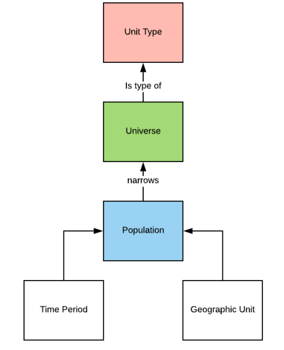

## Metadata for tabular data 

Now we have looked at metadata to describe a research project as a whole, let's take a look at metadata for data (also referred to as low level metadata). This metadata describes what type of data that is included in a dataset. We will be look at quantitative, tabular data.

In tabular data, we present data in columns and rows and collect data for different variables. In this unit, we will look at how to create metadata about variables.

First, we need to be able to identify what a variable is. 
Take a look at the tabular dataset. What are the variables in this dataset?

| f_n  | h   | b_d        | s    | m_s  | 
|------|-----|------------|------|------|
| John | 178 | 1998-09-02 | 1    | 3
| Gill | 200 | 1979-06-12 | 2    | 2
| Alice| 182 | 1986-12-24 | 2    | 1
| Fred | 168 | 2001-05-16 | 3    | 2
| Laura| 156 | 2011-03-05 | 2    | 1

<b>The variables are...</b>

- f_n
- h
- b_d
- m_s

Simply put, variables are the header of the columns in tabular data.

---
## Defining variables

We use the term variable all the time, but what is it's definition?

>Variable is a characteristic of a unit being observed. A variable might be the answer of a question, have an administrative source, or be derived from other variables.* 

Examples of a variable could be ...
- Height
- Weight
- Age

In research, you collect data about this variable, called variable data. This is what makes up our datasets.
- Height: 1.73m, 1.45m, 1.67m
- Weight: 57kg, 69kg, 71kg
- Age: 29 years, 37 years, 64 years

You can collect variable data direct from research activity e.g. measuring someone with a tape measure, weighing someone with scales, asking someone to state their age in a survey. You can also derive data from other variable data. For example, you derive someone's BMI from the variable data collected for height, weight and age. This would make BMI a **derived variable**, as it is calculated through other variables.

:::
*Definition: https://rdf-vocabulary.ddialliance.org/discovery.html#variable-and-variable-definition
UK Data Service: definition of a variable - A variable is an attribute that describes a person, place, thing, or idea. The value of the variable can "vary" from one entity to another.
Note: CoData doesn't include definition for variable - will be in new terminology bank
:::

---
## Why create variable metadata?

Thinking back to the tabular dataset example, if you were presented with the example dataset, would you have the information required to understand the dataset and assess whether it is relevant to you?

If you didn't have access to the dataset but you wanted to assess if it could potentially be of interest to you before you pay to access it, would receiving the following information give you enough information to decide?

>The dataset contains the variables:
>- f_n
>- h
>- b_d
>- m_s

Similarly, imagine you are coming back to a dataset you created 10 years ago. Would remember what the variabels f_n; h; b_d; m_s mean?

What information would you need in order to be able to understand the dataset and its variables?

<b> Variable metadata</b>

In order to understand the variables, you will probably need information for the following questions...

- What do the abbreviations mean?
- What type of data did you collect for the variable?
- How was the variable measured?
- How was the variable data collected?
- What was the unit of study?
- How much data was collected for each data?
- What are the valid inputs for the variable data?

Variable metadata provides the information to answer these questions. 

\------

If we didn't have information about the variables, we would have to undertake time consuming processes decode what variables mean and what type of data they collected. If it is our own data, this may include working back through legacy files to remember how the research was conducted. If it is other people's data or an external person is trying to understand our datasets, they would have to contact the data creator in order to clarify what the variables mean and the type of data. If trustworthy information about the variables cannot be located, that would hinder the reliability of the dataset and make it less likely to be re-used.

What are the benefits of variable metadata?

<b> Benefits of variable metadata</b>

**Personal benefit**
By having a clear record of what variable abbreviations mean and the type of data collected, metadata allows you to manage your data during the research process. It also helps for your future self when you return to your data, allowing you to quickly understand a dataset and potentially re-use it. 

**Re-usability of data**
With variable metadata, people get a broader and more comprehensive picture of what data exists in a dataset. So even if a variable is not a focal point of the original research project or publication, another person may find this variable and re-use the variable data in their secondary research. Moreover, by knowing what variables a research project contains, researchers may be able to cross-study comparisons that they did not know would be possible if they were only working from high level metadata.

If you're sharing your (meta)data, variable metadata can also help the **discoverability of data**
Variable metadata is sometimes used by data catalogues as part of their search and filter functions. For example ...
- [UK Data Service variable search tool](https://discover.ukdataservice.ac.uk/variables)
- [ICSPR](https://www.icpsr.umich.edu/web/pages/ICPSR/ssvd/)
- [CLOSER variable search tool](https://discovery.closer.ac.uk/search/variables)

They also provide information about the variables directly on these sites, allowning people to interact with variable metadata in a straightforward way.

---

## What metadata should you create?

Thinking back to the type of information we would need to understand the variable and the dataset, what metadata elements could we capture to provide 

**What do the abbreviations mean?**

Metadata elements

  
  - Variable name
  - Variable label
  - Variable description
    

\------

**What type of data did you collect for the variable?**

Metadata elements

  
  - Value representation
  - Data type
  - Valid inputs
    

\------

**How was the variable measured?**

Metadata elements

  
  - Unit of measurement
  - Derived Y/N
  - Data provenance
  - Measurement provenance
  - Source reference
    

\------

  

**What was the unit of study?**

Metadata elements

  
  - Unit type
  - Population
  - Universe
    

\------

**How much data was collected for each data?**

Metadata elements

  
  - Number of cases
  - Missing value code
  - Valid responses
  - Invalid responses
    

\------

In the rest of this unit, we shall go through these metadata elements and look at how we can capture information for each. As we go through each metadata element, you can practice capturing variable metadata in the Variable Metadata tab of the Metadata Template excel. You can use your own dataset or the example dataset in the unit. 

---

## Variable name, label and description

First of all, you need to describe and define the variable itslef. In order to do this, we will start with the metadata elements...
- Variable name
- Variable label
- Variable description

**Variable name** 
This is the term used for the variable in your dataset e.g. f_n, h, b_d, m_s

**Variable label** 
A short, clear label describing the variable, explaining any abbreviations in the variable name e.g. f_n = first name

**Variable description** 
A longer explanation of what the variable measures. Sometimes this includes how the variable was collected and what measurement was used. Add enough detail so that someone new to your research could understand.

For our example dataset above, we could create this variable metadata.

| Name | Label          | Description          |
|------|----------------|----------------------|
| f_n  | first name     | Full legal first name, no nicknames
| s    | sex            | Self-reported biological sex
| h    | height         | Height calculated to nearest cm
| b_d  | birthdate      | Date of birth yyyy/mm/dd
| m_s  | martial status | Self-reported marital status

---

## Value representation and data type

Next, you need to describe the type of data collected for the variable.

**Value representation** 
Value representation describes the structure and the content of the data variable for example: text, numeric, date, code, scale, geographic, image, symbol

**Data type** 
Data type provides further information about this data. 

For example, we've already described variable 'height' is numeric in the value representation. However, what else could we specify about the numeric data? 
- It will only contain **positive** numbers as you can't have a minus number for height
- In this dataset, the height variable data only contains **whole numbers**, not decimals
- In which case, we can call describe the data type to be **positive integer**. However, if the data did contain decimal points, for example 178.5cm we may describe the data type for height as float.

For 'date', the data is written in [ISO 8601 format](https://www.iso.org/iso-8601-date-and-time-format.html#:~:text=Therefore%2C%20the%20order%20of%20the,27%2018%3A00%3A00.000.) so can use the data type column to specify this.

For the variables 'sex' and 'marital status' the code list is expressed as numbers in the dataset. So we could use the data type column to specify that it the code is expressed numerically. Alternatively, if the dataset included the words 'male', 'female', 'other', 'not specified' (rather than 1, 2, 3, 4) for the sex variable metadata, we could put text in the data type as the codes are written out.

| Name | Label          | Description                         | Value representation | Data type   |
|------|----------------|-------------------------------------|----------------------|-------------|
| f_n  | first name     | Full legal first name, no nicknames | text                 | string
| s    | sex            | Self-reported biological sex        | code list            | numeric                        
| h    | height         | Height calculated to nearest cm     | numeric              | postive integer                       
| b_d  | birthdate      | Date of birth yyyy/mm/dd            | date                 | [ISO 8601](https://www.iso.org/iso-8601-date-and-time-format.html#:~:text=Therefore%2C%20the%20order%20of%20the,27%2018%3A00%3A00.000.)                          
| m_s  | martial status | Self-reported marital status        | code list            | numeric                          

>[!NOTE]
> KR Please could you let me know whether the data type seems correct here or if you would describe them in a different way. Thanks.

---

## Unit of measurement, valid range and missing values

Once you have describe the data as it appears in the dataset, it's important to include extra contextual information so you can interpret that data further and gain meaningful information.

For example, for height, we know the  data is numeric. However, we don't know if these numbers indicate metres, centimeters or millimeters. We need information around the the unit of measurement, what valid ranges are accepted, and identify the code for missing values.

**Unit of measurement** 
The unit of measurement is simply the unit used to express the quantity or magnitude of the object you're measuring. 
For the example dataset...
- The unit of measurement for the variable **height in this example is centimetres**. However, unit of measurement will not be applicable to some variables such as first name or marital status. In these cases, you can put N/A.

In order for research data to be suitable for analysis, it is best practice to use _one_ unit of measurement per concept. For example, the variable data for height shouldn't be recorded as 1m 78cm as this would mix two units of measurement, metre and centimetres. So even it the data was collected in this way, we should translate the data of height in one measurement unit, e.g. 1.78m _or_ 178 cm, keeping the one-to-one relationship between concept (height) and measure (m _or_ cm).

**Valid range** 
Valid range outlines the allowed values for this metadata element. 
For the example dataset ... 
- For height, you may want to set permitted values to be between 55 - 220 (depending on the population you are collecting data from).
- If the example dataset only collected data from living adults, you could set a valid range for birthdate as 1910-2007.
- For text, you may want to specify how many characters are permitted and set a valid range of 1-50 characters.
- For variables using codelists, sex and marital status, you could include a reference to the codelist you are using so people can reference the permissable codes and their meanings (we will look more indepth into codelist metadata in unit 2.4)

| name | label          |  Value representation | Data type       | Unit of measurement | Valid range   |
|------|----------------|-----------------------|-----------------|---------------------|---------------|
| f_n  | first name     | text                  | string          | N/A                 | 1-50 characters      
| s    | sex            | code list             | numeric         | N/A                 | CLsx_01                           
| h    | height         | numeric               | postive integer | cm                  | 55 - 220                       
| b_d  | birthdate      | date                  | [ISO 8601](https://www.iso.org/iso-8601-date-and-time-format.html#:~:text=Therefore%2C%20the%20order%20of%20the,27%2018%3A00%3A00.000.)  | N/A                 | 1910/01/01-2007/01/01                          
| m_s  | martial status | code list             | numeric         | N/A                 | CLms_01                                         

---

## Unit type, Population and Universe

Now we've described what the variable is and the data it contains, we need to describe what/who the data is about.

**Unit type** 
The Unit Type is the unit of observation or analysis in your research based on a single characteristic with no specification of time and geography. It is usually a primary entity, for example: individual, household, establishment, country, dog, apple

For the example dataset, we are collecting the name, height, birthdate, sex, martial status of an <mark>individual</mark>

**Universe** 
A Universe contextualises a Unit Type by providing additional delimiting characteristics, defining a certain class of entity, people, objects or events. 

For example... 
- Individuals with a university degree
- Individuals with an employment contract for a tech company
- Retail business establishments

In this way, the Universe is the larger group that the study's conclusions might apply to, based on the sample. However, while the Universe details further characteristics, it does not contextualise the Unit Type by georgaphy or time. 

For the example dataset, if the data was only collected for adults aged 18-50, the Universe would be individuals aged 18-50. This means we could compare Universe metadata from studies conducted at different times and/or locations so you can compare trends observed for adults aged 18-30.

A Universe may also be defined by what it excludes... 
- People except those with a university degree
- Dogs without an owner

**Population** 
The Population contextualises the Unit Type further by specifying time and geography. It refers to the specific group of individuals or entities from which the data is drawn. 

So if the Unit Type is individuals and the **Universe** is individuals aged 18-50, the **Population** could be individuals aged 18-30 **as of 2016** and **living in the UK**. So while Unit Type and Universe applies to all time periods and locations, Population specifies these details.

For example: 
- Households <mark>in urban areas in 2007</mark>
- All <mark>employees in the tech industry in 2012</mark>
- Dogs <mark>in Woof Re-Home Centre during 2016 - 2020</mark>

In the example dataset above, we would put the following ...

| name | label          | Unit Type                 |  Population                                    |Universe                      |
|------|----------------|---------------------------|------------------------------------------------|------------------------------|
| f_n  | first name     | Individual                | Adults aged 18-50 living in the UK as of 2016  | Adults aged 18-50
| s    | sex            | Individual                | Adults aged 18-50 living in the UK as of 2016  | Adults aged 18-50
| h    | height         | Individual                | Adults aged 18-50 living in the UK as of 2016  | Adults aged 18-50
| b_d  | birthdate      | Individual                | Adults aged 18-50 living in the UK as of 2016  | Adults aged 18-50
| m_s  | martial status | Individual                | Adults aged 18-50 living in the UK as of 2016  | Adults aged 18-50

As these variables are from a single data collection point, the Unit Type, Population and Universe will be the same. If your whole dataset only collects data from a single data collection point, then it may be more efficient to label the Unit Type, Population and Universe metadata at the dataset level so you don't have to repeat the metadata.

However, if your dataset compiled data from different sources and/or on different levels, you would need to specify the different Unit Type, Population and Universe for each variable.

For example, let's look at this example dataset collecting data on crop health. 

The data was collected in 2024 in England.

| Sample ID | Crop   | Date Collected | Field ID | NDVI Score | Disease Present | Farm ID | Farm Size (ha) | Region    | Avg. Rainfall (mm) | Avg. Temp (°C) |
| --------- | ------ | -------------- | ---------| ----------- | -------------- | --------|-------------|---------------| -------------------| -------------- 
| S001      | Wheat  | 2025-06-12     | F-EM01   | 0.78        | No             | Farm01  | 120         | East midlands | 55.2               | 19.1           |
| S002      | Barley | 2025-06-13     | F-NE07   | 0.65        | Yes            | Farm02  | 95          | North east    | 67.4               | 17.8           |
| S003      | Corn   | 2025-06-14     | F-SE03   | 0.82        | No             | Farm03  | 180         | South west    | 48.6               | 22.3           |
| S004      | Wheat  | 2025-06-15     | F-WM04   | 0.73        | No             | Farm01  | 120         | West midlands | 55.2               | 19.1           |

What are the different unit type that 

| Sample ID     | Unit type   | Universe  | Population | 
| ------------- | ----------- | --------- | ---------- 
| Sample ID     | Crop        |           | 
| Crop          | Crop        |           | 
| Date collected  | Crop       |           | 
| Field ID        | Field      |           | 
| NVDI score      | Crop       |           | 
| Disease present | Crop       |           | 
| Farm ID         | Farm       |           | 
| Farm size (ha)  | Farm       |           | 
| Region          | Region     |           | 
| Avg. Rainfall (mm) | Region  |           | 
| Avg. Temp (°C)  |Region      |           | 

Unit Type: Individual crop field sample (specific crop in a specific field at a specific time)

Population: All crop health samples collected from wheat, corn, and barley fields on selected farms during the 2025 growing season

Universe: All possible crop health observations for wheat, corn, and barley fields globally, across all years

>[!NOTE]
> JJ the above example doesnt really make sense in a single data collection, so I would remove  
> KR If that is the case, should Unit Type, Population and Universe only be recorded for Dataset level metadata and above? 
> KR Does the additional example make it more clear? // is it correct?

>[!NOTE]
>KR referencing DDI unit type, population and universe definitions from DDI 

---

## Unit type, Population and Universe

Let's try another example.

Take a look at the study [Understanding Society]

The study captures important information every year about the social and economic circumstances, attitudes, behaviours and health of people living in UK households. It covered approx. 32,000 UK households.

As part of the surveys, participants are ask about their employment. 

If respondents stated they were employed or self-employed, they are asked the following questions...

How were your hours set during January and February?
How were you paid during January and February 2020?
What was your usual take-home pay/earnings during January and February 2020?
During January and February how often did you work at home?[^1]

However if respondents stated they were not in work and have been unemployed for this time period, they did not have to ask answer these questions.

Considering the above, what do you think the Unit Type, Population and Universe metadata would be for the variable data collected by these questions?

Unit type
- Households

Population 
- Probability sample of approx. 32,000 households in Great Britain in 2009-10

Universe 
- People in work
- People not in work 

>[!NOTE]
> Universe not having a time & geography is slightly confusing, because it is a universe WITHIN a population, so it inherits 
> JJ A good example using Undestanding Society could be 
> Unit Type == Households 
> Population == "probability sample of approx. 24,000 households in Great Britain in 2009-10" 
> Universe == "questions asked to those in work". 
> This means that you can compare between different populations and time by the characteristics defined by the unvierse e.g. Those in work in USOC with those in work in the Census

>KR referencing DDI unit type, population and universe definitions from DDI 

[^1]: Questions taken from the 2020 survey: ['COVID-19 Wave 3 Questionnaire'](https://discovery.closer.ac.uk/item/uk.iser.ukhls/9916faf8-db88-42f9-b666-f4761b293179/1)

---

## Variable provenance 

Other important information to capture about a variable is it's provenance. The provenance describes where the variable data came from, how it was collected and how it may have changed over time.

**Derived (Y/N)**
Here you can specify whether the variable is derived from other variables or recorded directly from data collection processes (as we discussed in the begining of the unit).

**Measurement provenance**

Data provenance

Source reference

| name | label          | Derived             | Data provenance          | Measurement provenance       |Source reference        |
|------|----------------|---------------------|--------------------------|------------------------------|------------------------|
| f_n  | first name     |                     |                          |                              |                        |
| s    | sex            |                     |                          |                              |                        |
| h    | height         |                     |                          |                              |                        |
| b_d  | birthdate      |                     |                          |                              |                        |
| m_s  | martial status |                     |                          |                              |                        |

---
## Variable statistics 

Once we've described the type of data and its parameters, we can then give an overview about how the variable data appears in this dataset.

**Missing value code** 
It is useful to include the missing value code for a variable so you can identify where there are gaps in the data. 

**Number of cases** 
By stating the number of cases for variable (counting the cases excluding the missing value code0, you are able to capture the size of the dataset.

**Invalid cases**  
As the valid permissable range for a variable was outlined earlier, you can identify a number of invalid cases. The invalid cases should also include cases that contain other errors that mean the data should not be considered when drawing conclusions. From that you can calculate the number of invalid responses.

**Valid cases** 
Through subtracting invalid cases from the number of cases, you can calculate the the number of valid cases. This is can help us understand how effective a research process was and whether further investigation into how data was collected is needed. For example, if there is a comparatively high number of Invalid Cases to Valid Cases, we will probably have to look into the trustworthiness of the data before we draw conclusions. Equally, it can point to areas that you could potentially improve you data collection processes.

| Name | Label          | Missing value code        |Number of cases           |  Invalid cases                | Valid cases                |
|------|----------------|---------------------------|--------------------------|-------------------------------|-----------------------------|
| f_n  | first name     |  -999                     |                          |
| s    | sex            |  -999                     |                          |    
| h    | height         |  -999                     |                          |
| b_d  | birthdate      |  -999                     |                          |
| m_s  | martial status |  -999                     |                          |

>[!NOTE]
> To double check, you do not calculate missing value codes in your number of cases total?

---

## How can we ensure variable metadata is high quality?

Thinking back to the Introduction unit, how can we make sure variable metadata is high quality.

For example, you could use DDI Controlled Vocabularies for the following metadata elements...
- Data type
- Value representation

---
## How to collect variable metadata

Like the metadata template, can collect metadata in an excel, putting the metadata elements as columns and listing your variables in the first row. While we are covering some common variable metadata elements, you can add always add more depending on what you want to describe in your dataset. If you add elements it is important you define what information the metadata element records, the format of the data it records and its valid inputs. You can do this by pointing to a metadata standards' definition of a metadata element, or create a clear record of it youself.

If you're using excel you can use tools such as data validation drop down lists to implement controlled vocabularies where necessary, so your metadata is clean and of high quality.

You may also want to use tools to aid your metadata creation and management. For example [Collectica for Excel](https://www.colectica.com/software/colecticaforexcel/) is an add-on for excel and includes pre-defined metadata elements where you can input your metadata direclty into the dataset file (rather than having a separate excel file for your metadata).

---

## Practice creating variable metadata

Going back to the excel metadata template, click onto the variable sheet.
Using this template create metadata for the variables below.

**ADD EXAMPLE VARIABLES HERE**

<b>Answer</b>

ADD VARIABLE METADATA HERE SO PEOPLE CAN CHECK THEIR WORK

>[!NOTE]
> Should we leave the practice activity until the end so participants can see the overview of variable metadata before creating their own with the example variables? Or should we divide this into each section e.g. participants are given these variables from the start and we ask them to create it once we've done the group example.

---

## Create variable metadata for your research 

Further guidance on creating variable metadata:
- ADD resources here.

   
