## Intended Learning Outcome 
- Understand the characteristics of data
- Understand the purpose of data in research

---

## Outline 
- What is data?
- Data in research

---

## What is data?
We use the term data all the time, but what do we actually mean?

---
## Data is everywhere ...

We constantly engage with data in our everyday lives. Take your weather app for example.

>[!NOTE]
>**BO - not sure about "consume data". Suggest amending to "interact with/engage with/encounter data"** <p></p>
>:large_blue_diamond: KR, have updated, mark as complete?

What data is available when we check the weather?

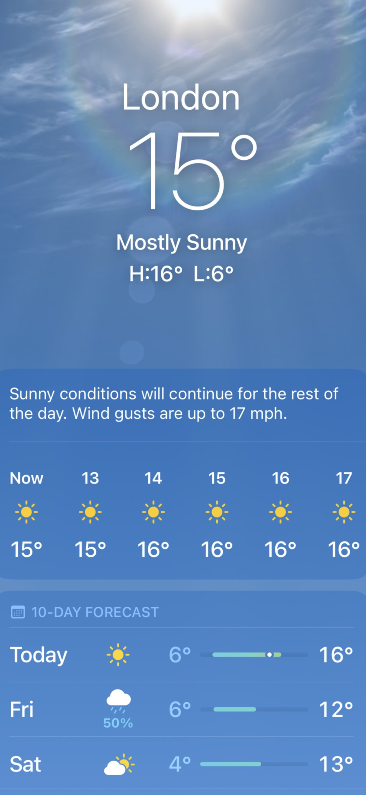

---

## Weather data ...

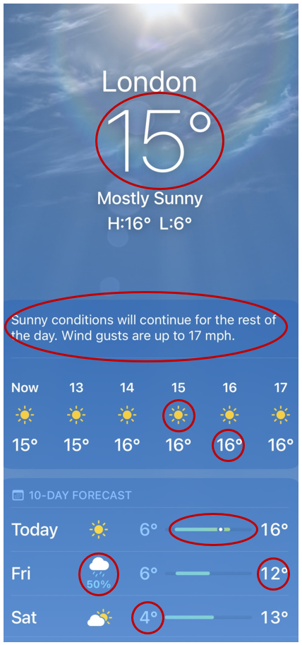 


The app gives us data on weather conditions for a specified time and location, such as:
- Temperature
- Precipitation
- Cloud coverage

>[!NOTE]
>**Should geography and time be included in this list as data items displayed in this image?** <br>
>**BO - I don't think it's wrong to include it, but you've said the app gives us data on weather conditions so I think it's fine to just list the data related to weather conditions**<br>
>:large_blue_diamond: KR Updated to just circle weather conditions. Wondering, is it too far to circle the imagery in the background of the app? Technically it reflects conditions outside? But maybe that's considered more formatting than data?

---

## Representation of data

Data can be represented in many different ways.

For example, as:
  - Numbers e.g. 16*
  - Text e.g. 'Sunny conditions will continue all day.'
  - Symbols e.g. ☀️
  - Date and time e.g. 04/05/2025, 14:00

By interpreting these representations, we gain meaning from the data. In this example, we interpret meaning for different weather conditions.

>[!NOTE]
>**BO - can we change "weather concepts" to "weather conditions"? We haven't mentioned the idea of concepts yet** <br>
>:large_blue_diamond: KR, updated. Mark as complete?

---

## The characteristics of data

While data can come in lots of different representations, all data has the same underlying purpose and characteristcs.

What are the characteristics of data that differentiates from them being *just* numbers, words or symbols?

::: notes 
Trainer: Ask the participants to take 5 minutes to discuss and come up with some thoughts. Collect responses from participants.
:::

---

## Characteristics of data 

What are the core characteristics of data that differentiate it from general information?

- Data relates to a **concept** that we want to know more about
  - e.g. 16* &rarr; temperature, London &rarr; geography, 14:00 &rarr; time
- Data is **collected, observed or measured** by an individual or an organisation so we can gather information about the concept
  - e.g. a meteorologist or the Met Office will collect data about the weather in different locations and different times
    
>[!NOTE]
>**Is last bullet point correct? This the characteristic of clean data but can it be the characteristic fo all data**<br>
>**BO - can the last bullet point be rephrased for clarity? "Within a single inquiry" isn't super intuitive to me, so I think the audience will feel the same. Even "concept of inquiry" is a bit jargon-y. Can it be rephrased and simplified?** <br>
> :large_blue_diamond: KR good point, I've put the bullet point below to archive for now.<br>
    - The data type is consistent within a single inquiry
        - e.g. all numbers, all text, all symbols

---

## Generic definition of data

Data has different definitions in different contexts and disciplines.

Wikipedia offers a broad understanding of data as ...<br>
>"...a collection of discrete or continuous *values* that convey *information* describing the *quantity, quality, fact, statistics*, or other basic units of meaning, or sequences of *symbols* that may be further interpreted *formally*"[^1]

Taking a more business focus, IBM defines data as ...<br>
>'...a collection of facts, numbers, words, observations or other useful information. Through data processing and data analysis, organizations transform raw data points into valuable insights that improve decision-making and drive better business outcomes.'[^2]

Looking at data from a research perspective, CODATA conceives data as...<br>
>'Facts, measurements, recordings, records, or observations about the world, collected by researchers, that are yet to be processed/interpreted/analysed. Data may be in any format or medium taking the form of writings, notes, numbers, symbols, text, images, films, video, sound recordings, pictorial reproductions, drawings, designs or other graphical representations, procedural manuals, forms, diagrams, work flow charts, equipment descriptions, data files, data processing algorithms, or statistical records.'[^3]

[^1]: ['Data', Wikipedia, webpage ]([10.5281/zenodo.10626169](https://en.wikipedia.org/wiki/Data#:~:text=Data%2C%20as%20a%20general%20concept,for%20better%20usage%20or%20processing.)
[^2]: ['What is Data?' IBM, webpage]((https://www.ibm.com/think/topics/data)
[^3]: [CODATA RDM Terminology (2023, v0001): overview](10.5281/zenodo.10626169)

>[!NOTE]
>**Is this the most useful data definition to give? I think we should pick one key definition we would like participants to come away with** <br>
>**BO - we could remove "Data is" from the start of the quote so it follows on from "we can understand data as" (not important, just preference :)). The CODATA definition is nice and links to what we're saying elsewhere about different ways data can be represented: https://zenodo.org/records/10626170. The IBM definition is nice but it's business-focused so not relevant for our audience: https://www.ibm.com/think/topics/data. We could offer a few different definitions and then create our own which takes the parts of the exisitng definitions that we like? Or maybe it's better to stick with one existing source? I don't know!**<br>
> :large_blue_diamond: KR I actually like the idea of presenting these different perspectives to show the different nuances the definitions can have and then we could pick out the common dominators.

---


## Research data

Data relating to a research enquiry or activity is known as **research data**. Research data serves a sepcific purpose in a research enquiry, whereas data generally may not be linked to a research enquiry pr activity.

CODATA defines resesarch data as...

> 'Data that are used as primary sources to support technical or scientific enquiry, research, scholarship, or artistic activity, and that are used as evidence in the research process and/or are commonly accepted in the research community as necessary to validate research findings and
results. All other digital and non-digital content have the potential of becoming research data. Research data may be experimental data, observational data, operational data, third party data, public sector data, monitoring data, processed data, or repurposed data.
Therefore, while data in research still conveys information (as the previous definition noted), it is in relation to a specific enquiry or activity.'[^4]

[^4]: [CODATA RDM Terminology (2023, v0001): overview](10.5281/zenodo.10626169)


>[!NOTE]
>**BO - a mix of "inquiry" and "enquiry" are used above. I think "enquiry" is accurate in this context.**
> :large_blue_diamond: KR noted, updated. Mark as complete.
---

## Unpacking research data

If we unpack research data further, we could say research data consists of a concept, a measure and data.
What concept it relates to is specified by the research enquiry or activity.


  ``` mermaid
  
  flowchart LR
    sitw(Something in the world) --> Rec(Which is recorded)
    Rec --> Rep(Has a representation)

 ```

If the box labelled 'data' is the representation, what could the first two boxes be?

   ``` mermaid

    flowchart LR
      Q1(?) --> Q2(?)
      Q2 --> Rep1(Has a representation)

 ```

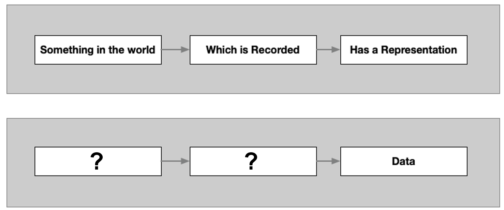

>[!NOTE]
>KR This was the description that was used before. Just popping down here in case we still want to use.<br>
>'Research data is a representation of something in the world, that has been captured in a specific way.'

---

## Data as a research object 

  ``` mermaid

  flowchart LR
    C(Concept) --> Me(Measure)
    Me --> Rep(Has a representation)

  ```


For example, you may want to collect data for a research activity that involves knowing the age of every participant in a study.<br>

**The concept** we want to capture is 'Age'.<br>

What units could we use to measure age?.<br>
- Years, months, days, minutes, seconds

How would that data look written down? 
- We would record this data numerically. The valid range of numbers that would be acceptable would start from 0 (as your age cannot be in minus numbers) to roughly 115, based on average livespan of a person.

>[!NOTE]
>KR Do we need to address the fact that in this scenario, you could use two units of measurement concurrently to describe a single piece of data? E.g. instead of recording someone's age as 5 years, you could record it as 5 years and 4 months. Or that's too detailed and we should keep higher level.
  

---

## A person's age as research data

This is how a person's age as research data would be concieved in our concept &rarr; measure &rarr; data flow.

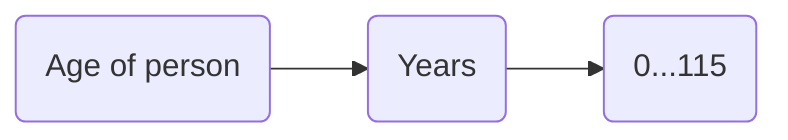


---

## Weather data 

Now lets go back to [the weather data](#weather-data-...) we looked at at the start of the course. 

Can you fill in the blank research data flow for a piece of data from that screenshot?

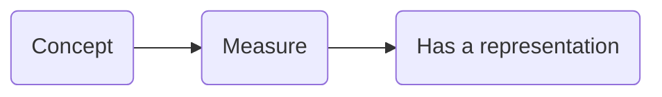

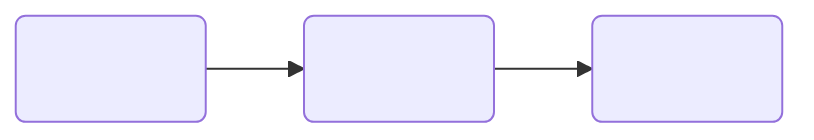

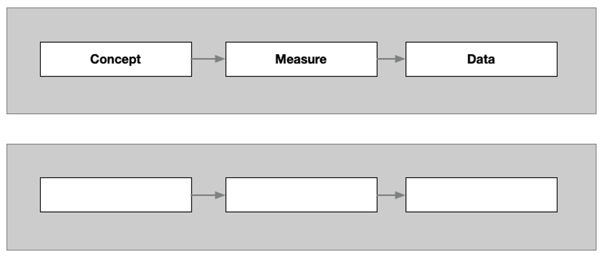

>[!NOTE]
>**BO - I think we need to give them an example first, and then ask them to fill out the weather example. So you could move the example below before this part.**
>:large_blue_diamond: KR noted, I have moved the person's age example up and add more details. Mark as complete?

---

## Weather data 

One concept &rarr; measure &rarr; data flow you might have captured is the temperature in London.

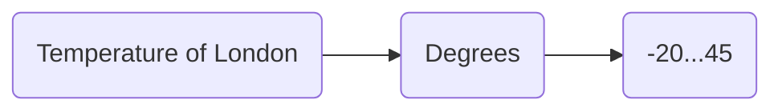

Or you might have looked at wind gusts.<br>

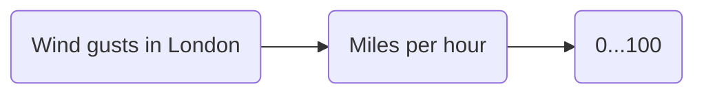

Or chance of rain.<br>

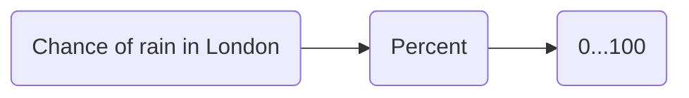

As we can see above, depending on what research data you focus will influence what concept you are measuring and determine what the concept &rarr; measure &rarr; data will be.
  
---

## Data as a research object

Here is another example:


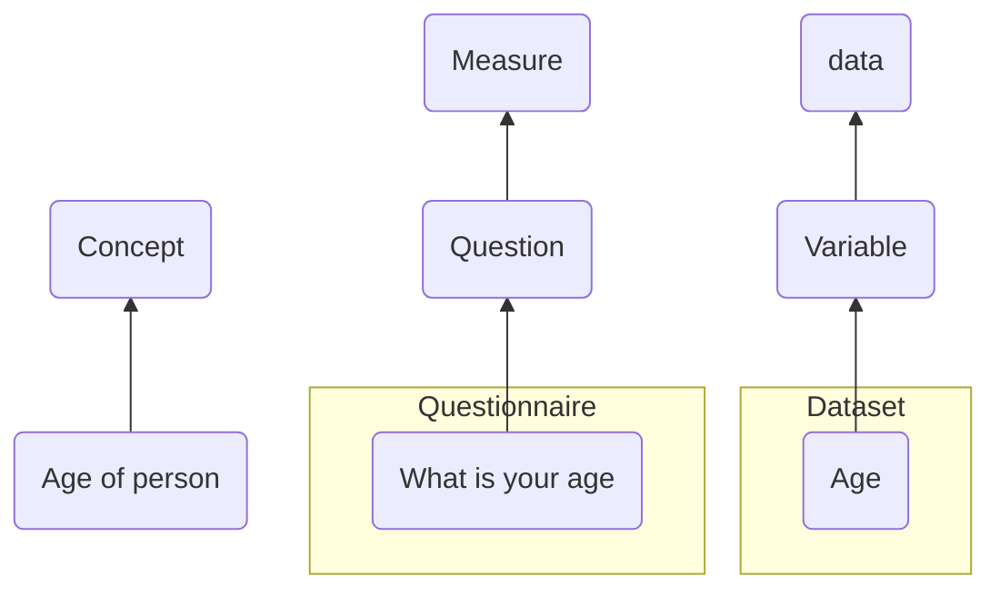


 

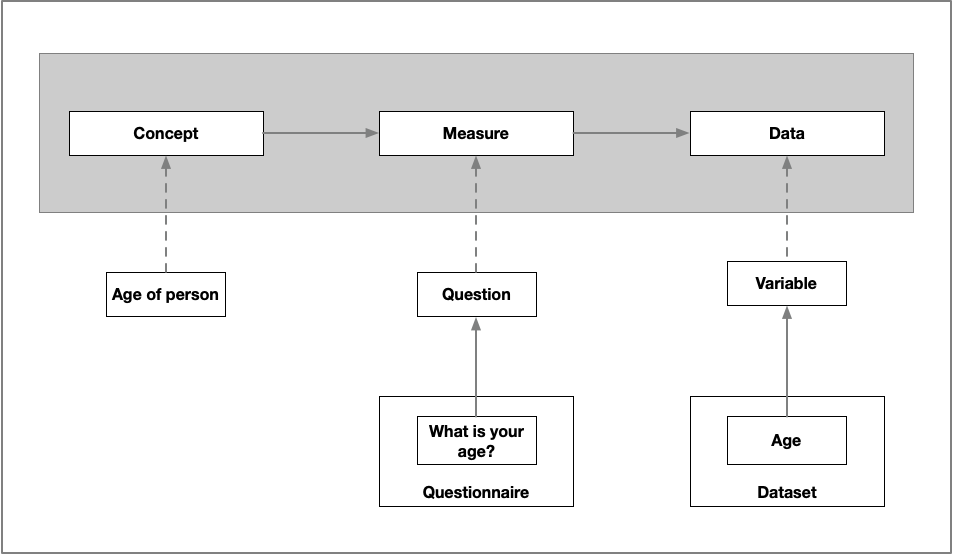

>[!NOTE]
>**BO - Can the diagram with questionnaires in follow the same format as the black and white one? I think the layout is more straightforward/easy to follow.**<br>
>:large_blue_diamond: KR agree. Unfortunately I can't seem to get mermaid to replicate this exact formatting so may just stick to screenshots instead.

---

## Different types of research data 

Let's try another context.

Imagine you are doing research into young people's relationship with social media.<br>
As part of this research, you need to find out how long each research participant spends on social media platform a day.

Consider what you could what research data you might collect for this enquiry and complete a concept &rarr; measure &rarr; data flow for them.<br>
There's no one right answer! Depending on what you focus on will determine what concept &rarr; measure &rarr; data flow you create.


>[!NOTE]
>**BO - I definitely don't like the use of inquiry here, I think we need to use language that's more familiar. Can we discuss?**
>:large_orange_diamond: KR noted to discuss.

---

## Practice (answer) 

One answer could be:

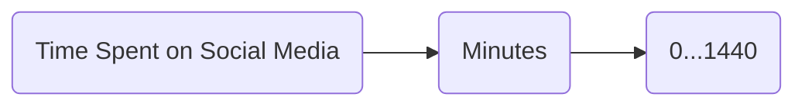
Before that, you might want to ask *if* they are on social media ...

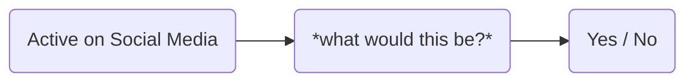

and if so, what social media platforms are they on ...

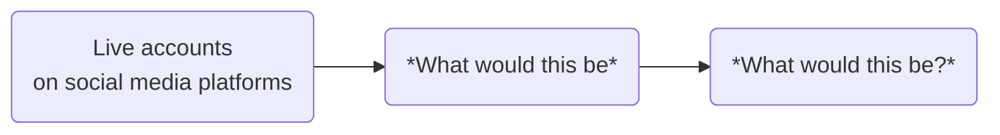

---

## Research data in your work

If you are currently doing research, consider what research data you're collecting.<br>
Trying complete a concept &rarr; measure &rarr; data flow for your research.


---

## Further learning

Now we have unpacked what research data is, in our next [unit 1.2](<2.2 Research data management.md>), we shall look at how we manage this research data.

If you would like learn more about research data, you can explore these training modules:
- Mantra: [Research Data in Context](https://mantra.ed.ac.uk/researchdataincontext/)
- Queen Mary: [Research Data explained (access as a guest)](https://qmplus.qmul.ac.uk/mod/scorm/view.php?id=414426)

---

## Test your knowledge

>[!NOTE]
>Need to add either questions or T/F statements here
>I think this section will be quite short

