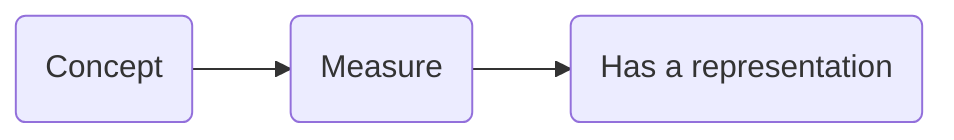
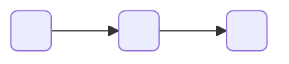
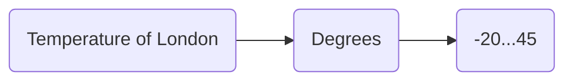
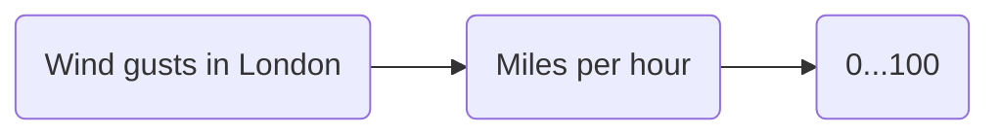
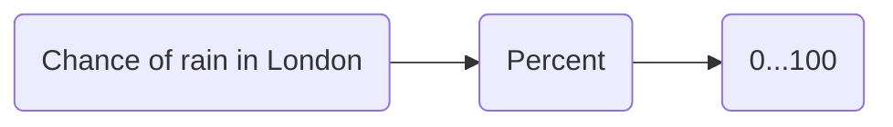
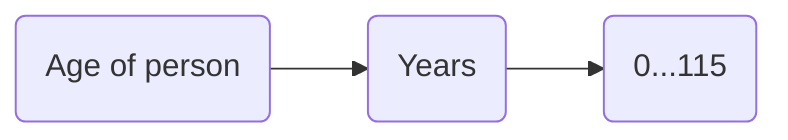
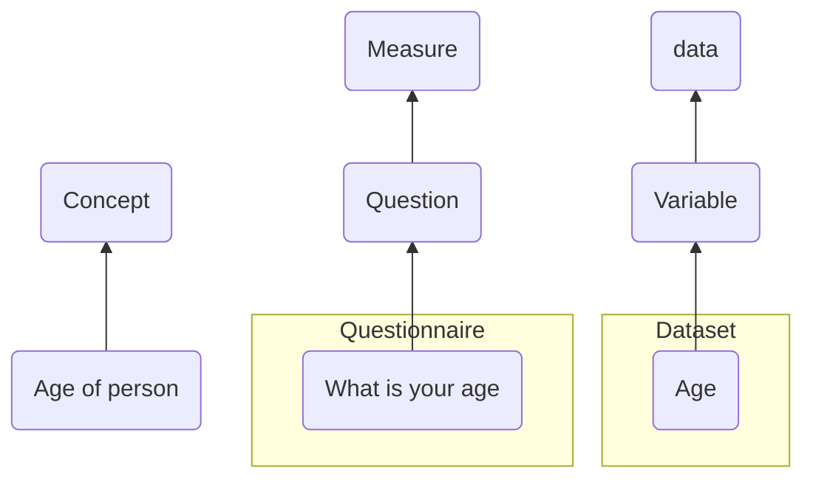
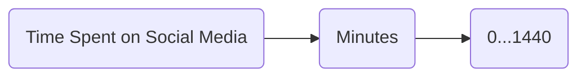
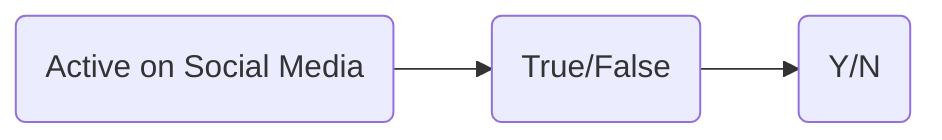
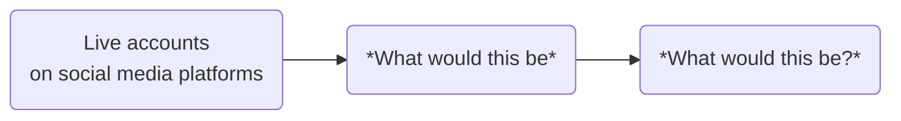

## Intended Learning Outcome 
- Understand the characteristics of data
- Understand the purpose of data in research

---

## Outline 
- What is data?
- Definition of data
- Data in research
- Introduction to example case study

---

## What is data?
We use the term data all the time, but what do we actually mean?

---
## Data is everywhere ...

We constantly consume data in our everyday lives. Take your weather app for example.

>[!NOTE]
>**BO - not sure about "consume data". Suggest amending to "interact with/engage with/encounter data"**

What data is available when we check the weather?


---

## Weather data ...

 


The app gives us data on weather conditions for a specified time and location, such as:
- Temperature
- Precipitation
- Cloud coverage

>[!NOTE]
>**Should geography and time be included in this list as data items displayed in this image?**
>**BO - I don't think it's wrong to include it, but you've said the app gives us data on weather conditions so I think it's fine to just list the data related to weather conditions**

---

## Representation of data

Data can be represented in many different ways.

For example, as:
  - Numbers e.g. 16*
  - Text e.g. 'Sunny conditions will continue all day.'
  - Symbols e.g. ☀️
  - Date and time e.g. 04/05/2025, 14:00

By interpreting these representations, we gain meaning from the data. In this example, we interpret meaning for different weather conditions.

>[!NOTE]
>**BO - can we change "weather concepts" to "weather conditions"? We haven't mentioned the idea of concepts yet**

---

## The characteristics of data

While data can come in lots of different representations, all data has the same underlying purpose and characteristcs.

What are the characteristics of data that differentiates from them being *just* numbers, words or symbols?

::: notes [#Trainer]
Ask the participants to take 5 minutes to discuss and come up with some thoughts
Collect responses from participants
:::

---

## Characteristics of data 

What are the core characteristics of data that differentiate it from general information?

- Data relates to a **concept** of inquiry
  - e.g. 16* &rarr; temperature, London &rarr; geography, 14:00 &rarr; time
- Data is **collected, observed or measured** by an individual or an organisation 
  - e.g. a meteorologist, Met Office
- The data type is consistent within a single inquiry
  - e.g. all numbers, all text, all symbols
    
>[!NOTE]
>**Is last bullet point correct? This the characteristic of clean data but can it be the characteristic fo all data**
>**BO - can the last bullet point be rephrased for clarity? "Within a single inquiry" isn't super intuitive to me, so I think the audience will feel the same. Even "concept of inquiry" is a bit jargon-y. Can it be rephrased and simplified?**

---

## Generic definition of data

Data has different definitions in different contexts and disciplines.

What does Wikipedia tell us? In its broadest sense, we can understand data as ...

- "Data is a collection of discrete or continuous *values* that convey *information* describing the *quantity, quality, fact, statistics*, or other basic units of meaning, or sequences of *symbols* that may be further interpreted *formally*"

 >[!NOTE]
>**Is this the most useful data definition to give? I think we should pick one key definition we would like participants to come away with**
>**BO - we could remove "Data is" from the start of the quote so it follows on from "we can understand data as" (not important, just preference :)). The CODATA definition is nice and links to what we're saying elsewhere about different ways data can be represented: https://zenodo.org/records/10626170. The IBM definition is nice but it's business-focused so not relevant for our audience: https://www.ibm.com/think/topics/data. We could offer a few different definitions and then create our own which takes the parts of the exisitng definitions that we like? Or maybe it's better to stick with one existing source? I don't know!**

---


## Data in research 

Data in research has a specific meaning and purpose.

CODATA defines data in research as:
- 'Data that are used as primary sources to support technical or scientific enquiry, research, scholarship, or  artistic activity, and that are used as evidence in the research process and/or are commonly accepted in the research community as necessary to validate research findings and results.'

Therefore, while data in research still conveys information (as the previous definition noted), it is in relation to a specific enquiry or activity.

::: notes
CODATA, https://codata.org/rdm

:::

>[!NOTE]
>**BO - a mix of "inquiry" and "enquiry" are used above. I think "enquiry" is accurate in this context.**
 
---

## Data as a research object

Data is a representation of something in the world, that has been captured in a specific way


  ``` mermaid
  
  flowchart LR
    sitw(Something in the world) --> Rec(Which is recorded)
    Rec --> Rep(Has a representation)

 ```

If data is the representation, what could the first two boxes be?

   ``` mermaid

    flowchart LR
      Q1(?) --> Q2(?)
      Q2 --> Rep1(Has a representation)

 ```


---

## Data as a research object 

Through this course, we will use the terms: Concept, Measure and Data

  ``` mermaid

  flowchart LR
    C(Concept) --> Me(Measure)
    Me --> Rep(Has a representation)

  ```


---

## Weather data 

- Going back to the weather data we look at at the start of the course, fill in the blank research data flow:






>[!NOTE]
>**BO - I think we need to give them an example first, and then ask them to fill out the weather example. So you could move the example below before this part.**
---

## Weather data 


- You may have got the same or you might have looked at wind gusts or chance of rain. For example:





- Depending on the focus of your research, the Concept, Measure and Data will be different.
  
---

## Data as a research object

Here is another example:







 


>[!NOTE]
>**BO - Can the diagram with questionnaires in follow the same format as the black and white one? I think the layout is more straightforward/easy to follow.**

---

## Practice [#worksheet]

Congratulations! You’re the newest member of a longitudinal research team at University College London.

The research is funded by UK Department for Young people and the Economic and Social Research Council. The research is looking into the impacts of social media on young people in Onglond.

They have already completed two waves of data collection, collecting data from 437 participants aged 11-16 years old using questionnaires. Wave 1 was completed in 2021 and Wave 2 was completed in 2023. 

You will conduct the next wave of data collection in two months time. 

---

## Practice (question) [Worksheet]

As part of this research, you will need to find out how long each participant spends on social media platforms in a day.

Fill out the Concept, Measure and Data boxes that might be needed to conduct this inquiry.


>[!NOTE]
>**BO - I definitely don't like the use of inquiry here, I think we need to use language that's more familiar. Can we discuss?**

---


## Practice (answer) [#Worksheet]

One answer could be:


Before that, you might want to ask *if* they are on social media ...



and if so, what social media platforms are they on ...



---

## Application [#Worksheet]

Fill out the Concept, Measure, Data boxes for your dataset.


---

## Further learning [#Overview]

Explore these training modules to develop your knowledge of Research Data:
- Mantra: [Research Data in Context](https://mantra.ed.ac.uk/researchdataincontext/)
- Queen Mary: Research Data Management: [Research Data explained (access as a guest)](https://qmplus.qmul.ac.uk/mod/scorm/view.php?id=414426)

---

## Test your knowledge

---

## Test your knowlesge (answers)
