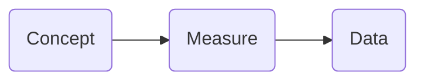

## Intended Learning Outcome 
- Understand the characteristics of research data
- Understand the purpose of data in research

---

## Outline 
- What is data?
- Data in research

---
## What is data?

In the Introduction course, we will look at how we can manage and document research data. Before we do this, it's important to have a strong understanding of what data is, the characteristics of data, and the role of data in research. <p></p>

We use the term "data" all the time, but what do we actually mean? We constantly engage with data in our everyday lives. Take your weather app for example. <p></p>

What data is available when we check the weather?


<details>
<summary><b>Data on the weather app</b></summary>
<p></p>

 


The app gives us data on weather conditions for a specified time and location, such as...
- Temperature
- Precipitation
- Cloud coverage

</details>

---

## Representation of data

In this weather app example, we gain information about _the measurement_ of weather conditions in London by interpreting data. However, we are interpreting different types of data to do this.

For example, interpreting data which are ...
  - Text e.g. 'Sunny conditions'
  - Symbols e.g. ☀️
  - Scale e.g. 0 (okta is a scale of measurement used to describe the amount of cloud cover) 

So data doesn't come in one set format. Instead, there are different _representations of data_ (which mean the same thing). By interpreting these representations, we gain meaning from the data.

---

## Generic definition of data

So, how could we go about defining data?

Data has different definitions in different contexts and disciplines.

Wikipedia offers a broad understanding of data as ...<br>
>"...a collection of discrete or continuous *values* that convey *information* describing the *quantity, quality, fact, statistics*, or other basic units of meaning, or sequences of *symbols* that may be further interpreted *formally*"[^1]

Taking a more business focus, IBM defines data as ...<br>
>'...a collection of facts, numbers, words, observations or other useful information. Through data processing and data analysis, organizations transform raw data points into valuable insights that improve decision-making and drive better business outcomes.'[^2]

Looking at data from a research perspective, CODATA conceives data as...<br>
>'Facts, measurements, recordings, records, or observations about the world, collected by researchers, that are yet to be processed/interpreted/analysed. Data may be in any format or medium taking the form of writings, notes, numbers, symbols, text, images, films, video, sound recordings, pictorial reproductions, drawings, designs or other graphical representations, procedural manuals, forms, diagrams, work flow charts, equipment descriptions, data files, data processing algorithms, or statistical records.'[^3]

While each definition has a slightly different focus, a common theme through each of them is that data can be interpreted in order to provide information about the topic or object the data is describing.

[^1]: ['Data', Wikipedia, webpage ]([10.5281/zenodo.10626169](https://en.wikipedia.org/wiki/Data#:~:text=Data%2C%20as%20a%20general%20concept,for%20better%20usage%20or%20processing.)
[^2]: ['What is Data?' IBM, webpage]((https://www.ibm.com/think/topics/data)
[^3]: [CODATA RDM Terminology (2023, v0001): overview](10.5281/zenodo.10626169)

---

## Research data

Data used for research can be called **research data**. As it is used in a specific context and for specific aims, research data can be given a narrower definition to data in general.

CODATA defines resesarch data as...

> 'Data that are used as primary sources to support technical or scientific enquiry, research, scholarship, or artistic activity, and that are used as evidence in the research process and/or are commonly accepted in the research community as necessary to validate research findings and
results. All other digital and non-digital content have the potential of becoming research data. Research data may be experimental data, observational data, operational data, third party data, public sector data, monitoring data, processed data, or repurposed data.
Therefore, while data in research still conveys information (as the previous definition noted), it is in relation to a specific enquiry or activity.'[^4]

So while research data can come in lots of different representations, all research data has the same underlying purpose and characteristcs.
<p></p> 
What are the core characteristics of research data that differentiate it from general information?
<p></p>

<details>
<summary><b>Characteristics of data</b></summary>
<p></p>

Data relates to a **concept** that we want to study and know more about. 
- In the weather app example, this could be: 16* &rarr; temperature, London &rarr; geography, 14:00 &rarr; time
<p></p>

Data is **collected, observed or measured** by an individual or an organisation with the intention of finding out more about a particular concept.
  - For example, a meteorologist or the Met Office will collect data about the weather in different locations and different times
  
</details>
   

[^4]: [CODATA RDM Terminology (2023, v0001): overview](10.5281/zenodo.10626169)

---

## Unpacking research data

Let's unpack the concept of research data further.

Research data is the outcome of the research lifecycle which could be concieved as ...

  ``` mermaid
  
  flowchart LR
    sitw(Something in the world) --> Rec(Which is recorded)
    Rec --> Rep(Has a representation)

 ```

If the 'representation' is the data we use in research, what could the first two boxes be?
What does something in the world refer to?
How was it recorded?

   ``` mermaid

    flowchart LR
      Q1(&nbsp;&nbsp;&nbsp;&nbsp;&nbsp;&nbsp;&nbsp;&nbsp;&nbsp;&nbsp;&nbsp;&nbsp;&nbsp;&nbsp;&nbsp;?&nbsp;&nbsp;&nbsp;&nbsp;&nbsp;&nbsp;&nbsp;&nbsp;&nbsp;&nbsp;&nbsp;&nbsp;&nbsp;&nbsp;&nbsp;) --> Q2(&nbsp;&nbsp;&nbsp;&nbsp;&nbsp;&nbsp;&nbsp;&nbsp;&nbsp;&nbsp;&nbsp;&nbsp;&nbsp;&nbsp;&nbsp;?&nbsp;&nbsp;&nbsp;&nbsp;&nbsp;&nbsp;&nbsp;&nbsp;&nbsp;&nbsp;&nbsp;&nbsp;&nbsp;&nbsp;&nbsp;)
      Q2 --> Rep1(Has a representation)

 ```

>[!NOTE]
>KR is a 'data flow' the best way to describe this?
>BO - I think it sounds fine, but I guess you're actually referring to the research lifecycle (i.e. generating a hypothesis to measure a something (something in the world), collecting data to measure >the concept (which is recorded)).
>JJ - I would rephrase "What action do we need take to record it?" to be **"How was it recorded?"**

---

## Data as a research object 

'Something in the world' can be described as the **concept** we are intentionally researching.<br>
'Which is recorded' relates to the **measure** we use to record the concept.<br>
We then use a **representation** to record individual cases of the measure. This is our data.<br>

  ``` mermaid
  
  flowchart LR
    sitw(Something in the world) --> Rec(Which is recorded)
    Rec --> Rep(Has a representation)


 ```


  ``` mermaid

  flowchart LR
    C(Concept) --> Me(Measure)
    Me --> D(Data)

  ```

This outlines how in the research lifecycle, we generate a hypothesis on a particular **concept** (something in the world), we **measure** the concept in order to test the hypothesis (which is recorded), producing **data** from our measurements (has a representation).

For example, you may want to collect data for a research activity that involves knowing the age of every participant in a study.<br>

What is **the concept** we want to capture? <br>
- Age of person.

What units could we use to **measure** age? <br>
- Years, months, days, minutes, seconds.
- In order for research data to be suitable for analysis, we can only use _one_ unit of measurement for each concept. So, we couldn't write age as 5 years and 4 months as we would be mixing to units of measurement, years and months. Instead, we could write age as 5 years _or_ 64 months, keeping the one-to-one relationship between concept and meausre.
- The way we conduct this measurement will be our data collection method. For example, we may measure age by asking research participants the question 'What is your age?' in a questionnaire. A questionnaire would therefore be our data collection method.

>[!NOTE]
>BO - It's common to use multiple units of measurement e.g. lots of studies ask respondents to provide their age in years and months (see the last example here https://ucldata.atlassian.net/wiki/spaces/CLOS/pages/37324672/Age-related+examples). Same for height and weight (see example 2 here https://ucldata.atlassian.net/wiki/spaces/CLOS/pages/37324678/Physical+measurements+examples). So should we be saying that you "should" only use one unit of measurement, rather than you "can" only use one unit of measurement? Or maybe it's better to say that if you use multiple units of measurement, you should later be combined them into a single unit of measurement or data point e.g. if you ask for age in years and months, you'd combine "1 year" with "1 month" to give you "13 months" for the purpose of your data analysis? Sorry if this sounds picky, I just don't want us to confuse people if they're used to seeing multiple units of measurement.
> JJ - BO - true, but I think the point is to say that what should end up in a single column of data should be of the same unit of measurement, ie the data collection might be. I think this is point to be made in the foundational section, so perhaps removed the second paragraph

How would would we represent that **data**? 
- Say we choose to measure age in years. We use numbers so we would record this data numerically. The valid range of numbers that would be acceptable would start from 0 (as your age cannot be in minus numbers) to roughly 115, based on the average lifespan of a person.
- The collection of this data will make up our dataset.

---

## A person's age as research data

This is how a person's age as research data would be concieved in our concept &rarr; measure &rarr; data flow.


---

## Weather data 

Now lets go back to [the weather data](#weather-data-...) we looked at at the start of the course. 

Can you fill in the blank research data flow for a piece of data from that screenshot?




<details>
<summary><b>Temperature</b></summary>
<p></p>

One concept &rarr; measure &rarr; data flow you might have captured is the temperature in London.


</details>


<details>
<summary><b>Wind gusts</b></summary>
<p></p>


Or you might have looked at wind gusts.<br>


</details>


<details>
<summary><b>Chance of rain</b></summary>
<p></p>

Or chance of rain.<br>


</details>

As we can see above, the research data you focus on will influence what concept you're measuring, and determine what the concept &rarr; measure &rarr; data will be.

</details>

---

## Different types of research data 

Let's try another research context.

Imagine you are doing research into young people's relationship with social media.<br>
As part of this research, you need to find out how long each research participant spends on a social media platform per day. Try creating a concept &rarr; measure &rarr; data flow for this enquiry.<br>


<details>
<summary><b>Concept &rarr; measure &rarr; data flow</b></summary>
<p></p>

One answer could be:


</details>

---

## Qualitative data example

Or you may be working with qualitative data. For example 

[NEED TO ADD QUALITATIVE DATA EXAMPLE]


<details>
<summary><b>Concept &rarr; measure &rarr; data flow for qualitative data</b></summary>
<p></p>

</details>

>[!NOTE]
>JJ lets remove the qual example for the time being
>

---

## Research data in your work

If you're currently doing research, consider what research data you're collecting.<br>
Trying complete a concept &rarr; measure &rarr; data flow for your research.


---

## Further learning

Now we've unpacked what research data is, in our next [unit 1.2](<1.2 Research data management.md>), we'll look at how we manage this research data.

>[!NOTE]
>BO - A very minor point, I noticed the tone change slightly towards the end of the unit to being more formal e.g. above it said "we shall look at...", so I've changed it to "we'll" to match the tone at the start of the unit.

If you'd like learn more about research data, you can explore these training modules:
- Mantra: [Research Data in Context](https://mantra.ed.ac.uk/researchdataincontext/)
- Queen Mary: [Research Data explained (access as a guest)](https://qmplus.qmul.ac.uk/mod/scorm/view.php?id=414426)

---

## Test your knowledge


