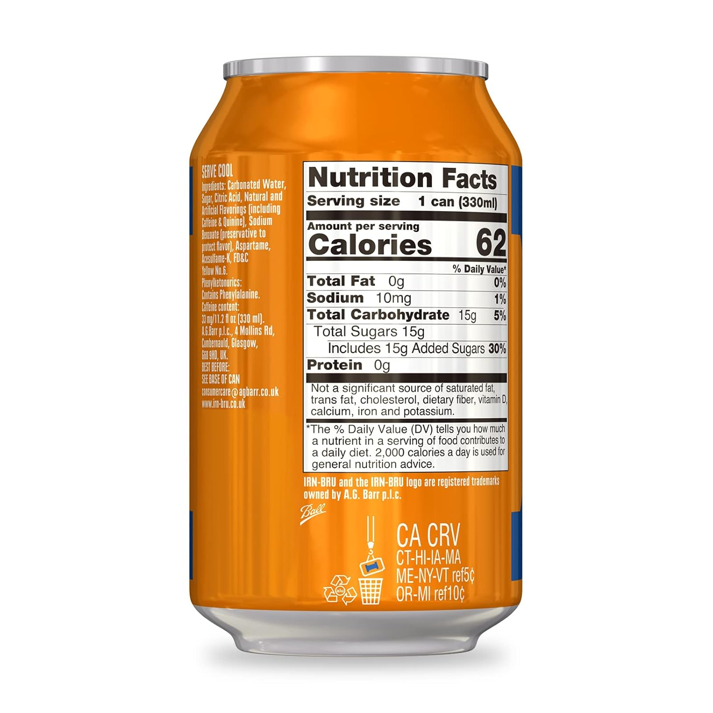
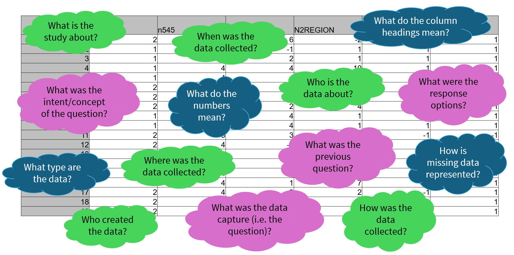
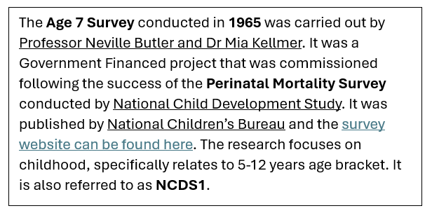
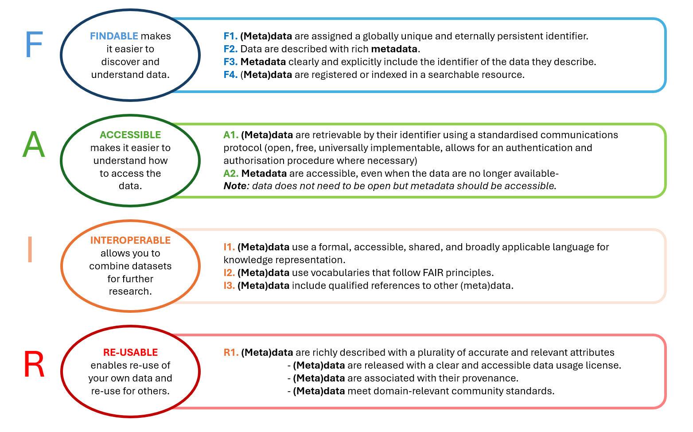

## Intended learning outcome

- Understand what metadata is and the purpose of metadata
- Understand how metadata differentiates from other forms of data documentation
- Benefits of creating and using metadata
- Metadata's role in FAIR
- Understand who will request metadata

>[!NOTE]
> BO - Similar to a comment on another unit, we'll want to go through the ILOs in all the units and make sure they're in the same format i.e. Understand..., Be able to explain..., Be able to identify... etc. Here we need to add something before "...Benefits of creating and using metadata" and "...Metadata's role in FAIR".

---

## Outline 

- What is metadata?
- What information is needed to understand and use data?
- What features of metadata differentiate it from other forms of data documentation?
- Why is metadata important?
- What are the benefits of metadata?
- Why create metadata?

---

## Introduction to metadata

In the last [unit 1.3](<1.3 FAIR>) we identified metadata as a fundamental component of FAIR data. In this unit, we will look at what metadata is.

But first, let's start with an imahined scenario.

Imagine it's a hot day and you're very thirsty. You come across a plain, sealed drink can on the side of a road ...

Do you know what's inside the can? Would you want to drink it?

---

## A mystery canned drink ... a metaphor

Because the can doesn't have a label, we don't know ...
- What's inside 
- Where it's come from
- When it was made
- Who made it

It's unlikely that anyone will want to drink from that can, and if they do, it's a risk!

Alternatively, if you came across this can in a local supermarket, would you know what is inside it? Would you be happy to drink it?

 

---

## A mystery canned drink ... explained

Most people would be more confident about what is inside the can, as the packaging contains:

- The brand
- Description of the drink and its flavour
- Ingredient list
- Nutritional information
- Production factory
- Location of production
- Producer contact information
- Best before date

With this information, you have a better insight into what's inside the can and whether you can trust its contents and want to drink it.

The can is also more trustworthy if it's found in a shop you know and trust. If the can was stocked in a shop alongside other similar drinks, you would be able to read the labels, compare the products, and make an informed decision about the drink you pick.

---

## Why do we need this information

It can take companies more time and resources to produce detailed packaging for products so, why do it?

**Companies' personal interest** 
Companies want people to find and buy their product. If it's not, the company will fail at their goal of making a profit. Having good information about the product makes it more trustworthy and engaging for customers, making people more likely to buy it.

**Legally required** 
It may be legally required information, such as ingredients list or place of origin. Without this, companies would not be able to produce and sell their porducts.

**Consumer need** 
The consumer of the drink requires this information in order to make an informed decision. For example, someone who needs to measure their sugar intake for their health needs a clear nutritional label. Someone with allergies will require information about ingredients and the factory of production.

>[!NOTE]
> JJ+ KR notes: Legally required information, what information is necessary and who is it important to/why Different information for different audiences - sugar, diabeties  
> BO - not sure if you plan to include this info, but I actually think it reads fine as is and is a good entry point to metadata.
>:large_blue_diamond: KR, have added section above as to why the information necessary. Can review and decide whether we want to include.

---

## How does the can relate to metadata ...

Imagine the liquid inside the can is a dataset from a research project. 

The label that provides information about the drink (the brand, location of production, ingredients list, nutritional information etc.) is the metadata which describes the dataset, telling us what data the dataset contains and how it was produced.

Like the plain can, if a research project doesn't have any metadata, we don't know any contextual information about a research project such as _who_ collected the data, _when_ and _where._ If we don't have metadata, we also don't know what data exists within the datasets.

Similar to storing the can in the supermarket, data catalogues store metadata for different datasets in the same place allowing us to search and compare across different datasets. Having a dataset in a data catalogue and/or data repository also increases the trustworthiness of the data. We will cover data catalogues and repositories in more detail in [unit 2.4](<2.4 Using metadata: discover data.md>)

In the same way that having product information helps companies sell their products, metadata helps researchers make their data discoverable and reusable, leading to more citations of their data. Creating robust metadata can also be a funding requirement for a research project.

Let's look at metadata in a research context ...

>[!NOTE]
> BO - I think the first two sentences are a bit confusing, as we're swapping between the can and the dataset. Suggest removing, as the next sentence flows nicely from the first anyway.
>:large_blue_diamond: KR, I have tried clarifying the first couple of sentences as I just want to be really clear how the metaphor transfer to a research environment. However, if you feel it reads better without, then we can go with that.

---
## Understanding a mystery dataset

Imagine you are conducting a research project exploring the behviours of young people in 1965-1970 in the Northern regions of England. You will use secondary data and need to identify relevant datasets for your project.

You come across this dataset and you need to determine whether it would be useful for your research.

What information would you need to know whether this dataset is relevant for you research project?

What information would you need to certify and trust this data and make sure you can include it in your research project?

|          | N622   | N1545  | N1171  | N2REGION | N1112  | N1261 |
|----------|--------|-------|--------|-----------|--------|-------
| 1        | 2      |  4    | 6      | -2       | 1      | 1            
| 2        | 1      |  4    | -1     | 1        | 1      | 1        
| 3        | 1      |  4    |  4     | 10       | 1      | 1 
| 4        | 1      |  4    |  4     | 4        | 1      | 1  
| 5        | 1      |  4    |  4     | 4        | 1      | 1  
| 6        | 2      |  4    |  2     | 1        | 2      | 1  
| 7        | 2      |  4    |  6     | 2        | 1      | -1  
| 8        | 2      |  4    |  2     | 4        | 1      | 1  
| 9        | 1      |  4    |  4     | 1        | 1      | 1  
| 10       | 1      |  4    |  4     | 1        | 1      | 1  
| 11       | 2      |  4    |  3     | 2        | -1     | -1  
| 12       | 2      |  4    |  -1    | 1        | -1     | -1  
| 13       | 1      |  4    |  3     | 1        | 1      | 1  
| 14       | 2      |  4    |  2     | 4        | 1      | 1  
| 15       | 2      |  4    |  -1    | 7        | 1      | 1  
| 16       | 2      |  4    |  1     | 7        | 1      | 1  
| 17       | 2      |  4    |  3     | 2        | -1     | 1  
| 18       | 2      |  4    |  6     | 2        | 1      | 1  
| 19       | 2      |  4    |  6     | 10       | 1      | 1  

*Data is from study: [National Child Development Study](https://closer.ac.uk/cross-study-data-guides/cognitive-measures-guide/ncds-cognition/ncds-age-7-copying-designs-test/)
Sweep: [Age 11 Survey (1969)](https://discovery.closer.ac.uk/item/uk.cls.ncds/a52ee654-efa8-4839-a545-fd82bec63e71)
Data file: [NCDS2 Parental Interview Form (1969) Dataset](https://discovery.closer.ac.uk/item/uk.cls.ncds/b3909a8c-2118-4f82-ad34-245ce610ea07)*
Copyright © GESIS Leibniz Institute for the Social Sciences, 2016

> [!NOTE]
> :large_orange_diamond: KR I have taken this dat from metadata training powerpoint. Please can we confirm this is from an open teaching dataset?
> :large_orange_diamond: KR **NOTE** N545 is from a different dataset - Perinatal Mortality Study (1958) Dataset (not Age 11 survey), variable: 0 Mother's present marital status - is this potentially confusing?

---

## Information you need to understand data

Here are some of the questions you may need to ask in order to understand the dataset and determine whether it should be included in your research research project. 

How do we get the answer to these questions as someone who is coming across this data for the first time?

---

## Metadata: answering essential quesitons

To answer these questions, we need metadata. 

Metadata is a type of documentation that accompanies a research project. It describes the research project and its data, and it is normally created by the person(s) who conducted the research. Metadata provides us with the context we need to understand and interpret the research project and its data so we can use in an intelligent and meaningful way.

As a starting point, metadata can be considered as the who/what/where/when/why/how of the data. 
- **Who** collected the data? 
- **What** data did they collect? 
- **When** was the data collected? 
- **Where** was the data collected? 
- **Why** was the data collected? 
- **How** was the data collected?

---

## Information about the project (high level metadata)

Through answering the questions in the green bubbles, metadata can describe the research project. Metadata about the overall research project may also be called high level metadata as it gives a high level overview of the whole research effort.

**What** is the project about?
- Title of the project
- Subject or topic of the project
- Abstract giving context for the project

**Who** created the data?
- Creator of the research 
- Publisher of the research
- Funder of the research 

**When** was the data available?
- Date research started
- Date research completed
- Date made available

**Where** was the data was collected?
- Country
- Region
- City

Why is high level metadata important for understanding a research project and determining whether if its relevant for our research activities?

High level metadata gives us a quick snapshot of what the research project is about. This is particularly useful when we are looking through a large amount of research. It also gives us supporting information that may not be included in the dataset itslef, for example who created the data, where it was conducted, how to access the data and who to contact for further information.

For example, you can find the high level metadata for the mystery dataset [on this webpage.](https://discovery.closer.ac.uk/Item/uk.cls.ncds/a52ee654-efa8-4839-a545-fd82bec63e71/17)

If we look on at the high level metadata on the above webpage, we know that the research was conducted in 1969 across England, Scotland and Wales and was produced as part of the National Child Development Study. 

While the overall project may be related to our own, do we have enough information to know if this particular dataset would be relevant and/or useful for our secondary research? What other information might we need?

---

## Information about the data (low level metadata)

If we only have high level metadata for a project, we probably won't know what type of data the dataset actually contains.

For example, the two tables below could both be labelled as health data in children conducted in 1969 across England, Scotland and Wales. However, they contain different data. If we don't have metadata to describe what the dataset contains, we will have to go through a lengthier process of accessing the data files in order to assess whether they are relevant for us.

|          | Age    | Gender| Weight | Height    | BMI  
|----------|--------|-------|--------|-----------|------
| 1        | 2      |  4    | 6      | -2        | 1                  
| 2        | 1      |  4    | -1     | 1         | 1              
| 3        | 1      |  4    |  4     | 10        | 1      
| 4        | 1      |  4    |  4     | 4         | 1      
| 5        | 1      |  4    |  4     | 4         | 1      

|          | Age    | Gender | Visual impairment | Hearing impairment | Use of accessibility equipment
|----------|--------|--------|-------------------|--------------------|---------------------------
| 1        | 2      |  4     | 6                 | -2                 | 1          
| 2        | 1      |  4     | -1                | 1                  | 3         
| 3        | 1      |  4     |  4                | 10                 | 1     
| 4        | 1      |  4     |  4                | 4                  | 2      
| 5        | 1      |  4     |  4                | 4                  | 2      

As accessing datasets can be time consuming and/or costly, having information about the data readily available before you access a dataset is important. It helps us understand what a dataset contains and let's us assess whether we to want access and use that dataset. This makes research processes more efficient and cost effective. 

If you have restricted access datasets, it also helps protects the security of your data as  the information describes what type of data the research project collected, not the data itself.Information about the data itself can also help us manage and understand our own data as we handle process large volumes of data.

If you have restricted access datasets, it also helps protects the security of your data as  the information describes what type of data the research project collected, not the data itself.

Thinking back to example dataset, by answering the blue bubbles, metadata describes the data itself. This can be referred to as low-level metadata.

What do the column headings mean?
- Variables the dataset contains

What do the numbers mean?
- Numeric values / codes
- Unit of measurement
- Missing data values

What type of data are they?
- Data type: numeric, string

How was the data collected
- Data collection instrument

Information about the data can be found [on this webpage](https://discovery.closer.ac.uk/item/uk.cls.ncds/b3909a8c-2118-4f82-ad34-245ce610ea07). You can click into different variables (the titles of the columns) to gain insight into what data they collect. 

---

## Information about how the data was collected

If we anser the purple bubbles, metadata can also describe processes that were undertaken in the research project, such as data collection.

What were the response options?
- The format of the response e.g. free text, multiple choice, scale

What was the previous question?
- The order of the questions
- Whether a question is linked to another question

What was the data capture?
- Were the answers self-completed or recorded by another person
- Was it an online or paper survey

What was the intent/concept of the question?
- The wording of the question
- Key themes/topics linked to the question
- If the question is related to an assessment scheme

Having information about how the is data collected further helps us build a picture of the research project. For example, if we noticed that there were lots of missing or invalid responses and saw that the data collection method was self-completed, written form, we could infer that the research project may have had difficulty around participants completing the form correctly.

---

## Challenges of not having metadata

If you didn't have this metadata, how would you go about finding the information you need to understand the data?

We would probably have to engage with time-consuming processes, such as contacting people or organisations to get further information about the dataset and what it contains. 

While some information about data exists in research papers and outputs, it may take time to find and extract the information you need, or the information may be incomplete or unsuitable to facilitate reuse. Also, the purpose of a research paper is to report the findings of a particular research question, but data can be used to answer more research questions than the one it was originally intended to measure.

Metadata allows us to maximise the potential and impact of data. It provides the information needed for people to efficiently discover, understand and (re)use data, whether that's for secondary research or a literature review. With metadata, data can reach more people and enables people to use the same dataset for different purposes. 

> [!NOTE]
> :large_blue_diamond: * note, this section references DDIwFAIR doc

---

## Defining metadata terms

So, now we have a broad understanding of metadata is and how it can help us, let's look how it's formally defined.

As an evolving field, it is importnant to note that terminology around metadata can vary depending on the source you are using. The same term can be used or interpreted by people to mean slightly different things. 

In this module we will define metadata concepts and terms as we go along. Outside of this module, using a glossary or terminiology bank can be a useful way to identify a single source of truth to help your understanding and be consistent with you metadata processes.
  
For example, you could use [CoData RDM Terminiology bank](https://codata.org/initiatives/data-science-and-stewardship/rdm-terminology-wg/). Alternatively, there might be similar resources in your specific discipline that are openly provided by a leading organisation, for example.

When engaging with someone else's metadata, it can be useful to refer to their definitions of terms in case they differ from your own. Equally, if you are creating and managing metadata, it is important to be clear and consistent in the meaning of the terms of use.

>[!NOTE]
> Should we/can we include other metadata glossaries/terminology? **BO - depends how consistent they are with one another, it might create confusion if different gloassaries are conflicting but if they're complementary it might be ok. But it might be more helpful and less confusing to have one thing we constantly refer back to** 

>Should this be moved to the very top of the training to cover all concepts, not just metadata concepts? OR should this be moved to unit 1.1?

>[!NOTE]
> BO - maybe in the previous module when we're defining metadata we could tie this in. We could say that there are lots of different definitions and understandings of metadata and its associated terminology, and that in the next module (i.e. this one) we'll spend time unpacking and making sense of the terminology. But I might get to the end of this course and change my mind!
> :large_blue_diamond: Agree **KR TO MOVE TO PREVIOUS MODULE** 

---

## Defining metadata

Metadata is a form of data documentation, you may have heard being defined as “data about data”. It provides a framework to describe and understand data, so that it can be used in an intelligent and meaningful way.

According to CODATA, metadata is ...
_'Data about data. It is data (or information) that defines and describes the characteristics of other data. It is used to improve the understanding and use of the data.'_

The National Information Standards Organization offers a similar definition ...
_“Metadata is structured information that describes, explains, locates, or otherwise makes it easier to retrieve, use, or manage an information resource. Metadata is often called data about data or information about information.” *_

As noted, we may come across slight variations in the way people and organisations define metadata.
At it's core, metadata supports three main purposes:

**Discovery**
- Metadata helps people to find relevant resources

**Understandability and context**
- Metadata helps us to quickly understand resources, both what the resources consist of and how they were produced
  
**Use and action**
- Metadata provides us with the information on how to use the resource as well as any limitations around this

Through doing this, metadata maximises the potential of resources, such as research data. In research, metadata creates more opportunity for data citations, secondary research and cross-study comparison. It is also helpful for your future self, to help you understand your own data in the future (we will look further at the role of metadata in the next unit 2.2).

>[!NOTE]
> BO - I think this should be moved up, as I feel like we've zoomed into the details over the last few slides about what makes "metadata" metadata, and then this zooms right back out to a high-level overview of metadata. It could also be weaved into the existing content e.g. "maximising the potential of data" - I think I mentioned adding something like this a few slides up. And we've just mentioned the future self point above too. (Sorry I keep saying slides as that's how I'm used to talking about it! By slides I mean the new pages with headers). Maybe this should just be the three main uses of metadata, and the bit above is added to the other sections above?  
> :large_blue_diamond: Agree **KR TO ADD** 

> [!NOTE]
> BO - This feels a bit random and the tone is a bit more formal than the previous sections. Suggest changing to something like "So we know what metadata is and how it can help us, but how is it formally defined?". Then go into the different definitions. 

::: notes

If you’ve heard of metadata before, you’ll have likely heard the definition “data about data”.
Wikipedia has a slightly different take… (e.g. the date and time of a text message is metadata, but the text of that message is not)

(2) https://dataedo.com/kb/data-glossary/what-is-metadata
(3) Wikipedia “data that provides information about other data, but not the content of the data itself” [3] -- https://www.britannica.com/technology/metadata
(4) Parry, K. (2023). Metadata Is Not Data About Data. Decolonizing Data, p15-33
(5)[National Information Standards Organization](http://www.niso.org/publications/press/UnderstandingMetadata.pdf)
(6) CODATA RDM Terminiology 2023

:::

---

## What is the difference between metadata and data documentation?

Metadata is a type of data documentation, however it has several key defining features. So, what makes metadata different from other forms of data documentation?

Consider these two descriptions of a dataset. 

Description one:
 

Description two:

Both contain the same information, and both could be called 'data about data' or 'information about information'.

However, only one of these examples can be considered metadata. 

- What are the differences between these two descriptions?
- Which is most effective for data management? Why?
- Which description do you think is metadata? What features make it metadata?

<b>Differencces between the two descriptions</b>

**Strucutre**
Description one is written in full sentences whereas description 2 has been broken down into different sections. Each of these sections has a title which specifies what type of information is included in that section.

**Formatting**
Description one uses formatting (such as bold and underlined text) to highlight different types of information. Description two uses titles for different types of information and the description itself does not rely on further formatting.

Description two is the documentation that is metadata as it is structured and does not rely on formatting to express information. In the next section we will explore the key features of metadata further.

---

## Metadata is structured, machine-readable documentation

Two defining features of metadata is that it is **structured documentation** and **machine readable**. By being machine readable, metadata is also **machine actionable** meaning we can use computers to get more functionality out of our documentation.

Below, we explore these features in more depth.

<b>Structured</b>

Rather than a long text block, metadata is structured information that is formatted into metadata elements. This means different types of information are separated out and have their own title.

- A **metadata element** is the container that describes what information the metadata is convering. It could be described as the title or the label for the metadata.
  - e.g. 'Title', 'Alternate Title', 'Publisher', 'Date'

- A **metadata field** is the input area for a metadata element. Sometimes there are rules that dictate what values are allowed in a metadata field in order to make sure metadata is clean.
  - e.g. for the 'Date' metadata field, there may be a specification to format the information as dd/mm/yyy
    
By being structured, metadata organises our metadata into useful collections of information. For example, in the previous example, groups of metadata were organised into tabs: Sweep description, Coverage, Funding, Kind of Data, Dataset and Questionnaires. This help us both other people and our future selves to understand our resource or research, preserving it for continued use and improving resource management.

<b>Machine-readable and machine-actionable</b>

Metadata is stored in specific machine-readable formats such as JSON, csv, XML, and not in formats such as Microsoft Word or PDF. In order to store metadata in these formats, the information must be structured to a specific set of rules so computers to extract information from the metadata (as described above). If documentation is not structured, for example, it includes different types of information in one paragraph and/or relies on formatting such as colour, italics, bold, underline to indicate different information, a machine will not be able to interpret it's meaning.

By being **machine-readable**, metadata a computer what something is, how it relates to other objects or information, and tells the computer what to do with the information.

By being machine readable, metadata is also then **machine-actionable**. This means we can search our documentation use computers in order to find the information we need easily.

We can also store our resources on centralised platforms alongside other resources. These centralised platforms can read a resource's metadata and allow people to search and filter a huge range of resources. For example, a streaming platform uses a programmes metadata so people can search for shows by genre, director or length, a library catalogue allows people to find books based on topic, data of publication or author. In research, these platforms could be data repositories, data catalogues or data archives (more information about these plaforms in unit 2.4 Using metadata). This helps us to quickly discover, understand, access and compare different resources. As we using computers to do this, we save time and improve accuracy of resource management.

---

## Benefits of metadata

Now we have explored the defining features of metadata, what do your think the main benefits of metadata are in a research context?

Depending on how you engage with research, you may be using metadata or creating metadata. Often if you're conducting research yourself, you will be doing both. 

Have a think about what the different benefits for those using metadata, creating metadata and for research as a whole. Click on each section to see some of the examples we came up with.

<b>For people creating metadata (metadata creators)</b>

For people creating metadata, metadata ...
- Preserves your data and research
- Makes data management processes more robust and efficient
- Enables more accurate, reliable and higher-quality research 
- Helps your future self understand and reuse the data
- Helps others find, understand, compare, and use your data
- Increases the visibility of your study to other researchers and organisations
- Exploits the full potential of your data by supporting cross study and secondary research processes

<b>For people using metadata (metadata users)</b>

For people using metadata can ...
- Understand a research project and its data efficiently and effectively
- Assess how relevant data is for their research effort
- Compare dataset with other datasets
- Reproduce or reuse data
- Save time by not having to contact people for basic information around datasets

<b>For research as a whole</b>

For research as a whole, metadata ...
- Saves time for people working across the research field
- Provides proof of transparent and valid conduct
- Implements FAIR data principles
- Enacts best practice in research

>[!NOTE]
> KR should I make this more general and not related to research/data just yet? E.g. reference benefits in lots of different contexts?
>KR this needs expanding on so bullet points are justified

---

## Metadata and FAIR

Thinking back to the FAIR data principles, we can now see how metadata is a vital tool that underpins each principle.

::: notes
https://www.go-fair.org/fair-principles 
:::

---

## How do you feel about FAIR?

The Data Archiving and Networking Service have created a FAIR Aware tool where you can check your understanding of FAIR and the role of metadata in implementing the principles. 

The FAIR Aware Tools consists of a questionnaire of 10 questions that will take between 10-30 mins. Using the answers you provide, the tool assess your awareness level as well as provide tailored tips relevant to your role on how you can further improve your FAIR skills.

The tool is designed for researchers, policy makers, funders, publishers and research support personnel (e.g. data steward, curator,data manager, librarian).

If you want head over to the [Fair Aware tool](https://fairaware.dans.knaw.nl/) to take the questionnaire.

---

## Why create metadata?

We've discussed how metadata can benefit ourselves and others, and how it it's a core component of the FAIR data principles. It's not only a useful tool for us to use but also important information to capture and create.

However, are there other reasons we should create metadata?

As metadata is a powerful tool and best practice for research, it may also be **required** by ...

- **Institutes** (in your working contract or project agreements)
- **Funding agencies** may require metadata to ensure reusability of the data and that a project is meeting FAIR requirements
- **Journals** may specify metadata as a condition for publishing
- **Supervisors** may require metadaata in order to encourage data citations and enchance researcher reputation 
- By certain **projects** that include collaborations across agencies and/or organisations

Thinking back to unit 1.2 Research Data Management (RDM), metadata is a core component of RDM and should be included in all Data Management Plans (DMPs).

 >[!NOTE]
> :large_blue_diamond: Should this be moved to unit 2.7?

---

## In short ...

Metadata allows you to realise the full potential of your data, increasing its value and making it go further.

Metadata is ...
- Information that describes data which can provide a roadmap of your data
- Based on a structure that can be read and actioned by a computer 
- A note for your future self
- A tool to help others discover, understand and (re)use your data
- A tool for collaboration with others
- A hallmark of data management best practice and transparency
- Information that helps us maximise the full potential of data

---

## Want to know more ...

If you would like further information on how to define metadata, you can watch [this knowledge clip from UGent University](https://www.youtube.com/watch?v=DW2T_cnqKPU) to gain an overview of metadata in a research context.

---

## Test you knowledge

