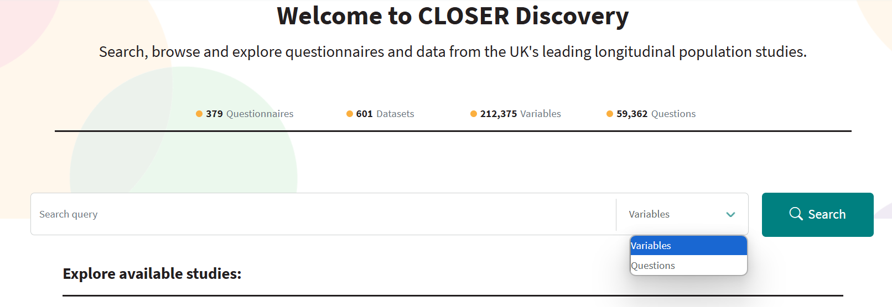
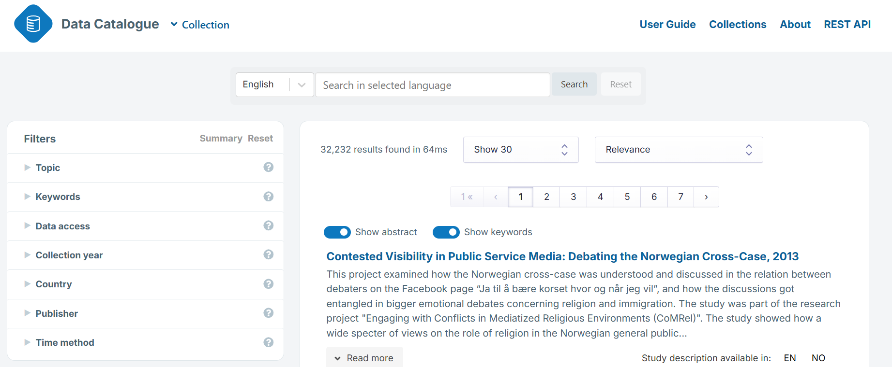

## Intended learning outcomes

- Understand what information metadata captures in research projects
- Know who is responsible for createing metadata
- Know when to create metadata

>[!NOTE]
> BO - Not sure about the wording of the first one. I think the last one is an objective rather than ILO "Challenge common misconceptions of metadata creation in research".

---

## Outline

- Metadata terms 
- Levels of metadata
- Different types of metadata
- Different ways metadata is created
- Roles in metadata creation
- How much metadata you need to create
- Metadata creation myths

---

## Metadata terms

You may have come across metadata before, or this may be your first time. As such, you might be coming across new terms or revisiting knowledge of metadata concepts.

As an evolving field, it is importnant to note that terminology around metadata can vary depending on the source you are using. The same term can be used or interpreted by people to mean slightly different things. 

In this module we will define different metadata concepts and terms as we go along. Outside of this module, using a glossary or terminiology bank can be a useful way to identify a single source of truth so you can be consistent in your metadata processes.
  
For example, you could use [CoData RDM Terminiology bank](https://codata.org/initiatives/data-science-and-stewardship/rdm-terminology-wg/). Alternatively, there might be key organisations in your discipline who provide similar resrouces.

>[!NOTE]
> Should we/can we include other metadata glossaries/terminology? **BO - depends how consistent they are with one another, it might create confusion if different gloassaries are conflicting but if they're complementary it might be ok. But it might be more helpful and less confusing to have one thing we constantly refer back to** 

>Should this be moved to the very top of the training to cover all concepts, not just metadata concepts? OR should this be moved to unit 1.1?

>[!NOTE]
> BO - maybe in the previous module when we're defining metadata we could tie this in. We could say that there are lots of different definitions and understandings of metadata and its associated terminology, and that in the next module (i.e. this one) we'll spend time unpacking and making sense of the terminology. But I might get to the end of this course and change my mind!

---

## Metadata in different contexts

Think about the different places you may have come across and engaged with metadata.

Metadata can be used in many different contexts and disciplines. 

For example, metadata might be used by:
- Coporate businesses e.g. to manage HR records and/or company files
- Retail shops e.g. to record and organise stock
- TV streaming platforms e.g. to describe and categorise programmes
- Cameras e.g. to capture location/time of photo, light exposure
- Fitness trackers e.g. to track and analyse health data 
- Research e.g. to document and organise research data

In this course we are specifically looking at metadata to describe research data, understanding what the role of metadata is within a research project.

---

## Data type and metadata

Metadata can be created for any type of data or research project. 

No research project exists in a void! Someone has to carry it out and have a specific purpose. Therefore, for every project, you will be able to capture information about the context of the research, e.g. who completed it, where it was conducted, when it was carried out, what it was about and why.

However, as you describe your project in more detail, the type of data your research collected will inform what metadata can be captured.

For example, the information you can capture about a tabular dataset is not the same as information you can capture for images or sounds.

A tabular dataset refers to data arranged in rows and columns. This data can be collected in different ways. For example:

  - Data captured through a measurement e.g. blood pressure
  - Data recorded through a question in a survey or census, or as part of an administrative process
  - Data captured through a device such as a location

For these datasets, metadata might record information about the different columns, describing what data they hold. 

For data that doesn't originally sit in tabular format, for example text, images and sounds, you need to process the resources into ‘numbers’ for statistical analysis. For example, for sounds, you may wish to record information about the length, the volume or the quality of the sound.

The Introduction and Foundation course will focus on metadata for tabular datasets.

>[!NOTE]
> BO - Suggest rephrasing to "For example, the information you can capture about a tabular dataset is not the same as information you can capture for images or sounds."

>[!NOTE]
>This section needs reviewing. Want to describe how metadata applies to all forms of data however, having describing tabular data is more straightforward (and will be the thing we focus on)
>Are the bullet points helpful?
> ARCHIVING 2 SENTENCES: Most obviously, metadata applies to data which has been collected for a specific purpose. Less obviously, it also applies to data such as text, images or sound which is processed into ‘numbers’ for statistical analysis

>[!NOTE]
>BO - I would structure this as 1: The first three sentences. 2: Examples of metadata for non-tabular data. 3: Example of metadata for tabular data, then say this is what the rest of the course will focus on. I think we should define tabular data in this section too.

---

## Organising metadata

The world of metadata is expansive. 

Knowing what different levels and types of metadata you can create can help you organise your metadata and check that you have captured necessary information to describe your data thoroughly.

---

## Levels of metadata

To help you understand the types of information metadata captures, it's helpful to think about the different levels of metadata. 

>[!NOTE]
> BO - I've rephrased this slightly to fit the tone.

You can create metadata at the project, dataset and item level.

**Project level**
- Describes the research project or study, providing an overall picture of the entire research project. For example who conducted the research, who funded it, what was the focus of the research, why was the research carried out, when was was the research carried out, and where was it conducted.

>[!NOTE]
> BO - I can't remember if you've said this before or if it comes later, but you could link the above to the WWWWWH of metadata. That's how I think of high-level/study-level metadata - it's about answering those questions.

**Dataset level**
- Describes a specific dataset that was collected or created as part of the research project. This is the mid-level detail that helps users understand how a particular dataset was produced and how it should be used.

>[!NOTE]
> BO - Can we add a couple of examples? I think that was helpful for the point above. 

**Item level**
- Describes individual items within dataset-specific files such as columns in a tabluar dataset or images in a multimedia dataset.

>[!NOTE]
> BO - Instead of "dataset-specific files" can we just say "datasets"? Can we also provide a few examples e.g. variable name, variable label, missing/invalid cases, summary statistics.

>[!NOTE]
>What do you mean by project level - give examples. Higher level aggregated information of the project. 

>What is the purpose of having these levels of metadata 

>If you just have the project level information / only have item level / only have project level - what information would you be missing? 

>You need a collection of different levels of information 

>Should be study/project? What is difference between study or project? 

>Include provenance (after project) - importance through all metadata levels 

>Would you call it Item level metadata or data level metadata? 

>[!NOTE]
> BO - Re: your notes above, I think we could add a point to say the level of metadata you create will influence how understandable your dataset is to other people i.e. if you only have high-level metadata, that might be less helpful than knowing exactly what questions were asked or how many missing cases there are on a particular variable.
> The level of metadata created also depends on where the data will be deposited e.g. some data catalogues may only require you to briefly describe your sample and the types of data collected - we can say repos will be covered in more detail later.
> I think study or project are fine, but we should probably be consistent throughout. I personally would say "research project" rather than "research study", but I don't think there's a right or wrong. Also might be confusing because when I'm talking about high-level metadata I use that interchangebly with "study-level"...
>I would say "variable level" rather than "data level" or "item level", but in this context, the point you're making is that metadata can be high or low level, and that doesn't always have to relate to data. For example, question-level metadata is just as fine grained as variable-level metadata. So maybe we don't want to mention the specific type of metadata and we just say High-level, medium-level, low-level, or we say Study-level, dataset/questionnaire level, variable/question level? Or something else?

---

## Where you find metadata in reseach settings 

Most commonly you will come across metadata in data and metadata repositories.

Repository pages often consist of metadata in order to give information on the research
- Project level:_[add screenshot example]_
- Dataset level:_[add screenshot example]_
- Item level:_[add screenshot example]_

---
## Metadata as a search tool

Metadata are also leveraged in search and filter tools to help users discover research data.

>[!NOTE]
> BO - leveraged as or leveraged in? I think it's in (but could be wrong!).

**Variable search tool**

UK Data Service Variable and Question Bank. 

CLOSER Variable search 

**Keyword search tool**

CESSDA Data Cataologue search 

>[!NOTE]
>Add
>Example: UK LAC - Linkeage data - having information at the wrong level - consent around data sharing wasn't documented at correct level
---

## Different types of metadata

You may have come across different ways to classify metadata. One common way is talking about different types of metadata. 
Metadata types group different metadata elements together based on a common purpose in documentation. Below are some common types of metadata. 
_Note some metadata elements may serve multiple purposes and be included in multiple metadata types_

<b>Structural</b>

  
Structural metadata  indicates how compound objects are put together. Examples include how pages are ordered to form chapters; how data are organised in a table; how datasets are organised in a collection.
  - Metadata element examples: linked datasets, table of contents

<b>Descriptive</b>

  
Descriptive metadata describes a dataset or resource in such a way that people can discover and identify it. Contains information that aids with findability.
  - Metadata element examples: creator(s), affiliation(s), title, abstract, keywords, persistent identifier, related publications

<b>Administrative</b>

  
Administrative metadata used to manage administrative aspects of the digital objects such as intellectual property rights and acquisition. Also documents information concerning the creation, alteration, and version control of the metadata itself. This is sometimes known as meta-metadata.
  - Metadata element examples: Access restrictions, Licensing, Copyright, Data management plan reference, Metadata version

<b>Technical</b>

  
Tecnical metadata is information describing the technical processes used to produce, or required to use a digital object.
  - Metadata element examples: File format, Software required, File size

<b>Provenance</b>

Provenance metadata is information concerning the creation, attribution, or version history of managed data. Provenance metadata indicates the relationship between two versions of data objects and is generated whenever a new version of a dataset is created. Provenance information is gathered along the data lifecycle as part of curation processes.
  - Metadata element examples: Date of data collection, Method of data collection, Version history of data
 

>[!NOTE]
>Is this required? What is the need/purpose of these classifications for audience member of training? Should we point towards another resource that will explain it.
>Different ways that metadata has been described/classified
>You may have come across these classficiations of metadata...
>Please could we check examples for metadata elements. Are these the best examples to give

::
Codata definitions for metadata types - RDM terminology 2023
:::

>[!NOTE]
> BO - I don't know if it's needed. Maybe we could even add it to foundation, as I think we're just introducing basic ideas and definitions in this course, so it might be too detailed/not necessary for this audience?

---
## Identifying different types of metadata

Let's take a look at the metadata for the [National Child Development Study](https://discovery.closer.ac.uk/item/uk.cls.ncds/524c8f92-493f-4660-90c4-0aa7ac3d2640) (which includes the [Age 7 Survey (1965)](https://discovery.closer.ac.uk/item/uk.cls.ncds/0103e4b4-09a6-41a8-997b-3ca0b1edcafc) we looked at in the last unit)

What different types of metadata can you identify?

>[!NOTE]
> Could also provide screenshots where they pick out different type of metadata.
> BO - good idea!

---
## Identifying different types of metadata
_[Organise this list of metadata elements into structural, descriptive or administrative.]_

---

## How is metadata created?

Metadata is created in different ways:

- Automatically generated.
  - Metadata software. For example: (This metadata stills needs to be verified by data managers and/or researchers)
- Maunually created, for example:

>[!NOTE]
>Add examples of software
>Web survey data (automatically generated)
>Image files (give location, time stamp)
>Automatically generated: Fitbits, health trackers, glucose monitors // blood pressure machine (requires manual record of result)

---

## When is metadata created?

<b>Prospective metadata creation (upstream)</b>

Prospective metadata creation refers to metadata that is created at the time of content or data creation — often automatically or by the creator. It happens before the asset enters a system for broader use.

This is also referred to as upstream metadata creation and is captured early to support efficient organisation, discovery, and reuse.

For example:
- A scientist tagging a dataset with metadata (e.g. author, location, method) before submitting it to a repository.
- A photographer adding EXIF data (camera type, date, location) to an image at the time the photo is taken. Often this will be automatically generated by the camera.
- A librarian cataloging a book upon acquisition using a predefined schema (e.g. MARC or Dublin Core).
- A researcher capturing metadata using 

Best Practices for upstream metadata creation:
- Embed metadata creation into workflows and data collection processes (e.g. surveys, forms, templates).
- Automate metadata capture (e.g., via sensors, software logs).
- Use controlled vocabularies and standardised schemas.
- Train content creators on why and how to tag effectively.

<b>Retrospective metadata creation (downstream)</b>

Retrospective metadata is created after the data/content has already been created or collected. This is typically done for archival, discovery, or compliance purposes.
This is also referred to downstream metadata creation, as it retrofits structure and meaning onto existing content. This may be because this data was not adequately described at the time of creation or data creators decide later in the research process that they want to deposit their data to a repository and need to comply to their metadata requirements.

Examples:
- Archivists describing historical documents their creation.
- Adding keywords and subject tags to an existing collection of datasets, videos or images.

Best practices for downstream metadata:
- When creating metadata retrospectively, it is important to document assumptions and gaps in the metadata provenance. 
- You can use AI tools to assist with large scale metadata generation (however this must be checked by a data manager or researcher)
- Audit and prioritise content high-value metadata assets, choosing the metadata elements that will support your project aim.

>[!NOTE]
>Web surveys - can create metadata at the point of survey creation - linking question metadata to variable metadata

---

## Who creates metadata?

Metadata creators 
- Researchers and data managers are responsible for planning and implementing metadata creation and management 

Roles in metadata creation
- It is useful to have multiple people working on metadata creation and management so metadata can be checked and quality assured

>[!NOTE]
> BO - The point above feels a bit vauge, like who should check it? Collaborators working on a project? Another researcher? Is there someone external who can do this? I'm also not sure if the point is needed.

---

## What metadata do you need to create?

No research is too small for metadata. Even an individual project will benefit from having strong metadata. The more metadata you create, the more discoverable, accessible and (re)usable your data becomes. 

However your resesources and how widely you want to share your data will determine what and how much metadata you create.

In our next unit, we will delve deeper into what metadata elements you could consider creating depending on you project size and aims. In this unit, we will cover on the metadata tools you should be aware of in order to implement best practice.

---
## Usage of metadata

Registry - single source of information (not interchange) - FAIRSharing (registry of places that share data in a FAIR way)

Catalogue - if you have a catalogue that uses a standard, you can aggregate metadata to a central place. However, catalogues do not always specify standards.

Repository - a way of maintaining the provenance and evolution of the metadata - has information around versioning. 

>[!NOTE]
> Is it helpful to make this distinction here?
> How can we describe the differences?
> Venn diagram between these tools
> BO - I like the idea of a diagram. I think we should define provenance here as I don't think we've mentioned it yet and it's quite jargon-y. We need a transitioning sentence at the start of this or at the end of the previous section. Maybe related to my comment above about what you create depends on where it's going to end up?

---

## Myths around creating metadata 

<b>“Metadata is just optional admin work.”</b>

Metadata  makes your research findable, accessible, interoperable and reusable (FAIR). Without it, people don't know what your dataset is about and what it contains. This lack of transparency makes a dataset less trustworthy and consequently less useable.

<b>“I’ll capture the metadata at the end of the project as my research data will be ready then.”</b>

Creating metadata at the end of a research project can be  complicated and time consuming process. You may have to re-find information about data or data collection processes. If you create and manage metadata as you go, you can capture crucial information as accurately and fully as possible.

<b>“Metadata is only for big datasets or labs.”</b>

Even if you're working on an individual project and have a single dataset, metadata matters. It documents the process behind your data, so others (and your future self) can understand it later. 

<b>“I know what my variables mean and they have a structured code, so everyone will understand them too.”</b>

While V1_Res may seem like a logical code for "Response variable for phase 1", other people who do not know anything about your research or dataset may not. It is always explain acronyms, codes, units, and scale. You will save others time having to contact the research team for clarification. Also, while you may know what the code means now, in a few years it may not remember. Metadata can help your future self understand your data quickly and effectively.

<b>“I don't have time to create metadata.”</b>

While metadata requires some time investment during the research process, it saves a lot of time and confusion later. Creating metadata as you go along means you don't have to unpick your research process at the end. It also saves you having to reply to clarification request from people trying to understand your research as the information is a structured and clear format.

<b>“I can’t share metadata because my data is restricted access.”</b>

Sharing metadata does not mean sharing your raw data.  FAIR's principle of 'open as possible, closed as necessary' recognises that some data is required to be restricted. Metadata, however, is a useful way to describe what type of information your data captures without releasing any data. Moreover, if your research project contains some data that can be available and others need to be restricted access, you can use your metadata to record different security levels at the dataset or item level.

---

- Increased workload
- Time consuming and resource heavy
- Limited usability
- Not relevant for your data

>[!NOTE]
> BO - I think there's some overlap with the FAIRwDDI FAQs here - we should check and if there's quite a bit of overlap maybe we could link to that document?

---

## Test your knowledge

---
