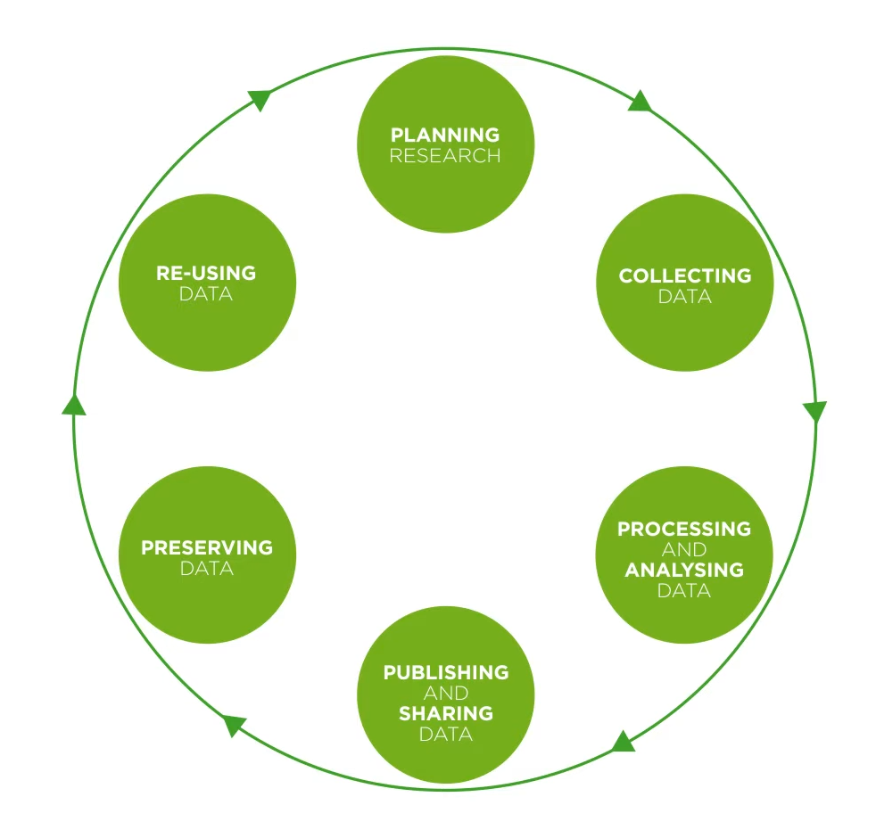

## Intended learning outcomes

- Understand the data lifecycle
- Understand how metadata supports the data lifecycle
- How metadata creation and management needs to be considered in all stages of data lifecycle

---

## Overview

- What are the different stages of the data lifecycle
- How does metadata relate to the data lifecycle
- How does metadata help create provenance 

--

## What are the 6 steps in the data lifecycle?

Try breaking down the data lifecycle into 6 stages

Name each stage and suggest what research activities might happen in each of them.

::: notes
_[Task: step 1: ask participants to name 6 stages of data lifecycle.
       step 2: ask participants to place 6 stages in order (don't specify shape)]_
:::

---

## Data lifecycle

To find out more about the research activities that happen at each stage, watch the [UK Data Service video on the data lifecycle here.](https://youtu.be/-wjFMMQD3UA)

::: notes
UK Data service - [Data ifecycle](https://ukdataservice.ac.uk/learning-hub/research-data-management/)

:::
---

## Which stage includes metadata?

All of them! Metadata should be integrated in all areas of the data lifecycle.

Having strong documentation helps both metadata users and metadata creators throughout the research data lifecycle.

---
## Creating metadata to aid the data lifecycle

Research can be a disconnected process. Information can be lost at different stages of the data lifecycle.

Metadata helps connect up the research process. Metadata can connect and accumulate information as you go through the process, allowing you to build on previous information and document the whole data lifecycle in a coherent and robust way.

You can also document different versions of your data, noting when elements are updated or changed, so you have a clear picture of the evolution of your (meta)data.

So creating metadata consistently from the very start of the data lifecycle, increases the quality and utility of your documentation.

---

## Metadata, the data lifecycle and provenance

By creating metadata throughout the data lifecycle, you create robust data provenance.

Data provenance is a type of metadata that documents the historical record of data as it moves through various stages, processes and transformations in the data lifecycle. 

Data provenance enhances trust, credibility and reproducibility of data by providing details such as who created the data, the history of modifications and who made those changes.

>[!NOTE]
>Do the data lifecycle names for each stage need to be changed so they reflect the image created by the UK Data Service?
>
::: notes
Data provenance: https://www.ibm.com/think/topics/data-provenance
Data Provenance Metadata: https://ardc.edu.au/article/data-provenance-metadata-builds-trust-credibility-and-reproducibility/#:~:text=Data%20provenance%2C%20a%20type%20of,whom%20the%20data%20is%20collected.

--- 
## How others can use metadata to inform their data lifecycle

If you are doing primary research, looking at previous research to inform your study design and data collection method can be helpful. If you are doing secondary research, finding the right datasets for your inquiry is a fundamtental part of your planning and data collection stage. You may also need to find data for other forms of inquiry outside of the research space, for example for policy briefings.

However, finding the right data can be time consuming. If datasets have incomplete or low quality metadata, it is hard to know what a dataset contains and whether it will be useful for us. It's also difficult to understand how the data was collected and how your study could build on existing research.

When robust metadata is available, you can search (meta)data repositories such UK Data Archive or CLOSER Discovery, allowing you to discover datasets effecitvely.

The metadata enables the filter and search functions of these sites. When you want to look into a dataset more closely, further metadata helps you quickly understand what the data is about, what it measures and how the research was conducted.

---

## Test your knowledge

