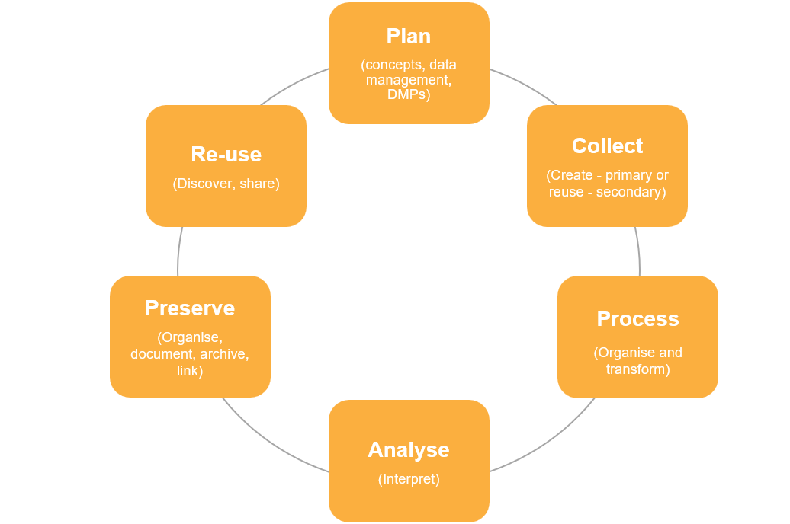

## Intended learning outcomes

[strucutre of this unit needs further consideration]

- How metadata supports the data lifecycle
- How metadata creation and management needs to be considered in all stages of data lifecycle
- How metadata enables each activity in the stage of data lifecycle
---

## Overview

--

## What are the 6 steps in the data lifecycle?

::: notes
_[Task: step 1: ask participants to name 6 stages of data lifecycle.
       step 2: ask participants to place 6 stages in order (don't specify shape)]_
:::

---

## The data lifecycle

_[This image needs to updated so it reflects the terminology of the image below]_

---

## Which stage includes metadata?

All of them! Metadata should be integrated in all areas of the data lifecycle.

Having strong documentation helps both metadata users and metadata creators throughout the research data lifecycle.

--- 
## Using metadata to inform your research

Data lifecycle stages: Plan, Collect, Preserve, Re-use

If you are doing primary research, looking at previous research to inform your study design and data collection method can be helpful. If you are doing secondary research, finding the right datasets for your inquiry is a fundamtental part of your design and data collection. You may also need to find data for other forms of inquiry outside of the research space, for example for policy briefings.

However, finding the right data can be time consuming. If datasets have incomplete or low quality metadata, it is hard to know what a dataset contains and whether it will be useful for us. It's also difficult to understand how the data was collected and how your study could build on existing research.

When robust metadata is available, you can search (meta)data repositories such UK Data Archive or CLOSER Discovery, allowing you to discover datasets effecitvely.

The metadata enables the filter and search functions of these sites. When you want to look into a dataset more closely, further metadata helps you quickly understand what the data is about, what it measures and how the research was conducted.

---
## Creating metadata to aid the data lifecycle

Research can be a disconnected process. Information can be lost at different stages of the data lifecycle.

Metadata helps connect up the research process.

Research can be a disconnected process – data and information management can utilise metadata to connect and accumulate information as you go through the process, making the previous information available at each subsequent stage (communications - between different people, find ways to connect up the research process). 

---

---

## Metadata helps build provenance in the data lifecycle

By creating metadata throughout the data lifecycle, you create robust data provenance.

Data provenance is a type of metadata that documents the historical record of data as it moves through various stages, processes and transformations in the data lifecycle. 

Data provenance enhances trust, credibility and reproducibility of data by providing details such as who created the data, the history of modifications and who made those changes.

::: notes
Data provenance: https://www.ibm.com/think/topics/data-provenance
Data Provenance Metadata: https://ardc.edu.au/article/data-provenance-metadata-builds-trust-credibility-and-reproducibility/#:~:text=Data%20provenance%2C%20a%20type%20of,whom%20the%20data%20is%20collected.

---

## Plan

[Metadata creator: Detail what you need to think about when creating metadata at this stage]
[Metadata user: Outline how using metadata assists researchers in this stage]

**Metadata user**
- Helps you find data when conducting a literature research in the planning stage
  - Challenges: data is hard to find if it is in spearate 

 **Metadata creator**
- Metadata at the planning stage:
  - Identify the data repositories/archives we want to deposit our data in. Some infrastructures may have metadata requirements, it is important to identify these at the start of your
  - What controlled vocabularies and metadata standards should we use
  

---

## Test your knowledge

