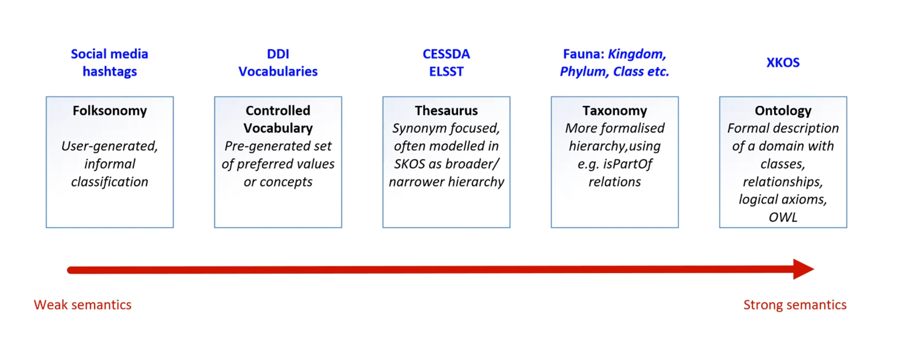

## Intended learning outcome

- Understand what controlled vocabularies are and why they're important
- How to find the right vocabulary for your research
- Practice finding and using controlled vocabulaires
- Overview of theasurus, taxonomies and ontologies
  
---

## Outline

- Metadata management and best practice
- Impact of low quality metadata
- What are controlled vocabularies and when do you use them
- Importance of controlled vocabularies
- What are taxonomies and how are they used
- What are ontologies and how are they used
- How do we find controlled vocabularies?

 ---

## Metadata management and best practice

In order to make sure metadata is effective for both humans and computers, we need to manage our metadata.

If we don't follow metadata best practice, the value and effectiveness of our metadata is diminished.

For example, why is this metadata not helpful?

 

---
## Defining bad metadata

 

---

## Impact of low quality metadata

Inconsistent and duplicated metadata:
- Hinders the searchability and discoverability of data
- Reduces the reliability and validity of data
- Is time consuming as people have to identify what terms are relevant for their search and integrate different terms

If metadata is bad quality, it undermines its three mains purposes to increase discovery, understanding and resusability of data.

---
## Best practice in metadata 

To ensure metadata is effective, best practice in metadata creation needs to be followed.

These best practices should promote:
- Consistency so metadata reliably describes data and can be compared across datasets
- Accuracte description so data is easily understood
- Searchability of metadata so data is discoverable
- Persistent use of terms that don't expire

---
## Tools for metadata best practice

Two main tools that are used implement metadata creation best practice are:

1. Controlled vocabularies
    
2. Metadata schemas and standards

In this unit, we will look at controlled vocabularies and the related concepts of taxonomies and ontologies.

In the next unit, we will look at metadata schemas and standards.

---

## What are controlled vocabularies?

'A controlled vocabulary is a list of terms that describes a certain domain of knowledge. In the controlled vocabulary you **only use one term to describe one particular phenomenon**, excluding all other synonyms.'*

The terms in controlled vocabularies can be used in metadata fields. They provide consistency and structure to metadata, reducing the risk of duplicate terms where different terms are used for the same concept or one term is used for multiple concepts.

For example, 

>[!NOTE]
> Currently using NBI Sweden definition of controlled vocabulary. Should this be changed to CoData RDM terminiology definition to keep consistency?

::: notes

*https://nbisweden.github.io/module-metadata-dm-practices/guide/index.html

Controlled vocabularies are used in descriptive metadata fields to support consistent, accurate, and quick indexing and retrieval of digital asset content. It has a specific definition associated with a particular value**. --> Hedden, H (2007) Taxonomies and controlled vocabularies best practices for metadata. (https://link.springer.com/article/10.1057/dam.2010.29)

:::

---

## Using a controlled vocabulary 

There are different controlled vocabularies for different concepts.

Example 1:

- [Give example of a metadata element using ISO 639-2]

- Language - [ISO 639-1/639-2](https://www.loc.gov/standards/iso639-2/php/code_list.php)
  - Specifies how to write languages e.g. English = en, French = fr, Spanish = es

Example 2:

- [Give example of a metadata element using ICD]

- Disease and health conditions: International Classification of Disease (ICD)
  - International standard to specifing terms to describe diseases and health conditions for clinical  and research purposes

Example 3:

- [Give example of a metadata element using DDI]

- Data Documentation Initiative (DDI) Controlled Vocabularies
  - Provides terms to describe social sciences, behavioral sciences, economics, and health sciences.

>[!NOTE]
> Provide another example consisting of a metadata element and the corresponding controlled vocabuarly it is using. Try include a discipline specific one.

---
## Choosing the right controlled vocabulary for your metadata

Sometimes metadata users will independently decide what controlled vocabularies they use for a particular metadata field. Other times, a metadata standard or schema might specify what controlled vocabulary to use for a specific metadata field. We will look at metadata standards in the next unit.

---

## Finding a controlled vocabulary

You can find relevant controlled vocabularies for your research online.
Websites such as [Bartoc](https://bartoc.org/) compiles many controlled vocabularies allowing you to search and filter to identify the one most appropriate for your research.
Similarly your area of research of academic discipline, may use certain controlled vocabularies. For example, for Oceanographic Data in the UK, you may want to use the [Natural Environment Research Council (NERC) Vocabulary Server](https://vocab.nerc.ac.uk/collection/) which lists all relevant controlled vocabularies for the feild.

If you storing your data in a repository or using a metadata standard, they may specify certain controlled vocabularies to use.

---

## Case study (practice): Finding a controlled vocabulary

Using [Bartoc](https://bartoc.org/), find a controlled vocabulary that is relevant for this data:

>[!NOTE]
> Would it be useful here to include a practice example where we give a small dataset example alongside a short explanation of what the research is about. We then ask participants to find a relevant controlled vocabulary using the Bartoc tool.

---

## Case study (answer): Finding a controlled vocabulary

This is the controlled vocabulary we chose.

Here are the reasons behind this choice:
- [Give the thought process behind choosing that particular controlled vocabulary]

>[!NOTE]
> We would then explain what controlled vocabulary we picked for this dataset and give the reasoning behind it (e.g. popular in the discipline, expansive, relevant etc.)
> We coul also add an practice activity of **using** the chosen controlled vocabulary, asking participants to complete a metadata element for the example dataset referring to a controlled vocabualry.
---

## Application: Find a controlled vocabulary for your research

Now you have practised finding a relevant controlled vocabulary, find a controlled vocabulary for your research.

---

## Application: Using a controlled vocabularly 

---

## Controlled vocabularies: going further

Some controlled vocabularies are more specific and not only define concept terms but also outline the relationship between different terms and/or concepts.

Theasuri, taxonomies and ontologies are specific types of controlled vocabularies that contian more detailed explanation of terms. 

The image below describes how the strength of semantics relate to different systems.

Strong semantics refer to systems that are more speific and complex in describing terms and the relationships to each other.  

>[!NOTE]
> Would you describe theasuri, taxonomies and ontologies as a type of controlled vocabylary or a separate systems all together?

---

## Theasuri 

Instead of providing a singular term, thesauri specifics a preferred term alongside variant terms, broader terms and narrower terms. They can also contain related terms that describe similar concepts.

Terms for art, architecture, decorative arts, material culture, and archival materials: Getty Institute Art and Architecture Thesaurus Online (AAT) 

UNESCO Thesaurus is the list of terms used in education, culture, natural sciences, social sciences, human sciences, communication and information.

:::
notes
https://pitt.libguides.com/metadatadiscovery/controlledvocabularies

:::

---

## Taxonomies

Taxonomies not only describe specific terms but also define hierarchical structures between different terms, outlining parent/child relationships.

_- Give an example of taxonomies_

---

## Ontologies

- Ontology further specifies the relationships between different terms
- _Give an example of ontology_

[Overview of ontologies - high level explanation]

---

## Test your knowledge 

