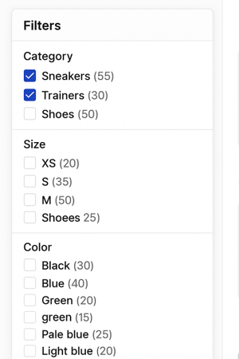

---

# Unit 2.5 Controlled vocabularies

## Unit overview

### Unit study time
2 hours

### Intended learning outcome

- Understand what controlled vocabularies are and their role in metadata creation
- Know how to find a relevant controlled vocabulary to use in metadata 
- Gain a high-level understanding of theasuri, taxonomies and ontologies

### Outline

- Metadata management and best practice principles
- Impact of poor quality metadata
- What are controlled vocabularies and when do you use them
- The benefits of controlled vocabularies and how they enable FAIR data
- Where to find controlled vocabularies
- What are theasuri, taxonomies and ontologies and how are they used

---

## Metadata management and best practice

As we explored in the [last unit](<2.4 Using metadata: Discover data.md>), metadata can be leveraged as a search and filter tool on data catalogues. This enables people to find data based on keywords, topics or dates. Through being machine actionable, metadata is a powerful form of documentation that provides more functionality than unstructured documentation.

In order to be machine actionable, computers need to be able to read metadata. Therefore, metadata must be structured and stored in appropriate, machine readable formats.

In [unit 2.1](<2.1 Introduction to metadata.md>) we touched on machine readable formats that metadata should be stored in. This includes CSV, XML, JSON and MS Excel. By being in these formats, machines can read metadata and action it. Metadata should not be stored in free-text formats such as PDF or MS Word, as computers will not be able to read and interpret this information. 

However, just because machines can read metadata does not mean that metadata is automatically valuable as a discovery tool. 

For example, look at the screenshot below that shows filters for a shopping site based on the object's metadata.
Why are these filters not helpful? What could be the issues with the clothes' metadata that are causing problems with the filters?

 

---

### Poor quality metadata

Duplicate terms, spelling errors, and wrongly placed categories create 'dirty' metadata which has limited use as a discovery tool. While machines can read dirty metadata, they can't action it correctly as the relationships between different objects are not effectively described by metadata. This means you get search returns that confuse different items and mix different categories.

 

**[1+2]** **Inconsistent or incorrect terms**

A computer doesn’t know that 'Shoees' is probably just a typo for 'Shoes', instead it treats them as two totally separate categories. Same goes for different terms like 'Trainers' and 'Sneakers.” Even though they mean the same thing to us, the system sees them as unrelated, which means your search results could miss half the data unless you manually spot and fix it.

**[2]** **Incorrect strucutre**

'Shoees' is also placed in the 'Size' category meaning it's linked to 'XS, S, M, L'. This is because the strucutre of the metadata and the relationship between the terms is incorrect. So while the computer can read this metadata, it can't action it correctly which means our ability to use metadata as a disocovery tool is hindered.

**[3]** **Vague and undefined metadata**

Then there’s vague metadata like “light blue” vs. “pale blue.” Are they the same colour? Should they be grouped together? Without clear definitions, it’s hard to tell, and that can lead to confusion or missed connections.

Thinking back to the FAIR principles, dirty metadata makes it harder for metadata to be interoperable. The metadata can’t easily slot into data catalogues or repositories as they don't follow the specified structure. This means we can can't compare metadata for the study with other studies and we miss out on opportunites to re-use data and compare studies.

---

### Impact of poor quality metadata

'Dirty' (poor quality) metadata...

- Hinders the searchability and discoverability of data as computers cannot read and interpret the metadata effectively
- Reduces the reliability and validity of data as uncorrected errors remain in the documentation
- Reduces the interoperability of the data as it is harder to identify and compare similar objects
- Makes research processes more time consuming as people have to identify what terms are relevant for their search and work around errors
  
'Dirty' metadata fails to effectively implement both the FAIR data principles and the main purpose of metadata: to increase the discovery, understanding and (re)usability of data.

---

## Metadata best practice

To help us overcome these issues and ensure metadata is high-quality and follows best practice.

**Best practice principles** 

Some best practice principles to consider include...
- **Accurate** descriptions that provide the appropriate level of information neccessary to understand a project
- Being **consistent** with the use of terms within a project's metadata to avoid confusion or misinformation
- Use **standardised** terms that are commonly used within the relevant discipline and are unlikely to become redunant
- **Searchability** of metadata so it can be used to discover data

**Tools to implement best practice** 

Two main tools that are used implement metadata creation best practice are...

1. Controlled vocabularies
2. Metadata schemas and standards

In this unit, we will look at controlled vocabularies and the related concepts of theasuri, taxonomies and ontologies.

In the [next unit (2.6)](<2.6 Metadata standards.md>), we will look at metadata schemas and standards.

>[!NOTE]
> BO - is there a citation for this, or is this what we understand as best practice? It reads to me as if these are an established set of rules/principles, like FAIR. I also think the last three points are a bit vague - can they be expanded on? E.g. I wouldn't know what this means and how to action it if I was new to metadata/CVs/standards "Persistent use of terms that don't expire". 
> HM - what does Searchability of metadata so it can be used to discover data mean?

---

## Controlled vocabularies

What are controlled vocabularies?

CODATA defines controlled vocabularies as...
> 'List of standardised terminology, words, or phrases, used for indexing or content analysis and information retrieval, usually in a defined information domain.'

NBI Sweden defines them as...
>'A controlled vocabulary is a list of terms that describes a certain domain of knowledge. In the controlled vocabulary you **only use one term to describe one particular phenomenon**, excluding all other synonyms.'[^1]

Simply, a controlled vocabulary provide a pre-defined list of input options for a metadata element. Through limiting what information can be inputted for a metadata element, controlled vocabularies provide consistency and structure to metadata amd reduces the risk of human errors and inconsistencies as explored above.

You can create your own controlled vocabulary by setting a list a set of accepted values for a metadata element. Where necessary, you can also provide definitions for the values in order to remove any confusion. 

For the colour metadata in the previous example, we could use the controlled vocabulary of...

- Green
- Blue
- Black

  
This would remove the issue of confusing categories ('pale blue' and 'light blue') and prevent the formatting error of 'Green' and 'green'.

There are also publicly available controlled vocabularies that provide a list of pre-defined terms that relate to a specific discipline or area of knowledge. These are created and updated by a relevant research community and are a type of community based standard. 

The power of a controlled vocabulary increases when it becomes widely adopted, as it makes metadata using the same vocabulary interoperable. This saves you time creating extra documentation and also makes your metadata more interoperable as other researcher projects will use the same vocabularies. Where possible, it's best to use publicly avaliable, community reviewed standards. 

For example, a country could be referred to in different ways ...
- America, United States, US
Or in different languages ...
- Germany, Deutschland, Allemagne

To standardise this infomraiton, we can use the publicly available controlled vocabulary [ISO 3166-1 Alpha-2 Country Codes](https://www.iso.org/obp/ui/#search). The controlled vocabulary provides two-letter codes for every country which can be used across languages, allowing us to standardise how we refer to countries across different research projects 
- US – United States
- DE – Germany

>[!NOTE]
> JJ - There are two issues, one is it is good practice to use a restricted list of terms, which is made very well, I think we could say CVs in a research or statistical context which is where the community based standards should be emphasised, but we are using the terms interchanagly as they serve the same purpose, but that might be something to save for Foundational  
> KR I have added a senstence about controlled list of terms to separate that out to indicate how they can be used to aid metadata creation.

[^1]: https://nbisweden.github.io/module-metadata-dm-practices/guide/index.html). I think it gives a bit more depth than the CODATA definition which is this 'List of standardised terminology, words, or phrases, used for indexing or content analysis and information retrieval, usually in a defined information domain.' 

---

## Using a controlled vocabulary 

Here is some metadata for a list of books. What columns do you think could benefit from using a controlled vocabulary? Why?

| Book title             | Author                | Original language  | Language  | Genre    | Quantity
|------------------------|-----------------------|--------------------|-----------|----------|----------
| To Kill A Mockingbird  | Harper Lee            |  English           | eng       | Fiction | 14                 
| On Social Contract     | Rousseau, Jean-Jacques|  french            | english   | Political non-fiction  | 5           
| The Odyessy            | Homer                 |  Ancient Greek     | Greek     | Poetry fiction | 9      
| Lord Of The Flies      | Golding, W.           |  English           | en        | Coming-of-age literature | 7    

---

### Where can we use a controlled vocabulary 

We could apply a controlled vocabulary to the Original language, Language, and Genre columns. This is because they will use similar or repeated terms that we need to ensure are standardised across our dataset. 

As the book title and author column will contain unique data for each object, a controlled vocabulary is not relevant. However, we do want to standardise how we write this information, for example, for 'Author', surname, first name / firstname surname / firstname initial, surname etc. You may use a metadata standard or schema as guidance on how to format these columns. We will explore this in the next [unit 2.6 Metadata standards](<2.6 Metadata standards.md>).

Looking at the data in those columns, what are some of the current issues?

<b>Current issues in the book metadata</b>

<ul>
<li>Data is presented in different ways: _English, eng, en_</li>
<li>Different levels of specficity of data in the genre column: _Fiction_ compared to _Coming-of-age literature_ and similar terms _Fiction_ and _Literature_ are used interchangeably with no further clarification</li>
<ul>
  
Controlled vocabularies provide a way to standardise these terms. The definitions for the terms have been widely agreed within a discipline and can save you time by referring directly to them rather than defining them yourself in your own documentation.

---

### Applying a controlled vocabulary 

Going back to the book example, we could use the following controlled vocabularies for the Language and Genre metadata fields.

-  A widely adopted cross-disciplinary controlled vocabulary for language names is the [ISO 639-1/639-3](https://iso639-3.sil.org/code_tables/639/data)
  - ISO 639-1/639-3 specifies how to write languages in three letter codes e.g. English = eng, French = fra, Ancient Greek = grc, Modern Greek = ell

- A domain-specific controlled vocabulary for labelling genres in library archiving is the [Library of Congress Genre/Form Terms for Library and Archival Materials](https://www.loc.gov/aba/publications/FreeLCGFT/freelcgft.html)

| Book title             | Author                | Original language  | Language  | Genre    | Quantity
|------------------------|-----------------------|--------------------|-----------|----------|----------
| To Kill A Mockingbird  | Harper Lee            |  eng               | eng       | Legal fiction; Domestic fiction; Bildungsromans | 14                 
| On Social Contract     | Jean-Jacques Rousseau |  fra               | eng       | Political literature; Philosophical literature  | 5           
| The Odyessy            | Homer                 |  grc               | ell       | Epic poetry; Mythological fiction; Adventure fiction  | 9      
| Lord Of The Flies      | William Golding       |  eng               | eng       | Allegories; Psychological fiction; Adventure fiction | 7  

By standardising the metadata, we avoid confusion around inconsistent categories or different levels of information. Instead, we can compare the same type of metadata across different objects as the metadata is interoperable. This means we can deposit the metadata into a centralised platform, like a library catalogue, where machines can effectively read it in order to use the metadata as a search and filter tool.

In the metadata records, you can also reference which controlled vocabularies are used so other people looking at the metadata can reference the original vocabulary as a single source of truth for the definitions of the terms.

---

## Controlled vocabularies for research metadata

Let's consider other common research metadata that we should use controlled vocabularies for.

**Cross discipline**

You may use cross discipline controlled vocabularies for the following research metadata...
- Countries
  - For metadata that describes where the research was conducted
- Languages
  - For metadata that describes that language the data is stored in
- File format
  - For metadata that describes what format the data is stored in
- Access and copyright
  - For metadata that describes a research project's access and copyright licenses

**Discipline specific**

You may use controlled vocabularies for discipline specific metadata such as...
- Metadata describing data collection methods or instruments e.g. Questionnaries, Surveys, Focus Groups 
- Metadata describing specialised terms and/or categories e.g. disease names in life sciences
- Metadata describing concepts specific to your discipline 

>[!NOTE]
> BO - Can we provide examples for the last two bullet points?
> JJ lets remove the last two bullet points, introducing keywords is the opposite of a CV! and standardised scales is not an area wher they are widely used

---

## How to find a controlled vocabulary

Once you identify what metadata you can apply a controlled vocabulary to, you need to find a relevant one to use.

Your research area or academic discipline may use and encourage certain controlled vocabularies. For example, if you had oceanographic data in the UK, you may want to use the [Natural Environment Research Council (NERC) Vocabulary Server](https://vocab.nerc.ac.uk/collection/) which lists all relevant controlled vocabularies for that field.

If you are storing your data in a repository or using a metadata standard or schema, they may specify certain controlled vocabularies to use (note, we will cover metadata standards in [unit 2.6](<2.6 Metadata standards.md>)).

You can also find controlled vocabularies yourself, using websites such as [Bartoc](https://bartoc.org/) which compiles many controlled vocabularies allowing you to search and filter across disciplines and concepts to identify the most appropriate one for your data. 

Try using [Bartoc](https://bartoc.org/) to find a controlled vocabulary that is relevant for your area of research.

When choosing a controlled vocabulary you should consider...
- Uptake of the controlled vocabulary in your research field
- Whether a metadata standard specifies the controlled vocabulary you should use
- Whether a data repository and/or catalogue you want to deposit your data in specifies the controlled vocabulary you should use

For example, say you're creating metadata for a social science project. You want to capture infomration about the unit of analysis, the type of data you collected in your research and 

Using the [Bartoc](https://bartoc.org/) tool, can you identify controlled vocabularies you may want to use?

>[!NOTE]
> Would it be useful here to include a practice example where we give a small set of metadata alongside a short explanation of what the research is about. We then ask participants to find a relevant controlled vocabulary using the Bartoc tool.  
> BO - Yes :)  
>Struggling to find an example for this

---

## Controlled vocabularies: going further

If you work with controlled vocabularies, you may also come across theasuri, taxonomies and ontologies. While these lists have a similar purpose to standardise metadata, they have slightly different features to controlled vocabularies.

As we covered earlier in this unit, controlled vocabularies offer **one term** to describe one concept. In comparison, theasuri offer different terms that are commonly used for the same concept. They may specify the preferred term to use. 

While controlled lists are a flat list that do not specify relationships between terms, taxonomies and ontologies describe the connections between terms. This includes the hierarchy of terms, for example a term that has a group of sub-terms related to it (also referred to as a parent/child , where a parent term has child terms (sub-terms) that can be described within it). 

>[!NOTE]
>SW can you explain a bit more explicitly the 'parent/child' term? As in what makes this a sub-term. Just a sentence as Im unclear which is the main term/sub term  
> HM - "As we covered earlier in this unit, controlled vocabularies offer one preferred term to describe a single concept. Thesauri provide multiple terms—including synonyms and related terms—that are commonly used for the same concept. They may specify the preferred term to use."
> HM -disucssed this section with Kate about not needing too much detail about each one, but should highlight that there are differnent types of CVs including theasuri, ontologies etc. Could move to later training and the colour filtering example could be used to show how relationships could work. 

The image below describes how the strength of semantics relate to different systems.

Strong semantics refer to systems that are more specific and complex in describing terms and the relationships to each other.  

Click through the different boxes to read more information about each system of knowledge.

<b>Theasuri</b>

Instead of providing a singular term, thesauri specifics a preferred term alongside variant terms, broader terms and narrower terms. They can also contain related terms that describe similar concepts.

For example ...
<ul>
<li>Getty Institute Art and Architecture Thesaurus Online (AAT) lists terms for art, architecture, decorative arts, material culture, and archival materials</li>
</ul>li>UNESCO Thesaurus is the list of terms used in education, culture, natural sciences, social sciences, human sciences, communication and information</li>
</ul>

<b>Classifications</b>

Classifications group similar items or terms into categories, defining the parameters of each category. These categories can be flat or hierarchial. Classifications are most often discipline specific.

For example ...
<ul>
<li>Disease and health conditions: International Classification of Disease (ICD)</li>
 <ul>
 <li>International standard to specifing terms to describe diseases and health conditions for clinical  and research purposes</li>
 </ul>
<li>[International Standard Classification of Occupations (ISCO)](https://ilostat.ilo.org/methods/concepts-and-definitions/classification-occupation/)</li>
 <ul>
 <li>Groups and categorises data on occupation and employment</li>
 </ul>
</ul>

<b>Taxonomies</b>

Taxonomies not only define terms but also outline hierarchical structures between different terms, specifying parent/child relationships.

For example ...
<ul>
<li>[Taxonomy of Innovation](https://hbr.org/2014/01/a-taxonomy-of-innovation)</li>
</ul>

<b>Ontologies</b>

CODATA defines an ontology as
'Shared and standardised list of words, terms and phrases to describe components of a particular discipline or domain, along with a taxonomy of their relations... Ontologies are typically developed by domain-specific institutions or communities to aid in the precise referencing of elements.'

Where taxonomies are focused on defining hierarchial relationships, ontologies have a wider reach and describe relationships between concepts and objects beyond hierarchial terms. For example, it may specify if an object is 'part of' or 'equaivalent to' something else. In this way, it is a more sophisticated and detailed description of the relationships between items.

For example ...

<ul>
<li>[Ontology for General Medical Science](https://bioportal.bioontology.org/ontologies/OGMS?p=summary)</li>
<li>[Environment Ontology](https://sites.google.com/site/environmentontology/Browse-EnvO)</li>
</ul>

---

## Test your knowledge 

True or false...
- Controlled vocabularies help ensure consistency in metadata by using agreed-upon terms.
- Controlled vocabularies are automatically generated by all metadata tools.
- Controlled vocabularies allow metadata creators to write free-text descriptions.
- You only use one controlled vocabulary for your entire metadata.
- You can create your own controlled vocabulary.

Questions...
- How do controlled vocabularies make metadata more interoperable?
- How can you find a relevant controlled vocabulary for your metadata?
- When should you find a controlled vocabulary?

<b>Answers</b>

<ul>
<li>True or false...</li>
 <ul>
 <li>Controlled vocabularies help ensure consistency in metadata by using agreed-upon terms. <b>TRUE</b></li>
 <li>Controlled vocabularies are automatically generated by all metadata tools. <b>FALSE</b> </li>
 <li>Controlled vocabularies allow metadata creators to write free-text descriptions. <b>FALSE</b>  </li>
 <li>You only use one controlled vocabulary for your entire metadata. <b>FALSE</b> </li>
 <li>You can create your own controlled vocabulary. <b>TRUE</b> </li>
 </ul>
<li>Questions...</li>
 <ul>
 <li>By standardising terms and definitions, controlled vocabularies help make metadata consistent and reduce the potential for human errors and the use of confusing terms. When different studies use the same controlled vocabularies, metadata can be integrated and compared meaning it is more interoperable. </li>

 <li>You can search repositories like [Bartoc](https://bartoc.org/) or domain specific repositories such as [Bioportal](https://bioportal.bioontology.org/) to find a relevant controlled vocabulary. You can also consult subject matter experts and academics or review published datasets.  </li>

 <li>Ideally, you should identify the controlled vocabularies you want to use at the start of the research lifecycle before data collection begin so terms can be applied consistently. Controlled vocabularies may also influence how you design your data collection method.  </li>
 </ul>
</ul>

---

## References

- NBISweden (2020) _Controlled vocabularies & ontologies_ www.nbisweden.github.io/module-metadata-dm-practices/02-ontologies/index.html
- Dzikowski, C., Bell, D., Gregory, A. (DDI Alliance and CODATA) (2022) _DDI Controlled Vocabularies_ [Online video] www.codata.org/initiatives/data-skills/ddi-training-webinars/ddi-controlled-vocabularies-the-cessda-workbench-skos-and-xkos/
- Gourley, D., Zhang, A. B. (2009) 'Creating metadata' pp 73-88 in _Creating Digital Collections: A Practical Guide_ Chandos Available at: 
https://doi.org/10.1016/B978-1-84334-396-7.50006-7
- Decision Tree Levels for Controlled Vocabularies www.docs.google.com/document/d/1YB7ugyI8yJPWE8qI6J8pwkD8RNLOIxv5NIgr30-HAo8/edit?tab=t.0#heading=h.c19wz64z9fbz

University of Pittsburgh (2025) _What are taxonomies and controlled vocabularies?_ www.pitt.libguides.com/metadatadiscovery/controlledvocabularies

