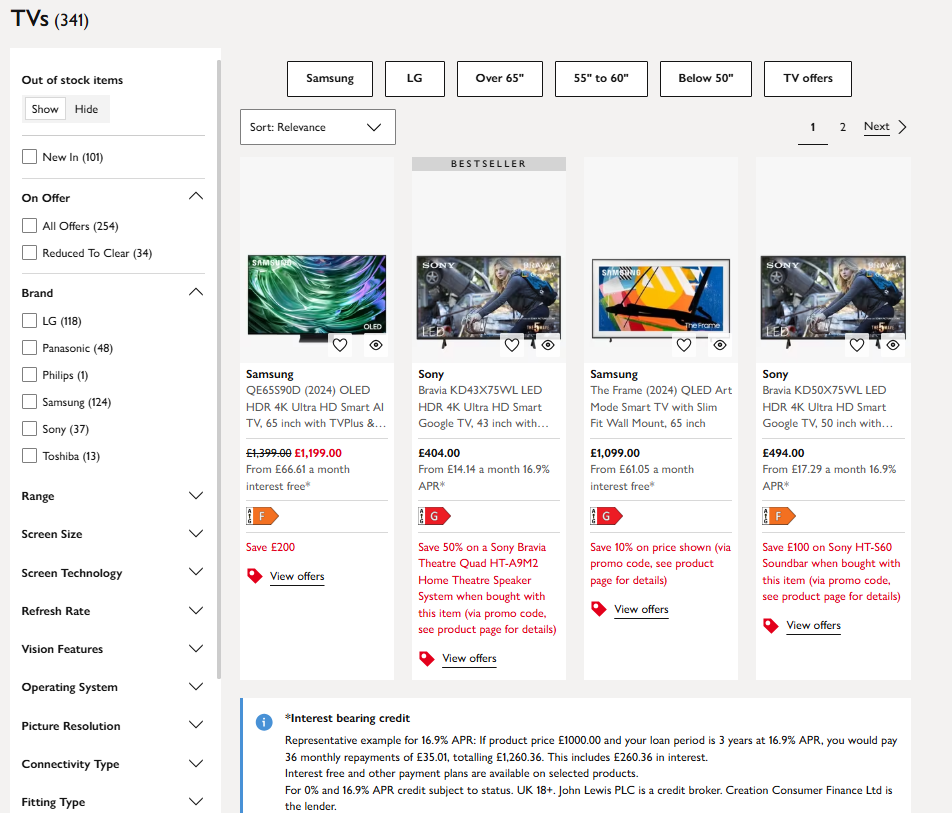
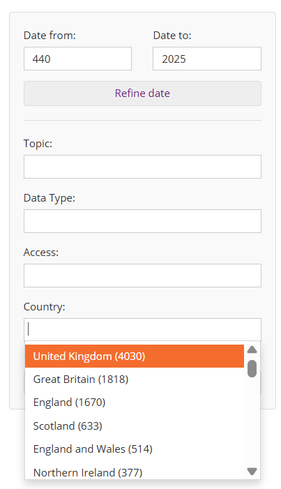
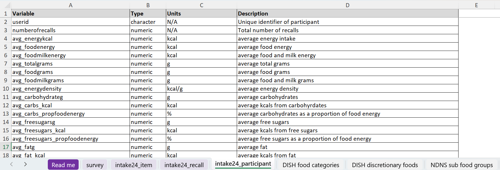
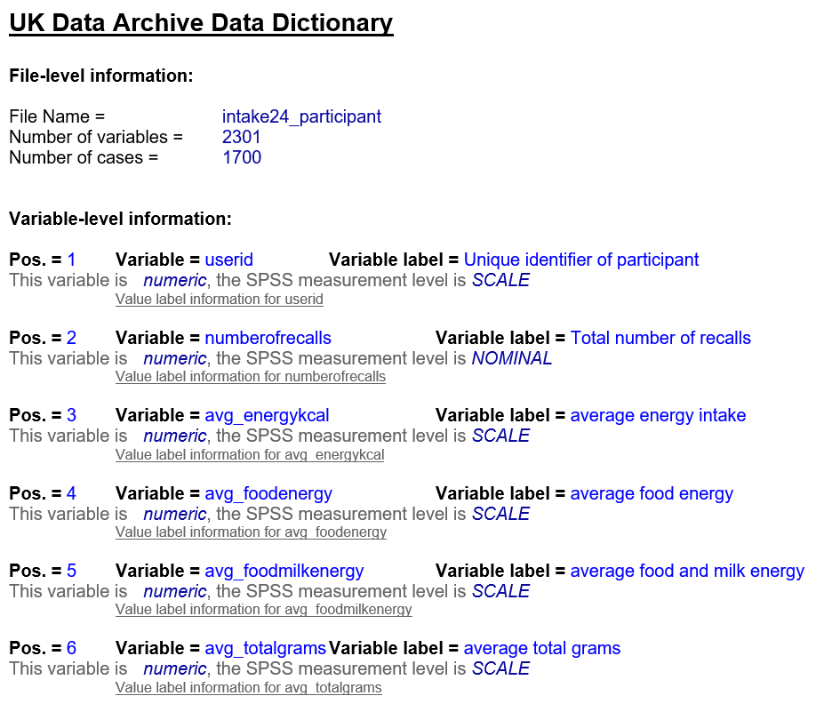

# Unit 2.4 Using metadata: Discover data

## Unit overview

### Unit study time
1.5 hours

### Intended Learning Outcome 

By the end of the unit, you will be able to ...

- Describe what a data repository and data catalogue is and understand what their role is in research
- Know how to search and filter data catalogues
- Explain the role of metadata in enabling the search/filter function on data catalogues
- Undestand how codebooks and data dictionaries help us understand a dataset further

### Outline

- How to use metadata to discover data
- Overview of data repositories and data catalogues
- Practise searching and filtering data catalogues
- Overview of codebooks and data dictionaries
- Using metadata to understand data

---

## Discovery

First, let's look at discovery. In our everday lives, we use metadata all the time to discover resources. Can you think of any examples?

<b>Everyday examples of using metadata for discovery </b>

 

<b>Shopping sites:</b> a product's metadata allows us to search and filter the site in order to find the item we're looking for. For example, we can look through categories, brand, price range etc.

 

 
<b>Streaming platforms:</b> a show's metadata allows us to search and filter the platform to find a show based on genre or actor, for example. 

<b>Photos:</b> when we take a photo, a device will often capture information such as when and where the picture was taken. You can then filter through this metadata when looking through your photos

---

### Data discovery in research

Why do we need to discover research studies and their data?

We may need to find existing research projects and their data to ...
- Conduct literature reviews and understand how a new project will fit into existing research
- Help inform the research design of a new research project
- Idenitfy secondary data for a new research project
- Help produce materials such as policy briefings

So, how do we go about finding data? 

Imagine you're a social science researcher looking at population and climate. You want to  conduct research on improving water quality in cities in the UK. You're considering working from secondary data and you want to find open data from the years 2000-2025 that relate to this subject.

How would you go about it? What tools would you use?

>[!NOTE]
> Not sure if this is the best example for the dataset search activity. Happy to go with another one that is suggested.
> BO - I think it's fine! If you need other social science examples, some options could be research on the mental health of students in the 2010's vs. the 2020's, or the impact of education on voting, or the impact of changes in family structure on child development (that's my personal interest so had to get that in there!). If they're doing practical activities related to the case study, these would work as there's lots of existing data on mental health, education, politics, family structure/family structure transitions (e.g. marital status, divorce status), child development outcomes (e.g. health, education, social mobility) etc.

---

## Tools to discover data

One common way people discover research is online, through data repositories and data catalogues. These searchable platforms can be accessed on the web, and they bring together a vast range research projects in one area.

The terms data repositories and data catalogues are sometimes used interchangeably but they are different tools.

**Data repository** 

The UK Data Service describes a data repository as 'a centralised database system that collects, manages, and stores datasets for later use'. They are designed for the long-term storage of datasets which can then be managed and accessed through the repository. 

**Data catalogue** 

CODATA defines a data catalogue as a 'curated collection of metadata records describing datasets and their data elements. Curated and organised using a formal metadata schema appropriate to data and data sets (e.g. ReCollect etc)'. Sometimes a data catalogue is referred to as a metadata repository (note that this is different from a data repository which stores the actual data). 

While a data repository stores the actual data, a data catalogue is a discovery tool. A data catalogue only stores the metadata records and direct people to where they can access the data. Therefore, when we're looking for data, we normally search a data catalogue and then access data using a data repository.

When a researcher finishes a project, it's good practice to deposit data in a trusted repository to ensure its long-term preservation (note, this does not mean data needs to be open). When data is deposited in a repository, it then becomes searchable on associated data catalogue sites. Thinking back to [unit 1.3](<1.3 FAIR.md>), data repositories and data catalogues are key components of FAIR infrastructure, making data findable, accessible, interoperable and re-usable. 

Data catalogues and data repositories can be cross-discipline or discipline specific. How can you find the right data catalogue and data repository for your area of interest? 

To find data repositories and catalogues for different disciplines, you can use search tools such as ...
- [re3data.org](https://www.re3data.org/)
- [FAIRsharing.org](https://fairsharing.org/)

Using the websites above, find data catalogues and/or repositories that are relevant to your area of interest. You can also talk to other researchers in your field to identify the leading data repository and/or catalogue for your discipline.

---

### Discovery: data catalogue

How could we use a data cataglogue to find relevant research projects relating to our brief described above?

First, we need to find a relevant data catalogue. As the brief states we are a social science researcher, we chose the data catalogue [UK Data Service](https://beta.ukdataservice.ac.uk/datacatalogue/studies/#!?Search=&Page=1&Rows=10&Sort=0&DateFrom=440&DateTo=2025). As the UK Data Service stores information about economic, population, and social research data in the UK, it will most likely contain projects relevant to the brief.

The UK Data Service gives you the ability to search and filter their catalogue so you can find relevant resources quickly.

Using these functions, we could put 'water quality' in the search bar ...

 

To refine our search further, we could set the filters to reflect the brief (e.g. 2000-2025, Natural environment, Open data) ...

 

Try using these search and filter functions as described above. What research projects do you find? 

<b>Relevant research projects</b>

 

If you follow the steps above, you may have come across the following research studies ...

> Walsh, C., Wang, L. (2024). Using Participatory Approaches To Instigate Improvements in Water Quality, 2021-2022. [data collection]. UK Data Service. SN: 856882, DOI: 10.5255/UKDA-SN-856882

> Hutchins, M. (2024). Water Quality Model Outputs for an Urban River in Birmingham, 2013-2014. [data collection]. UK Data Service. SN: 857393, DOI: 10.5255/UKDA-SN-857393

> Chenoweth, J., López-Avilés, A., Morse, S., Druckman, A. (2016). SPREE project water use and wellbeing survey. [data collection]. UK Data Service. SN: 852336, DOI: 10.5255/UKDA-SN-852336

> Reed, M., Helen, K. (2021). Exploring Ecosystem Markets for the Delivery of Public Goods in the UK: Stakeholder Interviews, 2018-2021. [data collection]. UK Data Service. SN: 855274, DOI: 10.5255/UKDA-SN-855274

> Organisation for Economic Co-operation and Development. (2021). OECD Environment Statistics, 1950-2020. [data collection]. UK Data Service. SN: 7784, DOI: http://doi.org/10.5257/oecd/env/2021

Data catalogues help us find relevant research projects in a quick, user-friendly way. They also provide citation information, meaning that when we are doing a vast amount of research to find secondary data or a literature review, data catalogues and metadata help us efficiently collect and store the important citation data.  

In these examples, how do you think we are using metadata to help us discover relevant research projects?

---

### The role of metadata in data catalogues

The reason we can search and filter data catalogues is because each study has metadata. Without it, we'd have to open every study page individually to see what it's about and whether it's relevant to our work. Instead, metadata gives us the power to tailor our searches and quickly scan lots of resources in a structured, efficient way.

**Keywords search tool**

When we enter terms into the search bar of a data catalogue, the computer looks for matches in a resource's metadata, providing us with relevant search results.

Take a look at some examples of search pages on data catalogues here...
- [UK Data Service](https://beta.ukdataservice.ac.uk/datacatalogue/studies/?Search=#!?Search=&Page=1&Rows=10&Sort=0&DateFrom=440&DateTo=2025)
- [ICPSR](https://www.icpsr.umich.edu/sites/icpsr/home)
- [CESSDA](https://datacatalogue.cessda.eu/)
- [CEDA](https://catalogue.ceda.ac.uk/)
- [Office for National Statistics](https://ons.metadata.works/browser/landing)
- [ARIADNE](https://portal.ariadne-infrastructure.eu/)
- [DataMed](https://datamed.org/)
- [BioStudies](https://www.ebi.ac.uk/biostudies/studies/)
- [BioSamples](https://www.ebi.ac.uk/biosamples/)
- [ICES Metadata Catalogue](https://gis.ices.dk/geonetwork/srv/eng/catalog.search#/home)

**Filter tool** 

Metadata can also be leveraged as filters to explore a large set of objects or data. Most data catalogues will provide filters based on metadata that describes the study for example, the geographical location, the date the research was published, the organisation that conducted the research, the topics it covers, the data access level. 

For example ...

Take a look at the data catalogues listed above and see what different filters they provide.

Some sites will also allow you to search and filter low level metadata about the data within the dataset themselves. For example...
- [UK Data Service: Variable and question bank](https://discover.ukdataservice.ac.uk/variables) allows users to search the variables and questions within datasets and data collection tools
- [CLOSER Discovery: Variable and question search](https://discovery.closer.ac.uk/) also offers users to search through variable and question metadata

---

## Using metadata to understand data

### Discovery to understanding 

Once we have used the search and filter functions on a data catalogue to find relevant research projects, how can metadata help us _understand_ what a research project is about?

When we click on a particular research study in a search list, we are taken to the profile page. 

For example...

 

Here, we can see the metadata describing the overall project. This gives us a clear overview of what the study is about, when it was conducted, what datasets it contains and how we can access the data.

Data catalogues and repositories will often specify what metadata people need to provide when they deposit their data. This means the same level of information available for each study so people can easily compare resources and search efficiently. We will look at other tools that are used to standardise metadata in the upcoming units [2.5](<2.5 Controlled vocabularies.md>) and [2.6](<2.6 Metadata standards.md>) .

---

### Understanding research projects in more detail

Data catalogues usually provide the overall picture of a research project. As we explored in [unt 2.1](<2.1 Introduction to metadata.md>), having more information about the variables within a dataset helps us understand a study further and assess whether it is relevant to our research needs.

So, how do we find metadata that describes variables and the type of data within a dataset?

On some data and metadata catalogues, you can view and explore variable metadata and question metadata (if a survey was conducted) online. For example....

**Variables**
- You can look at metadata for an individual variable, such as the data type and linked questions, on UK Data Service Variable and Question Bank. For example, Variable ['Past health problems - 5'](https://discover.ukdataservice.ac.uk//variables/variable/?id=9323_V230) 
- On CLOSER Discovery you can find similar variable metadata. For example, Variable ['(A1) Did CM receive housing benefit whilst at address'](https://discovery.closer.ac.uk/item/uk.cls.ncds/c440796b-67e0-4d0c-b7da-6e4e28d0bfe2)

**Questions**

- On CLOSER Discovery, you can also find metadata for an individual question. For example, ['How interested you are in Politics'](https://discovery.closer.ac.uk/item/uk.iser.ukhls/2f1e27ba-e2e9-4bfe-a814-fa54809a77c9). This gives us information about any linked variables to the question, where it appears in the questionnaire, how the participant could respond as well as the topics it relates to. 

On CLOSER Discovery and the UK data Service, you can also search and filter at the variable and question level. For example...

By being able to search across lots of questions and variables in different datasets, we can us spot opportunities to reuse existing data for new research or make cross study comparisons. Without variable and question metadata, we might not realise that two different studies, despite having different focuses, actually have comparable data within their datasets. This means we could miss out on re-using data and end up duplicating work.

Where data is open, some sites have used variable and question metadata to make their data interactice. For example, the British Election Study has created a ['Data Playground'](https://www.britishelectionstudy.com/data/) which allows users to create graphs using data from across all their studies conducted over the past 60 years. This functionality only works because all studies have detailed and standardised variable and question metadata. Without that, the 'Data Playground' wouldn’t be able to link or compare anything across studies.

Another way we can access variable and question metadata is through additional documentation stored alongside datasets. These types of documentation are called codebooks or data dictionaries that are usually available as downloadable resources on a data repository or catalogue. 

For example ...

 

---

### Understanding research: Codebooks and data dictionaries

When looking a data catalogue, you may come across a dataset's codebook or data dictionary. These files are normally stored alongside the dataset and give further information about what variables within a dataset. 

**What information do codebooks and data dictionaries cover?**

Both codebooks and data dictionaries bring together variable and question metadata so you can gain ainsight of the data within a dataset. Often, codebooks and data dictionaries can be automatically generated from metadata that is already created and managed as part of the research process. If a project didn't have metadata, it wouldn't be possible to create these types of documentation.

While they are sometimes used interchangeably, they are different resources.

### Codebooks

CODATA defines a Codebook as a 'Document, in social sciences, that provides a structured description of a dataset, including details such as variable names, definitions, possible values, ranges, data types, provenance (source or origin), and collection methods. It serves as a reference for understanding and interpreting the data.'

For example, take a look at this codebook from the 2024 research project "Dietary Intake in Scotland's CHildren (DISH)" ...

 

### Data dictionaries

CODATA defines Data dictionary as a 'collection of descriptions of the data objects or items in a data model. After each data object or item is given a descriptive name, its relationship is described (or it becomes part of some structure that implicitly describes relationship), the type of data (such as text or image or binary value) is described, possible predefined values are listed, and a brief textual description is provided. This collection can be organised for reference into a data dictionary.'

For example, take a look at the data dictionary for the DISH project ...

 

Data dictionaries provide a more high-level detail about variables within a dataset whereas Codebooks offer a more in depth insight, defining the variable further and describing what type of data was collected and how. The usefulness of a Codebook or Data dictionary depends on the level of detail and quality of the metadata.

https://terms.codata.org/rdmt/codebook
https://terms.codata.org/rdmt/data-dictionary

>[!NOTE]
> BO - I feel like the tone towards the end of this module is becoming a bit more formal

>[!NOTE]
> Is it necessary to differentiate between Codebook and Data Dictionary in this course? If so, what is the difference we would like to identify? The terms are used interchangeably by many orgs so would be good to get a clear understanding of this as I'm struggling  
> BO - From the definitions, it looks like codebooks are high level and data dictionaries are low level? Is that correct?

Jaacks, L., Food Standards Scotland. (2025). Dietary Intake in Scotland's CHildren (DISH), 2024. [data collection]. UK Data Service. SN: 9370, DOI: http://doi.org/10.5255/UKDA-SN-9370-1

---

## Test your knowledge

True or false...
- Data repositories and data catalogues are the same thing.
- Data catalogues store the actual research data.
- You can filter a data catalogue without metadata.
- A data dictionary includes analysis results and conclusions.

<b>Answers</b>

<ul>
<li>Data repositories and data catalogues are the same thing. <b>FALSE</b>
<li>Data catalogues store the actual research data. <b>FALSE</b>
<li>You can filter a data catalogue without metadata. <b>FALSE</b>
<li>A data dictionary includes analysis results and conclusions.<b>FALSE</b>
</ul>

---

## References

- Jaacks, L., Food Standards Scotland. (2025). Dietary Intake in Scotland's CHildren (DISH), 2024. [data collection]. UK Data Service. SN: 9370, DOI: http://doi.org/10.5255/UKDA-SN-9370-1
- [re3data.org](https://www.re3data.org/)
- [FAIRsharing.org](https://fairsharing.org/)
['Past health problems - 5'](https://discover.ukdataservice.ac.uk//variables/variable/?id=9323_V230)

- [UK Data Service: Variable and question bank](https://discover.ukdataservice.ac.uk/variables) allows users to search the variables and questions within datasets and data collection tools
- [CLOSER Discovery: Variable and question search](https://discovery.closer.ac.uk/)

  - [UK Data Service](https://beta.ukdataservice.ac.uk/datacatalogue/studies/?Search=#!?Search=&Page=1&Rows=10&Sort=0&DateFrom=440&DateTo=2025)
- [ICPSR](https://www.icpsr.umich.edu/sites/icpsr/home)
- [CESSDA](https://datacatalogue.cessda.eu/)
- [CEDA](https://catalogue.ceda.ac.uk/)
- [Office for National Statistics](https://ons.metadata.works/browser/landing)
- [ARIADNE](https://portal.ariadne-infrastructure.eu/)
- [DataMed](https://datamed.org/)
- [BioStudies](https://www.ebi.ac.uk/biostudies/studies/)
- [BioSamples](https://www.ebi.ac.uk/biosamples/)
- [ICES Metadata Catalogue](https://gis.ices.dk/geonetwork/srv/eng/catalog.search#/home)
---

