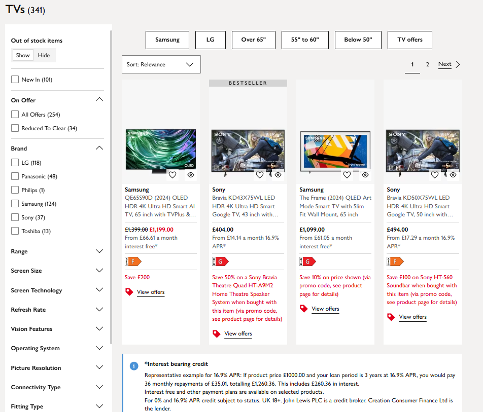
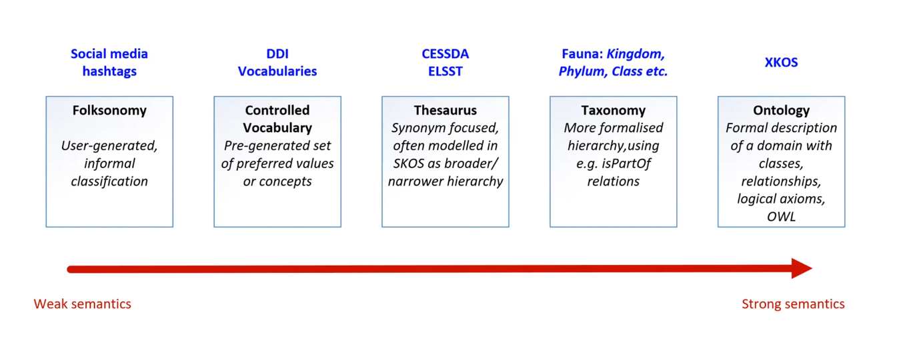

## Intended learning outcome

- Understand what controlled vocabularies are and their role in metadata creation
- Know how to find a relevant controlled vocabulary for a set of metadata
- Gain a high-level understanding of theasuri, taxonomies and ontologies
  
---

## Outline

- Metadata management and best practice
- Impact of low quality metadata
- What are controlled vocabularies and when do you use them
- Importance of controlled vocabularies
- What are taxonomies and how are they used
- What are ontologies and how are they used
- How do we find controlled vocabularies?

---

## Metadata as a search tool

As we touched on at the end of the last unit, metadata can be leveraged as a search tool, allowing people to find resources based on keywords. Metadata terms can also be used as filters to explore a large set of objects or data. Through being machine-actionable in this way, metadata is a powerful form of documentation and provides more functionality than unstructured documentation.

For example, on shopping sites, the filters we use to find the product we're after are metadata that have been used to described the product. 

 

In a research setting, we use data repositories and catalogues to find relevant datasets.

---

## Metadata management and best practice

In order to be machine actionable, metadata needs to be structured and stored in appropriate machine-readable formats.

In unit 2.1 we touched on machine-readable formats that metadata should be stored in. This includes CSV, XML, JSON and MS Excel rather than free- text formats such as PDF or MS Word. By being in these formats, machines can search and filter metadata.

However, just because machines can read and process metadata does not make that metadata automatically valuable as a discovery tool.

For example, look at the screenshot below. Why are these filters not helpful? 
What could be the issues with the clothes' metadata that are causing problems with the filters?

 

>[!NOTE]
> BO - The first sentence - specifically "metadata needs to be managed" - is too vauge. You could manage unstructured metadata that isn't machine-actionable. Is the key point actually that we need to use metadata standards to be interoperable and machine-actionable? I feel like that's sort of what you're trying to say, but the point is getting lost. 

>:large_blue_diamond: KR Agree. Have updated, do we feel this reads better?

---

## Bad metadata impacts discoverability and interoperability

Duplicate terms, spelling errors, wrongly placed categories impact metadata as a discovery tool.

 

Inconsistent or incorrect terms means metadata less interoperable. Machines don't recognise that 'Shoees' and 'Shoes' are most likely the same object but that one has a spelling error. Instead, they are concieved as two separate categories and the objects listed under 'Shoees' are separated from the objects listed 'Shoees'.

When we use different terms to mean the same object, we simiarly create confusion. For example, 'Trainers' and 'Sneakers' are most likely referring to the same object. However, as they are labelled differently they are created as separate categories. This means the objects under 'Trainers' and the objects under 'Sneakers' are not included in the same filter or search return, and it's up to the person searching to notice and interpret the meaning of these categories. This makes it harder to discover or compare similar objects.

Vague and undefined metadata can also be confusing for people trying to understand what a research project is about. For example, in the screenshot above, what's the difference between 'light blue' and 'pale blue'? Are they the same colour? It's important to use terms that intuitively describe data and/or refer to a clear definition of that term in your metadata.

'Dirty' metadata can be a barrier to depositing your (meta)data in a data repository or catalogue as it cannot integrate with a centralised system.

How do we know what best practice to follow?

>[!NOTE]
> BO - In the section above and here, we keep mentioning metadata best practice without actually saying what best practice is? If it's been said in previous modules, it needs to be repeated explicitly here. If we're making a new point, more detail and explanation is needed. I think the two points that are coming out so far are standards and controlled vocabs, but because it's not explicity stated it's a bit confusing. I keep thinking to myself "but what is "best practice"?!".

---

## Impact of low quality metadata

Inconsistent and duplicated metadata:
- Hinders the searchability and discoverability of data
- Reduces the reliability and validity of data
- Reduces the interoperability of the data
- Is time consuming as people have to identify what terms are relevant for their search and integrate different terms

If metadata is bad quality, it undermines its three mains purposes to increase discovery, understanding and (re)susability of data.

---
## Best practice in metadata 

To help us overcome these issues and make sure metadata is effective, best practice principles and tools have been established.

Best practice principles for metadata creation include:
- Consistency so metadata reliably describes data and can be compared across datasets
- Accuracte description so data is easily understood
- Searchability of metadata so data is discoverable
- Persistent use of terms that don't expire

---
## Tools for metadata best practice

Two main tools that are used implement metadata creation best practice are:

1. Controlled vocabularies
    
2. Metadata schemas and standards

In this unit, we will look at controlled vocabularies and the related concepts of taxonomies and ontologies.

In the next unit (2.5), we will look at metadata schemas and standards.

>[!NOTE]
> BO - I think this needs to be at the start of this unit, as everything before feels too vaugue because these ideas haven't been explicitly mentioned yet. I think the flow of this unit, in the format of the build of ideas, should be something like ... 

> 1. To maximise the potential of metadata, it needs to be created adhering to best practice 

> 2. Best practice looks like using CVs and standards (if there are other things, list them all but say in this unit we'll talk about CVs and standards) 

> 3. What are CVs, why should we use them, examples etc and what could happen if we don't use them 

> 4. What are standards, why should we use them, examples etc and what could happen if we don't use them 

> Update: I've just got to the end of the module and we haven't fully covered standards yet, so you could mention CVs here and say stanards will be covered in the following unit?

---

## What are controlled vocabularies?

'A controlled vocabulary is a list of terms that describes a certain domain of knowledge. In the controlled vocabulary you **only use one term to describe one particular phenomenon**, excluding all other synonyms.'*

>[!NOTE]
> BO - I think the paragraph below "Controlled vocabularies are a type of community based standard...." should come straight after this, as it's expanding on the definition. I think we could remove the first sentence from the paragraph below. Could the second sentence be rephrased for more clarity?

The terms in controlled vocabularies can be used in metadata fields. They provide consistency and structure to metadata, reducing the risk of duplicate terms where different terms are used for the same concept or one term is used for multiple concepts.

For example, **XXX**

Controlled vocabularies are a type of community based standard. They are created, maintained, and updated by communities or organisations in different disciplines. The power of a controlled vocabulary increases when it becomes widely adopted. If you're currently working on a research project, look out for what controlled vocabularies your discpline community recommends.

>[!NOTE]
> Currently using NBI Sweden definition of controlled vocabulary. Should this be changed to CoData RDM terminiology definition to keep consistency? **BO - yes I think so**
> JJ-> KR Send Sarah above definition as reference for CVs

::: notes

*https://nbisweden.github.io/module-metadata-dm-practices/guide/index.html

Controlled vocabularies are used in descriptive metadata fields to support consistent, accurate, and quick indexing and retrieval of digital asset content. It has a specific definition associated with a particular value**. --> Hedden, H (2007) Taxonomies and controlled vocabularies best practices for metadata. (https://link.springer.com/article/10.1057/dam.2010.29)

:::

---

## Using a controlled vocabulary 

There are different controlled vocabularies for different concepts.

>[!NOTE]
> BO - Should this say "...for different disciplines"? 
>:large_blue_diamond: KR I did actually mean concepts as there are CVs that are used across discplines that relate to a particular concept. Should I say disciplines and concepts? Or do you feel that disciplines capture the notion of concepts?

Here is some metadata for a list of books. What columns do you think could benefit from using a controlled vocabulary? Why?

| Book title             | Author                | Original language  | Language  | Genre    | Quantity
|------------------------|-----------------------|--------------------|-----------|----------|----------
| To Kill A Mockingbird  | Harper Lee            |  English           | eng       | Fiction | 14                 
| On Social Contract     | Rousseau, Jean-Jacques|  french            | english   | Political non-fiction  | 5           
| The Odyessy            | Homer                 |  Ancient Greek     | Greek     | Poetry fiction | 9      
| Lord Of The Flies      | Golding, W.           |  English           | en        | Coming-of-age literature | 7    

>[!NOTE]
> BO - I like this example :)

---

## Where can we use a controlled vocabulary 

We could apply a controlled vocabulary to the Original language, Language, and Genre columns. This is because they will use similar or repeated terms that we need to ensure are standardised across our dataset. 

As the book title and author column will contain unique data for each object, a controlled vocabulary is not relevant. However, we do want to standardise how we write this information, for example, surname, first name / firstname surname / firstname initial, surname etc. 

Looking at the data in those columns, what are some of the current issues?

<b>Answer</b>

- Data is presented in different ways: _English, eng, en_
- Different levels of specficity in data in the genre column: _Fiction_ compared to _Coming-of-age literature_ and similar terms _Fiction_ and _Literature_ are used interchangeably with no further clarification

Controlled vocabularies provide a way to standardise these terms. The definitions for the terms have been widely agreed in a discipline, and can save you time by referring directly to them rather than defining them yourself in your own documentation.

>[!NOTE]
> Is that correct re the author column? In that you would follow a standard to format that information.
> BO - Yes "author" is a metadata element in different standards (including DDI and Dublin Core).

---

## Finding a controlled vocabulary

Now that we've identified the columns we can apply controlled vocabularies to, we now need to find a relevant controlled vocabulary.

>[!NOTE]
> BO - This is a minor point, but I've noticed we use a combintation of abbreviations vs. writing in full, for example "you are" vs "you're", or "we have" vs. "we've". We could tidy this up at the end (if you think we need to). I'm not sure which we should use - abbreviations are more colloquial, if that's what we're trying to go for, but writing in full might look more professional.

You can find controlled vocabularies yourself, using websites such as [Bartoc](https://bartoc.org/) which compiles many controlled vocabularies allowing you to search and filter different across disciplines and concepts to identify the most appropriate one for your data.

Similarly, your research area or academic discipline may use and encourage certain controlled vocabularies. For example, if you had oceanographic data in the UK, you may want to use the [Natural Environment Research Council (NERC) Vocabulary Server](https://vocab.nerc.ac.uk/collection/) which lists all relevant controlled vocabularies for that field.

If you are storing your data in a repository or using a metadata standard, they may specify certain controlled vocabularies to use (note, we will cover metadata standards in unit 2.5).

>[!NOTE]
> BO - I think we could delete the first sentence from the para above. 

> :large_blue_diamond: KR Done. Mark as complete?

---

## Choosing the right controlled vocabulary for your metadata

Sometimes, metadata users will independently decide what controlled vocabularies to use for a particular metadata field. Other times, a metadata standard or schema might specify what controlled vocabulary to use for a specific metadata field. We will look at metadata standards in the next unit.

>[!NOTE]
> KR Should finding and choosing CV sections come after the DDI example?

>[!NOTE]
> BO - I don't think these two sentences need to be in their own section. I think you could just add a sentence to the section above to say that if you are using a metadata standard, the controlled vocab may already be specified for you. That links nicely with the repos bit too.

---

## Applying a controlled vocabulary 

Going back to our list of books example, we could use the following controlled vocabularies for the Language and Genre metadata fields.

- A widely adopted controlled vocabulary for language names across disciplines is the [ISO 639-1/639-3](https://www.loc.gov/standards/iso639-3/php/code_list.php](https://iso639-3.sil.org/code_tables/639/data)
  - ISO 639-1/639-3 specifies how to write languages in three letter codes e.g. English = eng, French = fra, Ancient Greek = grc, Modern Greek = ell

- A widely used vocabulary in the library archiving field is the [Library of Congress Genre/Form Terms for Library and Archival Materials](https://www.loc.gov/aba/publications/FreeLCGFT/freelcgft.html)

| Book title             | Author                | Original language  | Language  | Genre    | Quantity
|------------------------|-----------------------|--------------------|-----------|----------|----------
| To Kill A Mockingbird  | Harper Lee            |  eng               | eng       | Legal fiction; Domestic fiction; Bildungsromans | 14                 
| On Social Contract     | Jean-Jacques Rousseau |  fra               | eng       | Political literature; Philosophical literature  | 5           
| The Odyessy            | Homer                 |  grc               | ell       | Epic poetry; Mythological fiction; Adventure fiction  | 9      
| Lord Of The Flies      | William Golding       |  eng               | eng       | Allegories; Psychological fiction; Adventure fiction | 7  

>[!NOTE]
> Is there someone we could check with to ask if Library of Congress Genre/Form Terms would be a common vocabulary to use?

>[!NOTE]
> BO - This section needs an intro sentence, just something simple like "Going back to our list of books example,..."
> :large_blue_diamond: KR Done. Mark as complete?

---

## Using a controlled vocabulary: research metadata

Now let's think about applying a controlled vocabulary to metadata for research data. 

Below are two examples of metadata for the same dataset.The dataset is from a social science research project. Both metadata sets describe the same variables. 

>[!NOTE]
> BO - The sentence above it a bit wordy, suggest rewording to something like "Below are two sets of metadata for dataset collected as part of a social science research project."
> :large_blue_diamond: KR Done. Is that clearer?

What are the differences between the two sets of metadata?
What challenges might these differences cause?
Why do you think a controlled vocabulary would be helpful?

| Variable name          | Data type             | Measurement unit  | Method of collection | Response format
|------------------------|-----------------------|------------------|-----------------------|---------
| Age                    | Numeric               |  Years           | Survey 1              | Discrete
| Gender identity        | F, M, O            | --               | Survey 3                 | Categorical          
| Access to internet at home   | Y/N          |  --              | Survey 1                | Binary     
| Anxiety score         | GAD-7 scale         |  Scale           | Scale                   | Scale score 

| Variable name          | Data type             | Measurement unit  | Method of collection | Response format
|------------------------|-----------------------|------------------|-----------------------|---------
| Age                    | Numeric               |  Years           | Questionnaire   | Discrete
| Gender identity        | F, M, O           | --                | Questionnaire   | Categorical          
| Access to internet at home   | Boolean      |  --              | Questionnaire  | Binary     
| Anxiety score         | GAD-7 scale         |  GAD-7           | Standised scale instument  | Scale score 

>[!NOTE]
> This needs attention so it is accurate.

---

## Using a controlled vocabulary on research data

What controlled vocabulary might we use for social science research metadata?

Use [Bartoc](https://bartoc.org/) to find a controlled vocabulary we might use for this metadata.

<b>Answer</b>

DDI
  

---

| Variable name          | Data type             | Measurement unit | Method of collection  | Response format
|------------------------|-----------------------|------------------|-----------------------|---------
| Age                    | Numeric               |  Years           | Structured questionnaire   | Discrete
| Gender identity        | Categorical           | --               | Structured questionnaire   | Categorical          
| Access to internet at home   | Boolean         |  --              | Structured questionnaire   | Binary     
| Anxiety score (GAD-7 scale)  | Numeric         |  Scale score     | Standised scale instument  | Scale score 

- [Give example of a metadata element using DDI]

- Data Documentation Initiative (DDI) Controlled Vocabularies
  - Provides terms to describe social sciences, behavioral sciences, economics, and health sciences.

>[!NOTE]
> Provide another example consisting of a metadata element and the corresponding controlled vocabuarly it is using. Try include a non-social science discipline specific one.

---

## Case study practice: Finding a controlled vocabulary

Using [Bartoc](https://bartoc.org/), find a controlled vocabulary that is relevant for this metadata.

[Give an overview of the research project and some metadata elements]

>[!NOTE]
> Would it be useful here to include a practice example where we give a small set of metadata alongside a short explanation of what the research is about. We then ask participants to find a relevant controlled vocabulary using the Bartoc tool. 

> BO - Yes, I assumed with it being a case study that's what we'd do :) 

<b>Answer</b>

This is the controlled vocabulary we chose.

Here are the reasons behind this choice:
- [Give the thought process behind choosing that particular controlled vocabulary]

>[!NOTE]
> We would then explain what controlled vocabulary we picked for this dataset and give the reasoning behind it (e.g. popular in the discipline, expansive, relevant etc.) -- this is in the answers tab 

---

## Case study practice: Using a controlled vocabularly 

>[!NOTE]
> Building on the exercise above, ask participants to apply the controlled vocabulary to the metadata.

<b>Answer</b>

Again we would provide the answer to the above in a drop down field.

---

## Application: Find a controlled vocabulary for your research

Now you have practised finding a relevant controlled vocabulary, find a controlled vocabulary for your research.

---

## Controlled vocabularies: going further

Some controlled vocabularies are more specific and not only define concept terms but also outline the relationship between different terms and/or concepts.

Theasuri, taxonomies and ontologies are specific types of controlled vocabularies that contian more detailed explanation of terms. 

The image below describes how the strength of semantics relate to different systems.

Strong semantics refer to systems that are more speific and complex in describing terms and the relationships to each other.  

>[!NOTE]
> Would you describe theasuri (no), taxonomies and ontologies as a type of controlled vocabylary or a separate systems all together?
>Controlled vocabulary is a flat list of terms

>[!NOTE]
> BO - Is this and the following needed given that it's an introduction course?  
> :large_orange_diamond: KR I think it should be included here as on Bartoc's website / other CVs repository websites, Theasuri, taxonomies and ontologies are stored. So if we include the exercise where participants go and look for a relevant CV, I think we should cover these terms. Though can be high-level. However, happy to remove if we think it's too complex for this course. Can discuss on July 23rd team meeting.

---

## Theasuri 

Instead of providing a singular term, thesauri specifics a preferred term alongside variant terms, broader terms and narrower terms. They can also contain related terms that describe similar concepts.

Terms for art, architecture, decorative arts, material culture, and archival materials: Getty Institute Art and Architecture Thesaurus Online (AAT) 

UNESCO Thesaurus is the list of terms used in education, culture, natural sciences, social sciences, human sciences, communication and information.

:::
notes
https://pitt.libguides.com/metadatadiscovery/controlledvocabularies

:::

---
## Classifications

Example 1:

- [Give example of a metadata element using ICD]

- Disease and health conditions: International Classification of Disease (ICD)
  - International standard to specifing terms to describe diseases and health conditions for clinical  and research purposes 

>[!NOTE]
> Add information about classifcation

---

## Taxonomies

Taxonomies not only describe specific terms but also define hierarchical structures between different terms, outlining parent/child relationships.

_Give an example of taxonomies_

>[!NOTE]
> Hierarchial only
---

## Ontologies

- Ontology further specifies the relationships between different terms

  _Give an example of ontology_

>[!NOTE]
> Ontology isn't bound by hierarchy - have a set of relationships that is explicitly declared
>Something is 'a part of something', something is 'equivalent to'
>More sophisticated way to describe relations between item

---

## Test your knowledge 

