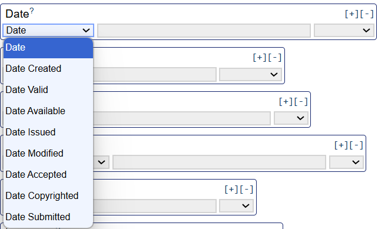

## Intended learning outcomes 

- Understand what study level metadata is and why it is important
- Understand who needs to create study level metadata
- Understand how to create study level metadata
- Know how to implement best practice (metadata standards and controlled vocabularies) in study level metadata

>[!NOTE]
> BO - Not sure about the order of the units. I think CVs and standards should come after this, so we start by introducing what metadata is, the different types of metadata, the benefits of metadata, and then CVs and standards.

---
## Outline

- What is study level metadata and why is it important (recap)?
- What types of metadata does it include?
- Who needs to create study level metadata?
- When do we create study metadata?
- How do we create study metadata?
- Where do we store and find study metadata?

---
## What is study level metadata?

Thinking back to the 'Metadata in research' unit, what is study level metadata?

What types of metadata would study level metadata include? 

What metadata elements might you include?

---
## Study level metadata elements

Study level metadata often includes descriptive, administrative and technical metadata.

For example, you could include: 

- Title of study
- Date the data was collected
- Creator of the data
- Location of data collected
- Format the data is in

---
## Who should create study level metadata and when should you create it?

**Everyone should create study level metadata.** Creating study level metadata from the beinging of your research project will save you time in the long-term. Adding to and updating your study level metadata as you go will further allow you to document any changes to the study throughout the project.

To begin with, you can create study level metadata in an excel spreadsheet stored alongside your data files.

What metadata elements you capture will depend on what you want to do with your research. If you want to share your research widely, you may need to include more study level information than if you just want to document metadtaa for your own use and personal reference.

What tools can we use to create study level metadata and implement best practice?

---
## Metadata standards

Using a metadata schema or standard can help make our study level metadata interoperable.

Schemas and standards can also help us identify what metadata to create as they often specifcy what metadata elements to capture.

What schema or standard to use depends on your research. You can select a discipline specific standard or an inter-disciplinary standard.

If you want to deposit your data or metadata in a repository, the repository may require you to adhere to a specific schema or standard. It is important to idenitfy this at the begining of your research so you know what information to collect.

>[!NOTE]
> REview and shorten
> BO - suggest removing as it is repetitive of the last unit. You could have a sentence to say "You may remember from the "Metadata standards" unit that..." and give a short recap before going into different standards.

---
## Metadata standards: Dublin Core

Dublin Core is a inter-disciplinary schema that is commonly used in different research projects. It contains 15 core elements.

While there is no universally agreed set of minimum metadata, Dublin Core is a useful guide for creating a strong basis of study level metadata.

Not all the metadata elements may be relevant for your research, but using Dublin Core is a good starting point for identifying what sort of metadata to create.

>[!NOTE]
> BO - "but using Dublin Core is a good starting point for identifying what sort of metadata to create." sounds repetitive of "Dublin Core is a useful guide for creating a strong basis of study level metadata.".
---
## Dublin Core Simple Metadata Generator

While you can create Dublin Core metadata in an Excel spreadsheet, Dublin Core also provides an online generator where you can input information about your research project and export metadata in a machine-readable file. 

>[!NOTE]
> BO - Minor but I think we go between using "metadata readable" and "metadata-readable", same for actionable and study-level. I think they should all be hyphenated.

Create study level metadata using [Dublin Core Simple Generator](https://nsteffel.github.io/dublin_core_generator/generator_nq.html)

>[!NOTE]
> Should we provide an example case study to create metadata for? E.g. provide information for a research study which participants can read and then create the metadata for using the generator. We can then provide answers. This may be useful as we can also show how you can create metadata in different ways if you don't use controlled vocabularies. This will then lead to the Advanced generator.
> We can also do an activity for participants to use simple generator for their own research.
> BO - Yes, and if we're making up a case study for the previous unit on CVs, we could use the same one here.

---
## Benefits of Dublin Core Simple Metadata Generator 

How does using the Dublin Core schema help our metadata creation?

- Specifies what metadata elements to capture
  - The 15 core elements provide a strong basis of what metadata to create
- Gives definitions of the metadata elements and what sort of data to input into the metadata fields
  - Each metadata element is linked to a new page providing a definition of the metadata element/field
  - For example, for names they recommend to put family name then first name. For dates, they recommend YYYY-MM-DD format
 
>[!NOTE]
> BO - Could move this into the section above when introducing the metadata generator, as I'm not sure it needs to be a section on its own, so you could describe what the generator is and then add this (i.e. why it's helpful, especially for beginners/individuals with limited resources)?

---
## Challenges of the Dublin Core Simple Metadata Generator

What do you think some of the challenges could be around the metadata created by the simple generator?
What tools do you think we could use to enhance metadata best practice?

---
## Challenges Dublin Core Simple Metadata Generator: controlled vocabularies

While there are some guidelines as to what to you can put in each metadata field, the simple generator does not refer to controlled vocabularies.

This means metadata can be presented in different ways. This could decrease the quality of your metadata as well as it's interoperability. 

For some input fields, controlled vocabularies may not be necessary. However, othe input fields it may be very useful in ensuring metadata is standardised and clear to understand. What are some of the metadata fields that you think could benefit from using controlled vocabularies?

---
## Example: unstandardised metadata

- Language:
  - English
  - En

>[!NOTE]
> Provide an example of how the language or location can be presented in different ways

---
## Challenges Dublin Core Simple Metadata Generator: undefined metadata elements

While the metadata element definitions go some way to describe sort of data sould be inputted into the metadata field, some elements are open to interpretation.

For example, in the 'Date' element could refer to:
- Date the research was created
- Date the metadata record was created
- Date the data was published
- Date data was submitted
- Date data was last modified

Why is it important that we specify what we are referring to?

---
## Dublin Core Advanced Metadata Generator

Now explore the [Dublin Core Advanced Metadata Generator](https://nsteffel.github.io/dublin_core_generator/generator.html). 

- What feautres and tools does it include in order to improve the quality of the metadata recorded?
- What's the difference between the Simple Generator and Advanced Generator?
- What tools does the Advanced Generator use that helps create metadata best practice?

---
## Dublin Core Advanced Metadata Generator

For some fields, the Advanced Generator provides a space to further specify the metadata element in order to avoid confusion:

 

 

a list of controlled vocabularies that you could use and gives us you the functionality to specify which one you choose. 

 

---

