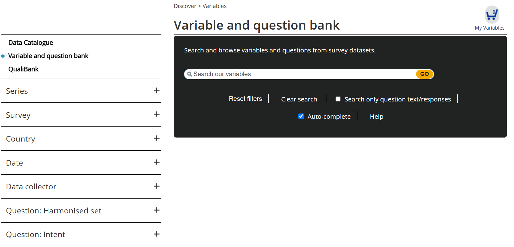
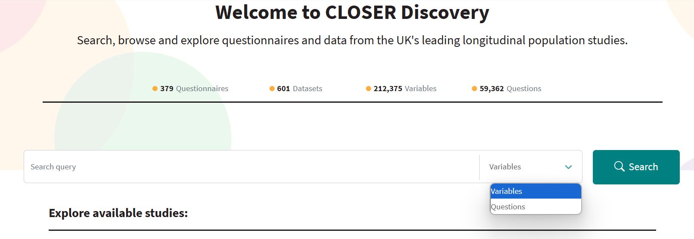
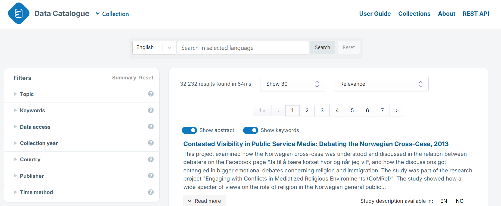

## Archived information for each unit
---

## Unit 1.0

>[!NOTE]
>Need to review case study example. Should we just have independent examples in each unit OR do something like below where there is a narrative and we use the same fictional example to base the practice activities on?

**Case study example**

Congratulations! You’re the newest member of a longitudinal research team at University College London.

The research is funded by UK Department for Young people and the Economic and Social Research Council. The research is looking into the impacts of social media on young people in England.

They have already completed two waves of data collection, collecting data from 437 participants aged 11-16 years old using questionnaires. Wave 1 was completed in 2021 and Wave 2 was completed in 2023. 

You will conduct the next wave of data collection in two months time. 

---

## Unit 1.1

---

## Unit 1.2

To be added back in when we go through with train the trainer materials.

:mortar_board: Trainer: give 5-10 minutes for people to discuss what common examples of bad data management is before moving on. Invite people to share their ideas with the group.

:mortar_board: Trainer: give 5-10 minutes for people to discuss what data management is before revealing the definition. Invite people to share their ideas with the group.

---

## Unit 1.3

>[!NOTE]
>**BO - do we want to say "as researchers", if the audience also includes data managers and funders? We could say "What can we do to enact these principles?" and have some examples for researchers and others for data managers? Or if they're the same there's no need to specify** 

> :large_blue_diamond: KR Great point re different audiences. When referring to 'other researchers' finding data, should I generalise that to 'other people' so to capture that it might be researchers, funders, policy makers etc.

## FAIR Data assessment list

If you have a dataset, use the [ARDS online FAIR dataset assessment tool](https://ardc.edu.au/resource/fair-data-self-assessment-tool/) to determine how FAIR your data is.

>[!NOTE]
>**Should this activity come later as it references/asks questions about a person's metadata level? Or could do the test now and ask participants to do it again after the course?**
>**BO - I think later to have a better understanding of the questions.**

::: notes 
[FAIRAire](https://www.openaire.eu/how-to-make-your-data-fair) -- has checklist
Jones, S. & Grootveld, M. (2017, November). How FAIR are your data? Zenodo. http://doi.org/10.5281/zenodo.1065991

:::

## Old content

- Helps demonstrate the impact of research when people re-use and cite your dataset, so you get credit for all your outputs
- Scientific journals and funders now require scientists to share data
- Increases your visibility as a researcher
- Improves the quality of your data and accuracy of your research results
- Provides proof of transparent and valid conduct
- Improves our confidence in data and research

## FAIR unit summary

- **F**indable, **A**ccessible, **I**nteroperable, **R**e-usable
- Aims to optimise and make reuse of data easier
- Infrastructures are best placed to implement FAIR for the benefit of users
- Data producers and users need to contribute to create FAIR data

>[!NOTE]
>**BO - Do we say the second point before the summary? If not we should, as the summary should include key points from the previous content.**

---

## Unit 2.1

>[!NOTE]
> KR Followed definition that structure of the metadata = element and the content = field  
> KR to update with CoData RDM terminology once complete
> BO - Yes, but we could maybe use more plain language instead of or alongisde this. The way I think about metadata elements is that they're the type of metadata, it's like a label for the metadata. We can see this clearly in the Discovery screenshot and your examples in your definition. The way I think about metadata fields is what you've written - it's a space to input the content. Could we add an example to metadata fields, like you've done for elements? You could say something like e.g. only numeric values may be permitted.  
> :large_blue_diamond: KR Updated, does this read better?

As well as external factors, metadata is helpful for your future self, to help you understand your data later down the line, and be able to share it in a meaningful way with others.

If we didn't have data level metadata and only had high level metadata, we would have to guess about what the dataset contains or contact someone for further details. We may then access the data and find that 

Equally, if we only had data level metadata, we wouldn't know important information about who produced the data, when it was produced and where. 

**Defining metadata terms**
You may have come across metadata before, or this may be your first time. As such, you might be coming across new terms or revisiting knowledge of metadata concepts.

**Old Table**

|          | N662   | N545  | N1171  | N2REGION | N1112  | N1261 |
|----------|--------|-------|--------|----------|--------|-------
|          | N662   | N545  | N1171  | N2REGION | N1112  | N1261 |
| 1        | 2      |  4    | 6      | -2       | 1      | 1            
| 2        | 1      |  4    | -1     | 1        | 1      | 1        
| 3        | 1      |  4    |  4     | 10       | 1      | 1 
| 4        | 1      |  4    |  4     | 4        | 1      | 1  

**Benefits of strucutre and machine-actionability**

 -  For metadata to be machine readable, it must be structured according to a specific set of rules
    - Standardises the content and structure of documentation, making it easier for computers to extract information from the metadata
    - Tells a computer what something is, how it relates to other things (“objects”), and what to do with it

- Makes data management for researchers easier and more efficient, saving time and imrpvoing accuracy
    - Allows researchers to quickly discover, understand and access data
    - Helps your future self to understand your past research, preserving your data for continued use

- Organise our metadata into useful collections of information. For example, in the previous example, groups of metadata were organised into tabs: Sweep description, Coverage, Funding, Kind of Data, Dataset and Questionnaires.

- Store our data in data repositories
  
- Search data repositories/archives
  [screenshot of filters in a repository]
  
- Compare studies

**Metadata and FAIR [Written out]**

FINDABLE makes it easier to discover and understand data.
- F1. (Meta)data are assigned a globally unique and eternally persistent identifier.
- F2. Data are described with rich metadata.
- F3. Metadata clearly and explicitly include the identifier of the data they describe
- F4. (Meta)data are registered or indexed in a searchable resource.

ACCESSIBLE makes it easier to understand how to access the data. 
- A1. (Meta)data are retrievable by their identifier using a standardised communications protocol (open, free, universally implementable, allows for an authentication and authorisation procedure where necessary)
- A2. Metadata are accessible, even when the data are no longer available
- _Note: data does not need to be open but metadata should be accessible._

INTEROPERABLE allows you to combine datasets for further research.
- I1. (Meta)data use a formal, accessible, shared, and broadly applicable language for knowledge representation.
- I2. (Meta)data use vocabularies that follow FAIR principles.
- I3. (Meta)data include qualified references to other (meta)data.

RE-USABLE enables re-use of your own data and re-use for others.
- R1. (Meta)data are richly described with a plurality of accurate and relevant attributes
    - (Meta)data are released with a clear and accessible data usage license.
    - (Meta)data are associated with their provenance.
    - (Meta)data meet domain-relevant community standards.
  

::: notes
https://www.go-fair.org/fair-principles 
:::

**Snippets from other trainings**

Below are snippets from other trainings that may be useful to include here. For now they are not included in the main structure in order to avoid repetition.

Benefits of metadata for you as a researcher:
- Increases research efficiency
- Maximises potential of your data, leading to secondary research, data citations and cross study comparison
- Improves data quality and FAIRness

**Finding information about research projects**

Where would you find the answers to these questions? Where would you look? Who would you contact?

**Finding information about research projects**

You may find the information online on sites like data repositories or data catalogues (more information about data respositories and catalogues in unit 2.4). For example:

**Screenshot 

**Summary**

- Metadata is information that describes data
- Metadata is based on a structure that can be processed by a computer 
- Metadata is important for your future self and others to discover, understand and (re)use data
- Metadata allows researchers to use data effectively because it includes the important information needed to exploit the full potential of data

---

## Unit 2.2

>[!NOTE]
> KR I feel the tone in this unit talks more to metadata creators (master students, researchers and data managers). For example, I use 'you should ...' or 'your data .../your research ...' etc. 

> Should I generalise it so it speaks also to funders and people who will not be directly involved in the metadata creation process? 

> BO - I quite like using phrases like your data/your research etc, as I think it fits in with the more personal/colloquial tone. I think the main audience will be individuals wanting to learn more about metadata, so I think it's fine.

**Metadata terms**

You may have come across metadata before, or this may be your first time. As such, you might be coming across new terms or revisiting knowledge of metadata concepts.

As an evolving field, terminology around metadata can vary depending on the source you are using. The same term can be used or interpreted by people to mean slightly different things. 

In this module we will define different metadata concepts and terms as we go along. Outside of this module, using a glossary or terminiology bank can be a useful way to identify a single source of truth so you can be consistent in your metadata processes.
  
For example, you could use [CoData RDM Terminiology bank](https://codata.org/initiatives/data-science-and-stewardship/rdm-terminology-wg/). Alternatively, there might be key organisations in your discipline who provide similar resrouces.

>[!NOTE]
> Should we/can we include other metadata glossaries/terminology? **BO - depends how consistent they are with one another, it might create confusion if different gloassaries are conflicting but if they're complementary it might be ok. But it might be more helpful and less confusing to have one thing we constantly refer back to** 

>Should this be moved to the very top of the training to cover all concepts, not just metadata concepts? OR should this be moved to unit 1.1?

>[!NOTE]
> BO - maybe in the previous module when we're defining metadata we could tie this in. We could say that there are lots of different definitions and understandings of metadata and its associated terminology, and that in the next module (i.e. this one) we'll spend time unpacking and making sense of the terminology. But I might get to the end of this course and change my mind!
> :large_blue_diamond: Agree **KR TO MOVE TO PREVIOUS MODULE**

**Metadata and data**
> ARCHIVING 2 SENTENCES: Most obviously, metadata applies to data which has been collected for a specific purpose. Less obviously, it also applies to data such as text, images or sound which is processed into ‘numbers’ for statistical analysis

>[!NOTE]
> JJ &rarr; KR
>What do you mean by project level - give examples. Higher level aggregated information of the project. Explain the purpose of having these levels of metadata  
> Expand on: if you just have the project level information / only have item level / only have project level - what information would you be missing?  
> Explain that you need a collection of different levels of information  
> Include how provenance is important throughout all metadata levels  

>[!NOTE]
> KR question: Would you call it Item level metadata or data level metadata?  
> Should be it be study/project? What is difference between study or project?  

**Metadata as a search tool**

Metadata are also leveraged in search and filter tools to help users discover research data.

>[!NOTE]
> BO - leveraged as or leveraged in? I think it's in (but could be wrong!).

**Variable search tool**

UK Data Service Variable and Question Bank. 

CLOSER Variable search 

**Keyword search tool**

CESSDA Data Cataologue search 

>[!NOTE]
>Add
>Example: UK LAC - Linkeage data - having information at the wrong level - consent around data sharing wasn't documented at correct level

Knowing what different levels and types of metadata you can create can help you organise your metadata and check that you have captured necessary information to describe your data thoroughly.

**Where you find metadata in reseach settings**

Outside of the metadata you create for your own research, you will most commonly come across metadata in data catalogues and data repositories.

For example:

- Project level:_[add screenshot example]_
- Dataset level:_[add screenshot example]_
- Item level:_[add screenshot example]_

THINK ABOUT WHERE TO PLACE THIS

**Where is metadata used in research settings?**

Registry - single source of information (not interchange) - FAIRSharing (registry of places that share data in a FAIR way)

Catalogue if you have a catalogue that uses a standard, you can aggregate metadata to a central place. However, catalogues do not always specify standards.

Repository - a way of maintaining the provenance and evolution of the metadata - has information around versioning. 

The level of metadata created also depends on where the data will be deposited e.g. some data registries or catalogues may only require you to briefly describe your sample and the types of data collected - we can say repos will be covered in more detail later.

>[!NOTE]
> Is it helpful to make this distinction here?
> How can we describe the differences?
> Venn diagram between these tools
> BO - I like the idea of a diagram. I think we should define provenance here as I don't think we've mentioned it yet and it's quite jargon-y. We need a transitioning sentence at the start of this or at the end of the previous section. Maybe related to my comment above about what you create depends on where it's going to end up?

However, as a research project is described in more detail, the type of data the project collected will inform what metadata can be captured.

- Increased workload
- Time consuming and resource heavy
- Limited usability
- Not relevant for your data

(which includes the [Age 7 Survey (1965)](https://discovery.closer.ac.uk/item/uk.cls.ncds/0103e4b4-09a6-41a8-997b-3ca0b1edcafc) we looked at in unit 2.1

---

## Unit 2.3

---

## Unit 2.4

Discovery to understanding 

Now imagine you have used the search and filter functions to find a list of research projects that may be of interest to you.
However, when you click through to the resource you are taken straight to this.

_[Provide a screenshot of a research profile page with very little metadata]_

Or if the data is open, straight to the dataset.

_[Provide a screenshot of a dataset with no accompanying documentation]_

What challenges might arise if we only had this information to work from?
Would you choose to cite or use this dataset in your work? Why?
Would you trust these sources?

>[!NOTE]
> BO - could ask how would they find the information they needed to understand and use the data file they'd been given? It links to the point below about contacting the research producers (although this feels a bit repetitive of what we've said in prior units).

---

Discovery to understanding: the role of metadata

Without strong documentation on data catalogue and repository sites, we're not able to easily understand what the research project is about. We have to contact the research producers to clarify details about the research project or we decide not to use the data as we cannot be sure how it was produced or what data it's contains.

This where metadata comes in. Metadata gives us the information to explain what the research project is about, how it delivered and what it's dataset(s) descrive.

>[!NOTE]
> BO - I feel like we're going back and forth in this section, sometimes revisiting things we've already covered in previous units, especially the bit above about how metadata helps us to understand a research project/data. I think by now they should already know what the role of metadata is, and this section should focus on why and how to use catalogues and respositories, and maybe just have the case study that you've already created flowing throughout each of the sections. I'll stop reviewing this section from here and we can discuss instead. :) 

---

## Unit 2.5

Cross-study comparison case studies:
- [The Effect of the Covid 19 Pandemic on Mental Health](https://learning.closer.ac.uk/researchcasestudies/the-effect-of-the-covid-19-pandemic-on-mental-health/)
  - Uses data from two studies:
    - Avon Longitudinal Study of Parents and Children (ALSPAC)
    - Generation Scotland: Scottish Family Health Study
   
- [Children of immigrants’ cognitive achievement](https://learning.closer.ac.uk/researchcasestudies/children-of-immigrants-cognitive-achievement/)
  - Uses data from two studies:
    - 1970 British Cohort Study
    - Millennium Cohort Study
   
- [Britain’s mobility problem](https://learning.closer.ac.uk/researchcasestudies/britains-mobility-problem/)
  - Uses data from four studies:
    - MRC National Survey of Health and Development (1946 British birth cohort)
    - National Child Development Study (1958 British birth cohort)
    - 1970 British Cohort Study
    - Understanding Society

---

## Unit 2.6
