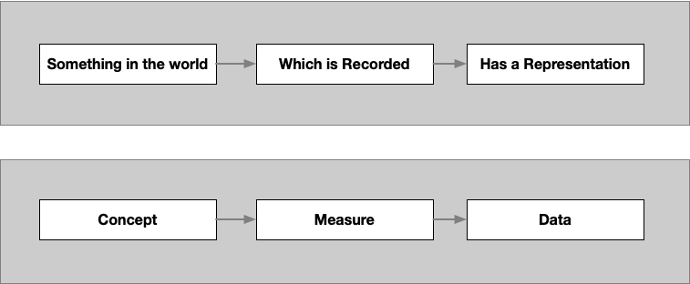

## Intended Learning Outcome

To be able to demonstrate a firm understanding of what data is and its purpose in research

---

## Exercise 1: Characteristics of Data

What are the characteristics of data that you think differentiates it from just being numbers?

::: notes
Ask the participants to take 5 minutes to discuss and come up with some thoughts
Collect responses from participants
:::

---

## Exercise 1: Characteristics of Data (Discussion)

We thought of:

- Has a label e.g. column name
- Has an identifier (person or organisation)
- Can be other things like text
- Could have a domension (weight, height, colour)
- Is consistent in the data type used, all numbers, all text

---

## What is Data (Definition)

**Wikipedia**

Data is a collection of discrete or continuous *values* that convey *information* describing the *quantity, quality, fact, statistics*, or other basic units of meaning, or sequences of *symbols* that may be further interpreted *formally*

**Alernative definition**

Data has a meaning and purpose by having:

- Values represent something in the (real or imaginary) world
- Is represented in a way that can be quantified and analysed.

---

## What is Data (Examples)

| Meaning or purpose   | Representation   |
|----------------------|------------------|
| No / Yes             | 0 , 1            | 
| Weight (kg)          | 55               | 
| Colour black / white | #000000, #000000 |
| Animal               | :chicken:  :cow: |

---

## Data covered in this course

The principles covered in the rest of this course apply to most types of data

- Most obviously, it applies to data which has been collected for a specific purpose, through a measurement such as Blood Pressure, a Question in a survey or census, or as part of an administrative process and data captured through a device such as a location
- Less obviously it also applies to data such as text, images or sound which is processed into ‘numbers’ for statistical analysis

---

## Data as a research object

::: notes
Data is a representation of something in the world, that has been captured in a specific way
Through this course we will use the terms, Concept, Measure and Data
:::

---

## Data as a research object (Example)

::: notes
Concept of Age
Measures in years
Represented as an interger (whole years)
:::

---

## Data as Research object (Terminology)

::: notes
need some additional text to help
:::

---

## Summary

To use data effectively, you will need to understand:

- What concept it is describing
- How it is measured
- How it is represented
- What it represents and how it can be quantified

The purpose of metadata is to provide a framework to describe and understand data, so that it can used in an intelligent and meaningful way

---
